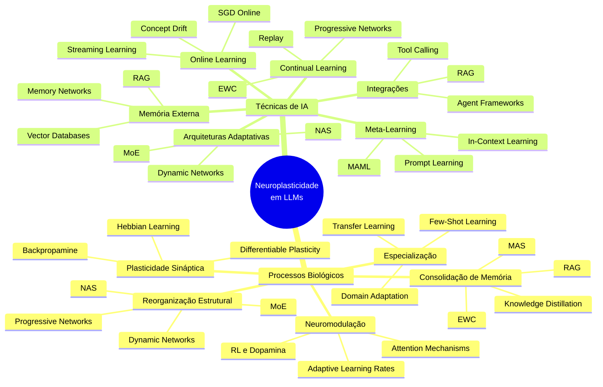
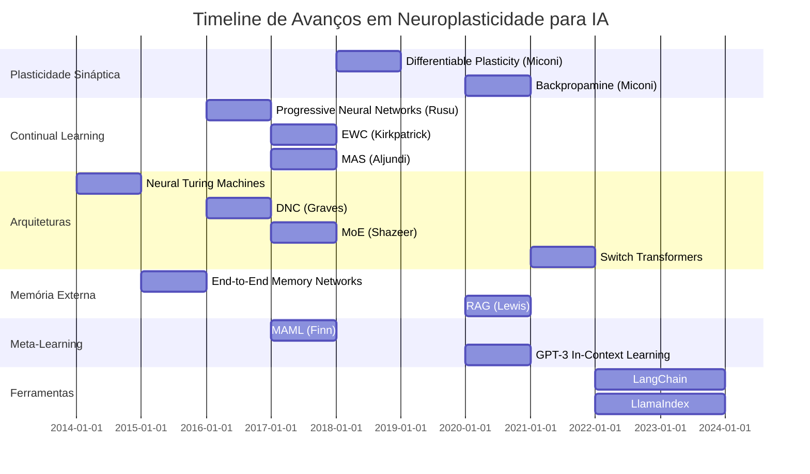
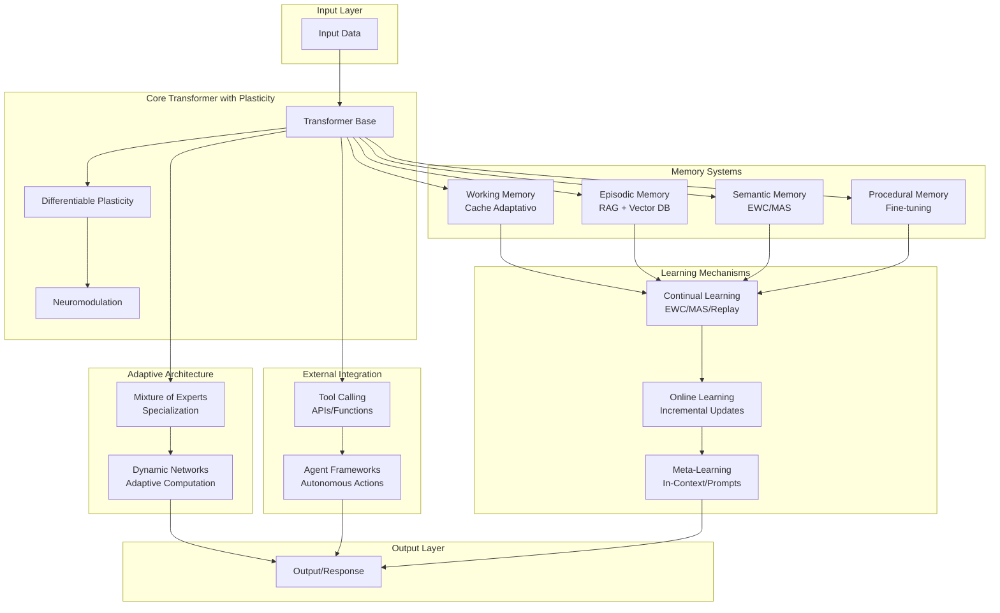
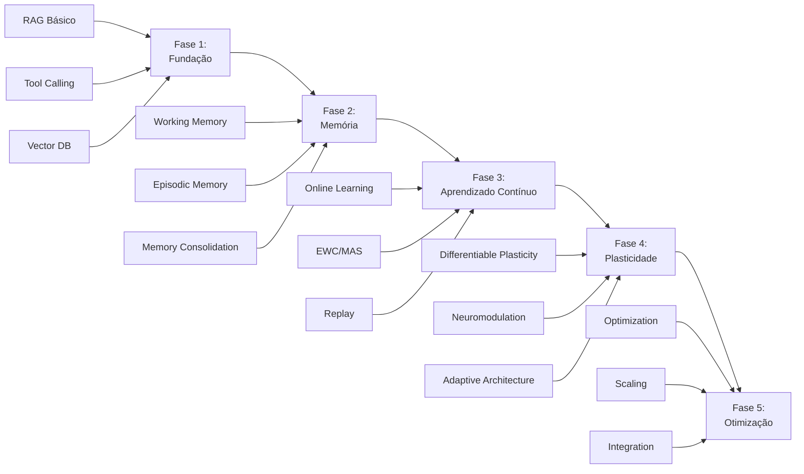

# Resumo Executivo: Estado da Arte em Neuroplasticidade para LLMs

## Visão Geral

Este documento apresenta um resumo abrangente e ilustrativo do estado da arte em neuroplasticidade aplicada a Large Language Models (LLMs). A pesquisa foi organizada em processos fundamentais da neuroplasticidade e técnicas gerais de IA, resultando em uma visão completa do que já existe e do que ainda precisa ser desenvolvido.

## Estrutura da Pesquisa

A pesquisa foi dividida em duas frentes principais:

1. **Processos da Neuroplasticidade**: Análise profunda de cada processo biológico e suas implementações em IA
2. **Técnicas Gerais de IA**: Abordagens práticas e teóricas para simular neuroplasticidade

## Mapa Conceitual: Relações entre Conceitos

## Timeline de Avanços Significativos

## Processos da Neuroplasticidade: Resumo

### 1. Plasticidade Sináptica

**Status**: ⚠️ Parcialmente Implementado

**Técnicas Principais**:
- **Differentiable Plasticity** (2018): Plasticidade treinável via backpropagation
- **Backpropamine** (2020): Neuromodulação aprendida para controlar plasticidade

**Aplicação em LLMs**: Limitada - maioria das implementações em redes menores

**Próximos Passos**: Aplicar em Transformers, reduzir overhead computacional

### 2. Reorganização Estrutural

**Status**: ✅ Bem Implementado

**Técnicas Principais**:
- **Neural Architecture Search (NAS)**: Busca automática de arquiteturas
- **Mixture of Experts (MoE)**: Especialização automática, escalável
- **Dynamic Networks**: Redes que adaptam estrutura durante execução
- **Progressive Neural Networks**: Crescimento incremental

**Aplicação em LLMs**: MoE amplamente usado (Switch Transformers, GLaM)

**Próximos Passos**: NAS para LLMs, reorganização online

### 3. Neuromodulação

**Status**: ⚠️ Parcialmente Implementado

**Técnicas Principais**:
- **Backpropamine**: Neuromodulação aprendida
- **Attention Mechanisms**: Funcionam como neuromodulação
- **RLHF**: Modulação via feedback humano

**Aplicação em LLMs**: Attention é fundamental, neuromodulação aprendida ainda experimental

**Próximos Passos**: Neuromodulação contextual, modulação hierárquica

### 4. Consolidação de Memória

**Status**: ✅ Bem Implementado

**Técnicas Principais**:
- **Elastic Weight Consolidation (EWC)**: Preserva parâmetros importantes
- **Memory Aware Synapses (MAS)**: Identifica importância automaticamente
- **RAG**: Memória externa via retrieval
- **Knowledge Distillation**: Transfer de conhecimento

**Aplicação em LLMs**: RAG amplamente usado, EWC/MAS em modelos menores

**Próximos Passos**: Consolidação eficiente em LLMs grandes, consolidação hierárquica

### 5. Especialização

**Status**: ✅ Muito Bem Implementado

**Técnicas Principais**:
- **Transfer Learning**: Fine-tuning de modelos pré-treinados
- **Domain Adaptation**: Adaptação a novos domínios
- **Few-Shot Learning**: Aprendizado com poucos exemplos
- **In-Context Learning**: Aprendizado do contexto

**Aplicação em LLMs**: Amplamente usado (BERT, GPT, etc.)

**Próximos Passos**: Especialização adaptativa, desespecialização controlada

## Técnicas Gerais: Resumo

### Continual Learning

**Status**: ⚠️ Parcialmente Implementado

**Desafio Principal**: Catastrophic Forgetting

**Soluções**:
- Regularization (EWC, MAS)
- Replay (Experience, Generative)
- Architecture (Progressive Networks)

**Aplicação em LLMs**: Limitada - maioria em modelos menores

### Online Learning

**Status**: ✅ Implementado

**Técnicas**:
- SGD Online
- Adaptive Optimizers (Adam, etc.)
- Streaming Learning

**Aplicação em LLMs**: Fine-tuning incremental, adaptação contínua

### Meta-Learning

**Status**: ✅ Implementado

**Técnicas**:
- MAML, Reptile
- In-Context Learning (GPT-3+)
- Prompt Learning

**Aplicação em LLMs**: In-context learning é fundamental em LLMs modernos

### Arquiteturas Adaptativas

**Status**: ✅ Muito Bem Implementado

**Técnicas**:
- NAS
- Dynamic Networks
- MoE

**Aplicação em LLMs**: MoE é padrão em modelos grandes

### Memória Externa

**Status**: ✅ Muito Bem Implementado

**Técnicas**:
- RAG
- Vector Databases
- Memory Networks

**Aplicação em LLMs**: RAG é amplamente usado na indústria

### Integrações de Ferramentas

**Status**: ✅ Muito Bem Implementado

**Técnicas**:
- Tool Calling
- Agent Frameworks
- RAG

**Aplicação em LLMs**: Amplamente usado (OpenAI, Anthropic, LangChain)

## Tabela Comparativa: Técnicas Principais

| Técnica | Maturidade | Escalabilidade | Eficiência | Aplicação em LLMs | Complexidade |
|--------|------------|----------------|------------|-------------------|--------------|
| Differentiable Plasticity | ⚠️ Experimental | ⚠️ Baixa | ⚠️ Baixa | ❌ Limitada | Alta |
| Backpropamine | ⚠️ Experimental | ⚠️ Baixa | ⚠️ Baixa | ❌ Limitada | Alta |
| EWC | ✅ Estável | ⚠️ Média | ✅ Boa | ⚠️ Parcial | Média |
| MAS | ✅ Estável | ⚠️ Média | ✅ Boa | ⚠️ Parcial | Média |
| Progressive Networks | ✅ Estável | ❌ Baixa | ⚠️ Média | ⚠️ Parcial | Média |
| MoE | ✅ Muito Estável | ✅ Muito Alta | ✅ Muito Boa | ✅ Amplamente Usado | Alta |
| RAG | ✅ Muito Estável | ✅ Muito Alta | ✅ Muito Boa | ✅ Amplamente Usado | Média |
| Tool Calling | ✅ Muito Estável | ✅ Muito Alta | ✅ Muito Boa | ✅ Amplamente Usado | Baixa |
| In-Context Learning | ✅ Muito Estável | ✅ Muito Alta | ✅ Muito Boa | ✅ Fundamental | Baixa |
| NAS | ✅ Estável | ⚠️ Média | ⚠️ Baixa | ⚠️ Parcial | Muito Alta |

**Legenda**:
- ✅ = Bom/Muito Bom
- ⚠️ = Parcial/Experimental
- ❌ = Limitado/Baixo

## Diagrama de Arquitetura: Sistema Neuroplástico Completo

## Análise Crítica do Estado Atual

### O que Funciona Bem

1. **RAG e Memória Externa**: ✅ Muito maduro, amplamente usado
2. **Tool Calling e Integrações**: ✅ Muito prático, amplamente adotado
3. **In-Context Learning**: ✅ Fundamental em LLMs modernos
4. **MoE**: ✅ Escalável, eficiente, amplamente usado
5. **Transfer Learning e Fine-tuning**: ✅ Padrão da indústria

### O que Precisa Melhorar

1. **Plasticidade Sináptica**: ⚠️ Ainda experimental, não aplicado em LLMs grandes
2. **Continual Learning**: ⚠️ Ainda sofre com catastrophic forgetting
3. **Neuromodulação Aprendida**: ⚠️ Limitada a modelos pequenos
4. **NAS para LLMs**: ⚠️ Muito caro, não prático ainda
5. **Consolidação Eficiente**: ⚠️ EWC/MAS não escalam bem

### Lacunas Identificadas

1. **Plasticidade em Transformers**: Falta aplicação direta de plasticidade diferenciável
2. **Reorganização Online**: Mudanças estruturais durante inferência
3. **Consolidação Hierárquica**: Múltiplos níveis de memória
4. **Neuromodulação Contextual**: Modulação baseada em contexto semântico
5. **Balanceamento Adaptativo**: Balanceamento dinâmico preservação/adaptação

## Oportunidades de Pesquisa

### Alta Prioridade

1. **Plasticidade Eficiente em LLMs**: Aplicar plasticidade diferenciável em modelos grandes
2. **Continual Learning Escalável**: Métodos que escalam para bilhões de parâmetros
3. **Consolidação Hierárquica**: Múltiplos níveis de consolidação
4. **Neuromodulação Contextual**: Modulação baseada em contexto

### Média Prioridade

1. **NAS para LLMs**: Busca de arquitetura eficiente para modelos grandes
2. **Reorganização Online**: Mudanças estruturais durante execução
3. **Desespecialização Controlada**: Remoção seletiva de conhecimento
4. **Meta-Learning Eficiente**: Redução de custo computacional

### Baixa Prioridade (Mas Interessantes)

1. **Plasticidade Multimodal**: Plasticidade em múltiplas modalidades
2. **Neuromodulação Hierárquica**: Múltiplos níveis de modulação
3. **Consolidação Adaptativa**: Balanceamento dinâmico

## Roadmap Sugerido para Implementação

## Qualidade e Padronização da Documentação

Esta documentação foi completamente padronizada para garantir consistência e qualidade:

### Estrutura Padronizada
- ✅ Todos os documentos seguem estrutura consistente: Introdução, Fundamentos Teóricos, Técnicas e Métodos, Papers Relevantes, Implementações Práticas, Casos de Uso, Limitações e Desafios, Direções Futuras, Referências
- ✅ Seções de Referências padronizadas com subseções: "Papers Acadêmicos" e "Recursos Online"
- ✅ Formatação consistente de papers com título, autores, ano, ArXiv (quando aplicável) e contribuição

### Formatação Melhorada
- ✅ Links ArXiv padronizados: `ArXiv: [número](https://arxiv.org/abs/número)`
- ✅ Terminologia consistente: uso padronizado de "LLMs", termos técnicos em inglês quando apropriado
- ✅ Links internos verificados e corrigidos entre todos os documentos

### Organização
- ✅ 33 documentos organizados em 9 categorias principais
- ✅ Documentos em `07-advanced-topics/` mantêm flexibilidade para seções específicas enquanto preservam estrutura base
- ✅ Níveis de detalhe consistentes entre documentos similares

## Referências Completas

### Papers Fundamentais

#### Plasticidade Sináptica
1. Miconi, T., Clune, J., & Stanley, K. O. (2018). Differentiable plasticity: training plastic neural networks with backpropagation. ArXiv: [1804.02464](https://arxiv.org/abs/1804.02464)
2. Miconi, T., Rawal, A., Clune, J., & Stanley, K. O. (2020). Backpropamine: training self-modifying neural networks with differentiable neuromodulated plasticity. ArXiv: [2002.10585](https://arxiv.org/abs/2002.10585)

#### Continual Learning
3. Kirkpatrick, J., et al. (2017). Overcoming catastrophic forgetting in neural networks. PNAS, 114(13), 3521-3526
4. Aljundi, R., et al. (2017). Memory Aware Synapses: Learning what (not) to forget. ArXiv: [1711.09601](https://arxiv.org/abs/1711.09601)
5. Rusu, A. A., et al. (2016). Progressive Neural Networks. ArXiv: [1606.04671](https://arxiv.org/abs/1606.04671)

#### Arquiteturas Adaptativas
6. Shazeer, N., et al. (2017). Outrageously Large Neural Networks: The Sparsely-Gated Mixture-of-Experts Layer. ArXiv: [1701.06538](https://arxiv.org/abs/1701.06538)
7. Fedus, W., Zoph, B., & Shazeer, N. (2021). Switch Transformers: Scaling to Trillion Parameter Models. ArXiv: [2101.03961](https://arxiv.org/abs/2101.03961)
8. Liu, H., Simonyan, K., & Yang, Y. (2018). DARTS: Differentiable Architecture Search. ArXiv: [1806.09055](https://arxiv.org/abs/1806.09055)

#### Memória Externa
9. Graves, A., Wayne, G., & Danihelka, I. (2014). Neural Turing Machines. ArXiv: [1410.5401](https://arxiv.org/abs/1410.5401)
10. Lewis, P., et al. (2020). Retrieval-Augmented Generation for Knowledge-Intensive NLP Tasks. NeurIPS 2020

#### Meta-Learning
11. Finn, C., Abbeel, P., & Levine, S. (2017). Model-Agnostic Meta-Learning for Fast Adaptation. ICML 2017
12. Brown, T., et al. (2020). Language Models are Few-Shot Learners. NeurIPS 2020

### Frameworks e Ferramentas

- **LangChain**: https://langchain.com
- **LlamaIndex**: https://llamaindex.ai
- **Avalanche**: https://avalanche.continualai.org
- **Hugging Face**: https://huggingface.co
- **FAISS**: https://github.com/facebookresearch/faiss
- **ChromaDB**: https://www.trychroma.com
- **Pinecone**: https://www.pinecone.io

### Recursos Online

- **Papers with Code**: https://paperswithcode.com
- **ArXiv**: https://arxiv.org (cs.AI, cs.LG, cs.NE)
- **GitHub**: Repositórios open-source
- **Blogs**: LangChain, LlamaIndex, Hugging Face

## Conclusão

O estado da arte em neuroplasticidade para LLMs mostra um campo em rápido desenvolvimento, com algumas técnicas muito maduras (RAG, Tool Calling, MoE) e outras ainda experimentais (Plasticidade Sináptica, Neuromodulação Aprendida). 

**Principais Descobertas**:
1. ✅ **Ferramentas Práticas Funcionam**: RAG, Tool Calling, Agents são amplamente usados
2. ⚠️ **Técnicas Biológicas Ainda Experimentais**: Plasticidade, Neuromodulação ainda em pesquisa
3. ✅ **Arquiteturas Adaptativas Maduras**: MoE, Dynamic Networks funcionam bem
4. ⚠️ **Continual Learning Desafiador**: Ainda sofre com catastrophic forgetting

**Recomendação**: Começar com técnicas práticas (RAG, Tool Calling) e gradualmente incorporar técnicas mais avançadas (Plasticidade, Neuromodulação) conforme a pesquisa avança.

## Nota sobre a Documentação

Esta documentação foi completamente padronizada e revisada para garantir:
- **Consistência**: Estrutura uniforme em todos os 33 documentos
- **Qualidade**: Formatação padronizada de papers, links e referências
- **Navegabilidade**: Links internos verificados e funcionais
- **Completude**: Cobertura abrangente do estado da arte

Todos os papers incluem links diretos para ArXiv quando disponíveis, e a estrutura permite navegação fácil entre tópicos relacionados.

---

*Documento gerado como parte do projeto NeuroPlastic Large Language Model (npllm)*
*Última atualização: Janeiro 2025*
*Documentação padronizada e revisada*
