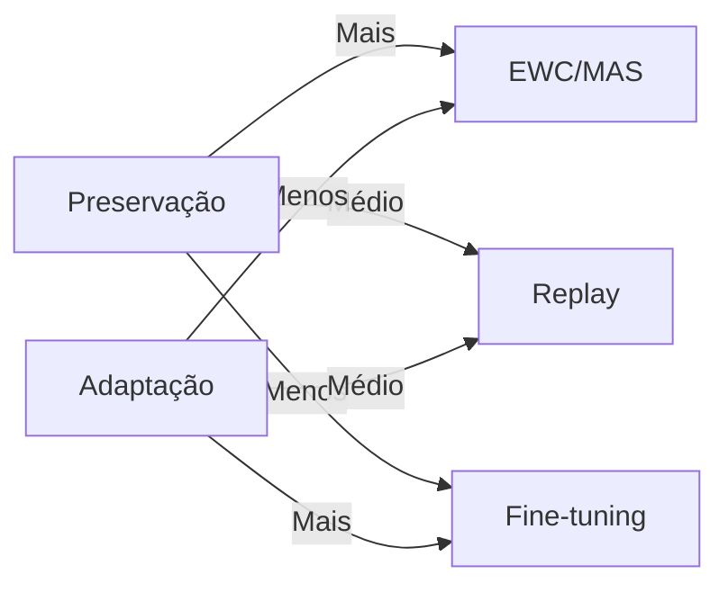
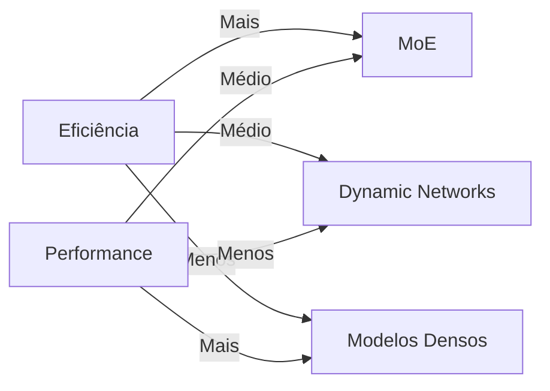
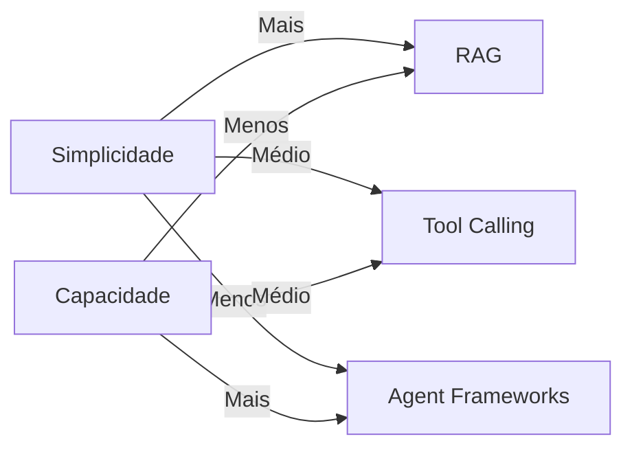
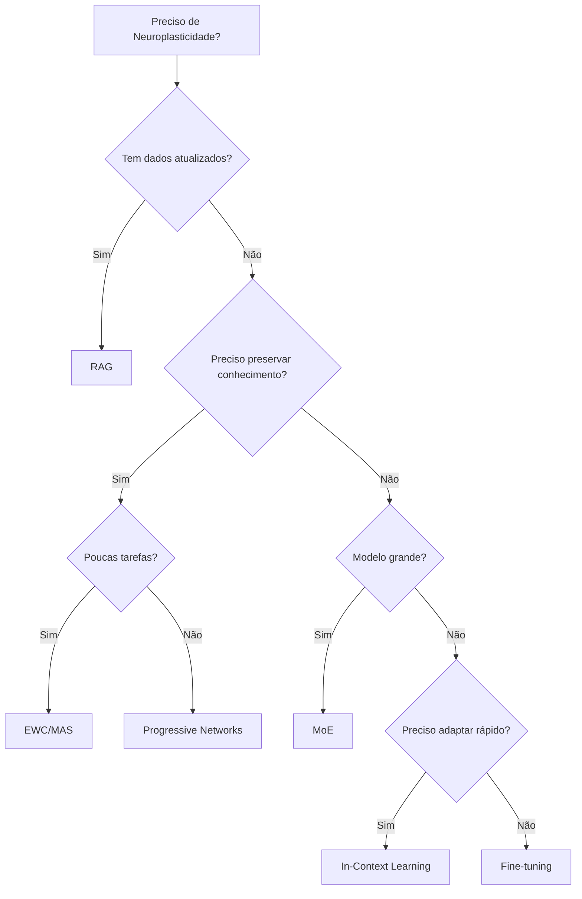

# Guia Comparativo: Quando Usar Cada Técnica

## Introdução

Este guia ajuda a decidir qual técnica usar em diferentes cenários, apresentando trade-offs, critérios de decisão e matrizes comparativas.

## Matriz de Decisão Rápida

### Por Objetivo Principal

| Objetivo | Técnica Recomendada | Alternativas |
|----------|---------------------|--------------|
| Acesso a dados atualizados | **RAG** | Tool Calling, External Memory |
| Preservar conhecimento antigo | **EWC/MAS** | Progressive Networks, Replay |
| Especialização por domínio | **MoE** | Fine-tuning, Domain Adaptation |
| Adaptação rápida a novas tarefas | **In-Context Learning** | Few-Shot Learning, Prompt Tuning |
| Aprendizado contínuo | **EWC + Replay** | Progressive Networks, MAS |
| Eficiência computacional | **MoE** | Dynamic Networks, Early Exit |
| Memória externa | **RAG** | Vector Databases, Memory Networks |
| Integração com ferramentas | **Tool Calling** | Agent Frameworks, MCP |

### Por Recursos Disponíveis

| Recursos | Técnica Recomendada | Por quê |
|----------|---------------------|---------|
| Poucos dados | **In-Context Learning** | Não requer treinamento |
| Pouco poder computacional | **RAG** | Não requer retreino |
| Pouco armazenamento | **EWC/MAS** | Não requer dados antigos |
| Muitos dados | **Fine-tuning** | Aproveita dados disponíveis |
| Hardware especializado | **MoE** | Escala eficientemente |
| Infraestrutura distribuída | **MoE** | Distribui bem |

## Comparação Detalhada

### Memória Externa

#### RAG vs. External Memory Networks

| Critério | RAG | Memory Networks |
|----------|-----|----------------|
| **Facilidade** | ✅ Muito fácil | ⚠️ Complexo |
| **Escalabilidade** | ✅ Muito alta | ⚠️ Limitada |
| **Atualização** | ✅ Fácil | ❌ Difícil |
| **Interpretabilidade** | ✅ Alta | ⚠️ Média |
| **Custo** | ✅ Baixo | ⚠️ Médio |
| **Quando usar** | Acesso a documentos | Aprendizado de padrões temporais |

**Recomendação**: Use **RAG** para maioria dos casos. Memory Networks apenas para casos específicos.

### Preservação de Conhecimento

#### EWC vs. MAS vs. Progressive Networks

| Critério | EWC | MAS | Progressive Networks |
|----------|-----|-----|----------------------|
| **Facilidade** | ✅ Fácil | ✅ Fácil | ⚠️ Média |
| **Eficácia** | ✅ Boa | ✅ Boa | ✅ Muito boa |
| **Escalabilidade** | ⚠️ Média | ⚠️ Média | ❌ Baixa |
| **Custo** | ✅ Baixo | ✅ Baixo | ❌ Alto (crescimento) |
| **Quando usar** | Poucas tarefas | Poucas tarefas | Muitas tarefas pequenas |

**Recomendação**: 
- **EWC/MAS** para poucas tarefas (< 10)
- **Progressive Networks** para muitas tarefas pequenas
- **Replay** para casos intermediários

### Arquiteturas Adaptativas

#### MoE vs. Dynamic Networks vs. NAS

| Critério | MoE | Dynamic Networks | NAS |
|----------|-----|------------------|-----|
| **Maturidade** | ✅ Muito maduro | ⚠️ Experimental | ⚠️ Experimental |
| **Escalabilidade** | ✅ Muito alta | ⚠️ Média | ❌ Baixa |
| **Eficiência** | ✅ Muito alta | ✅ Alta | ❌ Baixa |
| **Custo** | ✅ Baixo (runtime) | ✅ Baixo | ❌ Muito alto (search) |
| **Quando usar** | Modelos grandes | Eficiência adaptativa | Otimização de arquitetura |

**Recomendação**: 
- **MoE** para modelos grandes em produção
- **Dynamic Networks** para eficiência adaptativa
- **NAS** apenas para pesquisa/otimização

## Trade-offs Comuns

### Preservação vs. Adaptação

**Decisão**: Balance baseado em:
- Importância do conhecimento antigo
- Frequência de novas tarefas
- Disponibilidade de dados antigos

### Eficiência vs. Performance

**Decisão**: 
- **Eficiência crítica**: MoE
- **Performance crítica**: Modelos densos
- **Balance**: Dynamic Networks

### Simplicidade vs. Capacidade

**Decisão**:
- **Começando**: RAG
- **Intermediário**: Tool Calling
- **Avançado**: Agent Frameworks

## Fluxograma de Decisão

## Casos de Uso Específicos

### Caso 1: Chatbot com Conhecimento Atualizado

**Recomendação**: **RAG + Tool Calling**

**Por quê**:
- RAG para conhecimento estático
- Tool Calling para dados em tempo real
- Simples de implementar
- Escalável

### Caso 2: Modelo que Aprende Múltiplas Tarefas

**Recomendação**: **EWC + Replay**

**Por quê**:
- EWC preserva conhecimento importante
- Replay mantém performance
- Balance preservação/adaptação
- Escalável

### Caso 3: Modelo Grande com Especialização

**Recomendação**: **MoE**

**Por quê**:
- Escalável
- Especialização automática
- Eficiente computacionalmente
- Maduro

### Caso 4: Adaptação Rápida sem Retreino

**Recomendação**: **In-Context Learning + RAG**

**Por quê**:
- Sem retreino necessário
- Adaptação instantânea
- Acesso a conhecimento externo
- Eficiente

## Checklist de Decisão

Use este checklist para decidir:

- [ ] Preciso de dados atualizados? → RAG
- [ ] Preciso preservar conhecimento? → EWC/MAS
- [ ] Modelo muito grande? → MoE
- [ ] Adaptação rápida? → In-Context Learning
- [ ] Integração com ferramentas? → Tool Calling
- [ ] Múltiplas tarefas? → Continual Learning
- [ ] Eficiência crítica? → Dynamic Networks
- [ ] Simplicidade? → RAG + Fine-tuning

## Referências

Consulte os documentos específicos para mais detalhes:
- [RAG Systems](../04-memory-mechanisms/rag-systems.md)
- [Continual Learning](../02-continual-learning-techniques/continual-learning.md)
- [MoE](../03-adaptive-architectures/mixture-of-experts.md)
- [Tool Calling](../05-tool-integrations/tool-calling.md)

