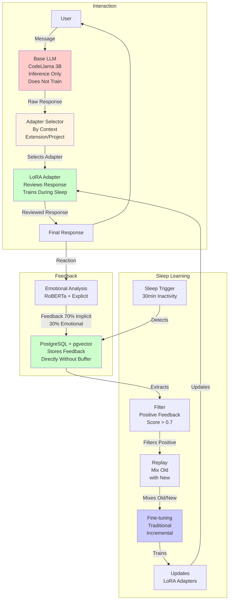

# npllm Detailed Architecture

**Date**: 2025-01-27  
**Version**: 1.0  
**Status**: ✅ Final Simplified Architecture

---

## 📋 Objective

This document defines the final simplified architecture of the npllm system, based on deep technical research and interactive decisions. The system was significantly simplified, removing unnecessary components and keeping only the essential.

---

## 🎯 Final Decisions

### ✅ Essential Components (6)

1. **Base LLM (CodeLlama 3B)**
   - Does not train (plug-and-play)
   - Can be replaced by any compatible LLM
   - Function: Main reasoning and code generation

2. **Adapter Selector**
   - Direct selection by context (file extension/project structure)
   - Does not train (only rules/heuristics)
   - Function: Selects appropriate adapter for context

3. **LoRA Adapters**
   - Trains only during sleep
   - Specialization by context (Python, Odoo, Django, etc.)
   - Function: Reviews and adjusts Base LLM responses

4. **PostgreSQL + pgvector**
   - Stores feedback and context
   - Enables semantic search
   - Function: Medium-term memory

5. **Emotional Analysis (RoBERTa)**
   - Captures user emotion (satisfaction, frustration, confidence)
   - Automatic analysis + explicit feedback when available
   - Function: Guides learning prioritizing satisfactory patterns

6. **Sleep System**
   - Consolidation during inactivity (30 minutes)
   - Traditional fine-tuning with example replay
   - Function: Updates LoRA Adapters with learned knowledge

### ❌ Removed Components (7)

1. **Modulator**: Direct adapter selection is sufficient
2. **Neuromodulated Attention**: Standard LLM attention is sufficient
3. **Cerebellum**: LoRA Adapters already do specialization
4. **RL PPO**: Supervised fine-tuning is sufficient
5. **Backpropamine**: Traditional fine-tuning is sufficient
6. **MAS**: Example replay is sufficient
7. **Replay Buffer**: Go directly to PostgreSQL, filter during sleep

---

## 🏗️ Complete Architecture

### System Diagram

**Legend**:
- **Red**: Base LLM (does not train)
- **Green**: Components that learn (Adapter, PostgreSQL, Fine-tuning)
- **Blue**: Consolidation process (sleep)
- **Light Yellow**: Selector (does not train, only rules)

---

## 🔄 Detailed Flows

### 1. Interaction (During Use)

**What Happens**:
1. User sends message/query
2. Base LLM processes (inference only, does not train)
3. Selector detects context (file extension, project structure)
4. Selector selects appropriate adapter (e.g., `.py` → Python adapter, `odoo/` → Odoo adapter)
5. Adapter reviews/adjusts response
6. Final response is presented

**No Training During Use**

---

### 2. Feedback (During Use)

**What Happens**:
1. User receives response
2. System captures reaction (automatic sentiment analysis)
3. System captures explicit feedback if available (👍/👎, rating)
4. System integrates feedback (70% implicit + 30% emotional)
5. Feedback goes directly to PostgreSQL (no buffer)

**No Filtering During Use**

---

### 3. Consolidation (Sleep)

**What Happens**:
1. System detects inactivity (30 minutes without interaction)
2. Extracts feedback from PostgreSQL
3. Filters only positive feedback (satisfaction/confidence, score > 0.7)
4. Mixes old examples with new (replay)
5. Traditional incremental fine-tuning
6. Updates LoRA Adapters

**Only Adapters Are Trained**

---

## 📊 Table: Final Components

| Component | Function | Trains? | When? | Status |
|-----------|----------|---------|-------|--------|
| **Base LLM** | Main reasoning | ❌ No | Never | ✅ Essential |
| **Adapter Selector** | Selection by context | ❌ No | Never (rules) | ✅ Essential |
| **LoRA Adapters** | Response review | ✅ Yes | Only during sleep | ✅ Essential |
| **PostgreSQL + pgvector** | Storage | ❌ No | Persistence | ✅ Essential |
| **Emotional Analysis** | Emotion capture | ❌ No | Inference only | ✅ Essential |
| **Sleep System** | Consolidation | ❌ No | Orchestration | ✅ Essential |
| **Filter** | Filters feedback | ❌ No | During sleep | ✅ Essential |
| **Replay** | Mixes examples | ❌ No | During sleep | ✅ Essential |
| **Fine-tuning** | Trains adapters | ❌ No | Orchestration | ✅ Essential |

---

## 🔧 Technical Details

### Adapter Selector

**Implementation**:
- Selection by file extension: `.py` → python, `.js` → javascript
- Selection by project structure: `odoo/` → odoo, `django/` → django
- Fallback: generic adapter

**Does Not Need Training**: Only rules/heuristics

---

### Feedback System

**Implementation**:
- 70% implicit feedback (accept/edit/delete)
- 30% emotional feedback (sentiment analysis or explicit)
- Direct storage to PostgreSQL

---

### Consolidation System (Sleep)

**Implementation**:
1. Detects inactivity (30 minutes)
2. Extracts feedback from PostgreSQL
3. Filters positive (score > 0.7)
4. Replay: mixes old with new examples
5. Traditional incremental fine-tuning
6. Updates LoRA Adapters

**Only Adapters Are Trained**: Base LLM is not touched

---

## 📊 Comparison: Before vs. After

### Before (Complex)

- **Components**: 10+ (Base LLM, Modulator, Cerebellum, Attention, LoRA, MAS, Replay Buffer, RL, Backpropamine, etc.)
- **Training**: During use (Backpropamine) + During sleep (Fine-tuning)
- **Complexity**: High, many interacting components
- **Overhead**: High, training during use

### After (Simplified)

- **Components**: 6 essential (Base LLM, Selector, LoRA Adapters, PostgreSQL, Emotional Analysis, Sleep System)
- **Training**: Only during sleep (Traditional fine-tuning)
- **Complexity**: Low, clear and simple components
- **Overhead**: Low, no training during use

---

## ✅ Benefits of Simplification

1. **Simplicity**: Fewer components, easier to understand and maintain
2. **Efficiency**: No overhead from training during use
3. **Effectiveness**: Based on technical research and proven practices
4. **Scalability**: Can evolve by adding components if necessary
5. **Maintainability**: Less code, fewer bugs, easier to debug

---

## 📚 Technical Justifications

### Why Remove Modulator?

- **LoRA Papers** (Hu et al., 2021): Multiple adapters can be selected by simple heuristics
- **AdapterHub** (Pfeiffer et al., 2020): Direct selection is industry standard
- **Common Practice**: Selection based on file extension/project structure is effective

### Why Remove Neuromodulated Attention?

- **Attention Is All You Need** (Vaswani et al., 2017): Standard attention is already very powerful
- **Fine-Tuning Papers**: Fine-tuning with RLHF is more effective than attention modulation
- **LoRA Papers**: LoRA adapts behavior indirectly, doesn't need explicit modulation

### Why Remove Cerebellum?

- **LoRA Papers** (Hu et al., 2021): LoRA allows specialization by task/domain
- **Parameter-Efficient Transfer Learning** (Houlsby et al., 2019): Adapters are sufficient for specialization
- **Continual Learning Papers**: LoRA adapters can learn incremental patterns

### Why Use Only Traditional Fine-tuning?

- **Fine-Tuning Papers**: Traditional fine-tuning is proven and stable
- **Differentiable Plasticity Papers** (Miconi et al., 2018): Still experimental for large LLMs
- **Common Practice**: For production, traditional fine-tuning is preferred

### Why Replay Instead of MAS?

- **Experience Replay Papers** (Rolnick et al., 2019): Replay is simpler than MAS
- **Continual Learning with LoRA**: LoRA + Replay is sufficient
- **Common Practice**: Replay is standard for continual learning

---

**Creation Date**: 2025-01-27  
**Last Update**: 2025-01-27  
**Status**: ✅ Final Simplified Architecture Defined

