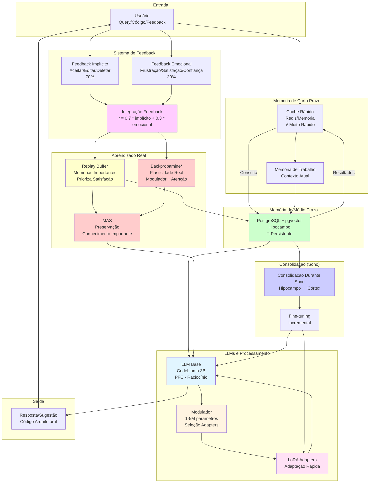
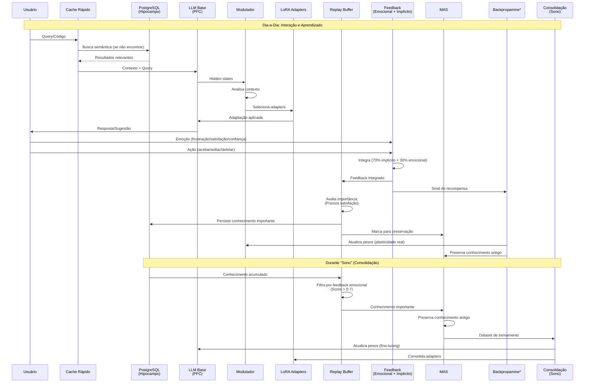
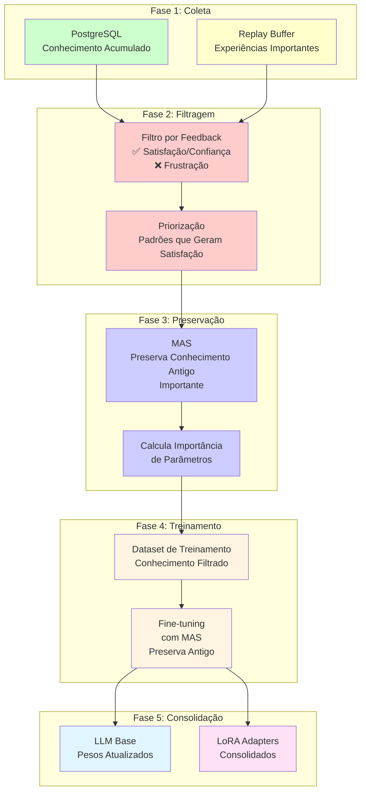

# Arquitetura de Aprendizado Real e Funcionamento do Dia-a-Dia

**Data**: 2025-01-27  
**Versão**: 1.0  
**Status**: 📊 Foco: Aprendizado Real + Funcionamento Diário

---

## 📋 Sumário Executivo

Este documento foca **apenas no aprendizado real e funcionamento do dia-a-dia**, sem integração com Linux. Inclui:

1. **Aprendizado Real**: Backpropamine, MAS, Replay
2. **Funcionamento Diário**: Interações, feedback, consolidação
3. **Sistema de Memória**: Curto, médio e longo prazo
4. **Sistema de Feedback**: Emocional + implícito
5. **Consolidação**: Durante sono

**Foco**: Cérebro (SNC) apenas, sem corpo (SNP/Linux).

---

## 🧠 Arquitetura Simplificada: Apenas Cérebro



**Legenda**:
- `*` = Componente experimental (Backpropamine)
- Cores diferentes = Diferentes subsistemas

---

## 🔄 Fluxo do Dia-a-Dia: Interação → Aprendizado → Consolidação



---

## 🧠 Componentes de Aprendizado Real

### 1. MAS (Memory Aware Synapses)

**Função**: Preserva conhecimento importante durante aprendizado

**Como Funciona**:
1. Calcula importância de cada parâmetro baseado em gradientes
2. Durante novo aprendizado, penaliza mudanças em parâmetros importantes
3. Preserva conhecimento antigo enquanto aprende novo

**Fórmula**:
```
Loss_total = Loss_novo + λ * Σ(importância * (peso_atual - peso_antigo)²)
```

**Onde é Usado**:
- Durante consolidação (sono)
- Durante fine-tuning incremental
- Preserva conhecimento consolidado na LLM Base

**Status**: ✅ Implementado (mas não testado)

---

### 2. Replay Buffer

**Função**: Reapresenta memórias importantes durante aprendizado

**Como Funciona**:
1. Armazena experiências com feedback positivo (satisfação/confiança)
2. Durante treinamento, mistura exemplos antigos com novos
3. Prioriza padrões que geram satisfação

**Critério de Seleção**:
- Score > 0.7: Mantém (importante)
- Score < -0.3: Marca como evitar (frustração)
- Entre -0.3 e 0.7: Descarta (não relevante)

**Onde é Usado**:
- Durante treinamento de adapters
- Durante consolidação (sono)
- Prioriza conhecimento que gera satisfação

**Status**: ✅ Implementado (mas não testado)

---

### 3. Backpropamine (Experimental)

**Função**: Mudanças reais de pesos baseadas em atividade

**Como Funciona**:
1. Cada conexão tem: peso base + peso plástico
2. Peso plástico adapta-se baseado em atividade
3. Treinável via backpropagation
4. Permite aprendizado contínuo sem esquecer

**Fórmula**:
```
Peso_Total = Peso_Base + (Peso_Plástico × Atividade)
```

**Onde é Usado** (Experimental):
- **Modulador**: Aprendizado rápido de seleção de adapters
- **Atenção**: Neuromodulação contextual
- **Cerebelo**: Padrões específicos (futuro)

**Status**: ⚠️ Experimental (Fase 2)

---

## 📊 Sistema de Feedback Integrado

### Feedback Implícito (70%)

**Fonte**: Ações do usuário

**Sinais**:
- **Aceitar código**: +1.0 (recompensa máxima)
- **Editar código**: +0.3 a +0.8 (depende da distância de edição)
- **Deletar código**: -0.5 (recompensa negativa)
- **Ignorar**: -0.1 (recompensa negativa leve)

**Características**:
- ✅ Objetivo, baseado em ação real
- ✅ Sinal forte e confiável
- ✅ Disponível imediatamente

---

### Feedback Emocional (30%)

**Fonte**: Emoções do usuário

**Sinais**:
- **Satisfação**: +0.8 a +1.0 (intensidade)
- **Confiança**: +0.9 a +1.0 (intensidade)
- **Frustração**: -1.0 a 0.0 (intensidade)
- **Neutro**: 0.0

**Características**:
- ⚠️ Subjetivo, mas importante para interação humana
- ⚠️ Sinal mais fraco que implícito
- ⚠️ Pode ser ruidoso

**Detecção**:
- Análise de sentimento (RoBERTa)
- Detecção de emoções específicas (futuro)
- Comentários do usuário
- Texto de feedback

---

### Integração de Feedback

**Fórmula**:
```
r_total = 0.7 * r_implícito + 0.3 * r_emocional
```

**Onde**:
- `r_implícito` = -1.0 a +1.0
- `r_emocional` = -1.0 a +1.0
- `r_total` = -1.0 a +1.0

**Uso**:
- **Replay Buffer**: Prioriza conhecimento com r_total > 0.7
- **RL PPO**: Recompensa para treinar Modulador
- **Backpropamine**: Sinal de recompensa para plasticidade
- **Consolidação**: Filtra conhecimento durante sono

---

## 💤 Consolidação Durante "Sono"

### Processo Completo



### Quando Acontece

1. **Período de Inatividade**: Sistema detecta que usuário não está usando
2. **Acúmulo de Conhecimento**: PostgreSQL tem conhecimento suficiente para consolidar
3. **Agendamento**: Periódico (ex: diário, semanal)

### O Que Acontece

1. **Coleta**: Extrai conhecimento do PostgreSQL
2. **Filtragem**: Filtra por feedback emocional (prioriza satisfação)
3. **Preservação**: MAS preserva conhecimento antigo importante
4. **Treinamento**: Fine-tuning incremental com MAS
5. **Consolidação**: Atualiza pesos da LLM Base e LoRA Adapters

---

## 🔄 Ciclo Completo: Dia-a-Dia

### Manhã: Primeiras Interações

1. **Usuário** faz query sobre arquitetura
2. **Cache** verifica se tem resposta
3. Se não, **PostgreSQL** busca semântica
4. **LLM Base** processa com contexto
5. **Modulador** seleciona adapters apropriados
6. **Resposta** é gerada e apresentada

### Durante o Dia: Aprendizado Contínuo

1. **Usuário** interage, recebe sugestões
2. **Feedback** é capturado (emocional + implícito)
3. **Replay Buffer** avalia importância
4. **Conhecimento importante** é persistido no PostgreSQL
5. **Backpropamine** (se ativo) atualiza Modulador
6. **MAS** preserva conhecimento antigo

### Noite: Consolidação (Sono)

1. **Sistema** detecta inatividade
2. **PostgreSQL** acumulou conhecimento suficiente
3. **Replay Buffer** filtra por feedback emocional
4. **MAS** preserva conhecimento antigo importante
5. **Fine-tuning** consolida conhecimento
6. **Pesos da LLM** são atualizados
7. **LoRA Adapters** são consolidados

### Próximo Dia: Conhecimento Consolidado

1. **LLM Base** tem conhecimento consolidado
2. **LoRA Adapters** estão atualizados
3. **Modulador** aprendeu padrões de seleção
4. **Sistema** está mais inteligente

---

## 📊 Tabela: Componentes de Aprendizado Real

| Componente | Função | Status | Prioridade |
|------------|--------|--------|------------|
| **MAS** | Preserva conhecimento importante | ✅ Implementado | 🟡 Alta |
| **Replay Buffer** | Reapresenta memórias importantes | ✅ Implementado | 🟡 Alta |
| **Backpropamine** | Plasticidade real (mudanças de pesos) | ⚠️ Experimental | 🔵 Baixa |
| **Feedback Emocional** | Prioriza conhecimento satisfatório | ⚠️ Básico | 🔴 Crítica |
| **Feedback Implícito** | Recompensa baseada em ações | ✅ Implementado | 🔴 Crítica |
| **Consolidação Sono** | Transferência hipocampo → córtex | ⚠️ Planejado | 🟡 Alta |

---

## 🎯 Resumo: Aprendizado Real e Funcionamento Diário

### Aprendizado Real

1. **MAS**: Preserva conhecimento importante durante aprendizado
2. **Replay**: Reapresenta memórias importantes, prioriza satisfação
3. **Backpropamine**: Mudanças reais de pesos (experimental, no Modulador)

### Funcionamento Diário

1. **Interação**: Usuário → Cache → PostgreSQL → LLM → Resposta
2. **Feedback**: Emocional (30%) + Implícito (70%) → Replay → PostgreSQL
3. **Aprendizado**: Backpropamine atualiza Modulador, MAS preserva
4. **Consolidação**: Durante sono, conhecimento vai para pesos da LLM

### Fluxo Contínuo

```
Interação → Feedback → Aprendizado → Consolidação → Melhoria
    ↓           ↓            ↓              ↓            ↓
  Query    Emoção +    Backpropamine    Sono      LLM Mais
  Código   Ação        + MAS + Replay            Inteligente
```

---

## 🔬 Detalhamento Técnico

### MAS: Como Preserva Conhecimento

```python
def compute_importance(model, dataloader):
    """
    Calcula importância de parâmetros baseado em gradientes
    """
    importance = {}
    for name, param in model.named_parameters():
        if param.requires_grad:
            importance[name] = torch.zeros_like(param)
    
    for batch in dataloader:
        loss = compute_loss(model, batch)
        loss.backward()
        
        # Acumula magnitude dos gradientes
        for name, param in model.named_parameters():
            if param.requires_grad and param.grad is not None:
                importance[name] += param.grad.abs()
    
    return importance

def mas_regularization_loss(model, importance, old_params, lambda_reg=0.5):
    """
    Calcula loss de regularização MAS
    """
    reg_loss = 0.0
    for name, param in model.named_parameters():
        if name in importance and name in old_params:
            diff = param - old_params[name]
            reg_loss += (importance[name] * diff.pow(2)).sum()
    
    return lambda_reg * reg_loss
```

### Replay: Como Prioriza Satisfação

```python
def decide_persistence(experience, emotional_feedback, implicit_feedback):
    """
    Decide se experiência deve ser persistida baseado em feedback
    """
    # Score emocional
    emotional_score = 0.0
    if emotional_feedback.sentiment == "satisfaction":
        emotional_score = 0.8 + (emotional_feedback.intensity * 0.2)
    elif emotional_feedback.sentiment == "confidence":
        emotional_score = 0.9 + (emotional_feedback.intensity * 0.1)
    elif emotional_feedback.sentiment == "frustration":
        emotional_score = 0.0 - (emotional_feedback.intensity * 0.5)
    
    # Score implícito
    implicit_score = 0.0
    if implicit_feedback.action == "accept":
        implicit_score = 1.0
    elif implicit_feedback.action == "edit":
        implicit_score = 0.5 - (implicit_feedback.edit_distance * 0.3)
    elif implicit_feedback.action == "delete":
        implicit_score = -0.5
    
    # Score combinado (70% implícito + 30% emocional)
    combined_score = (0.7 * implicit_score) + (0.3 * emotional_score)
    
    # Decisão
    if combined_score > 0.7:
        return "keep", combined_score
    elif combined_score < -0.3:
        return "avoid", combined_score
    else:
        return "discard", combined_score
```

### Backpropamine: Como Funciona (Experimental)

```python
class PlasticLayer(nn.Module):
    """
    Camada com plasticidade diferenciável
    """
    def __init__(self, in_features, out_features):
        super().__init__()
        # Peso base (estático)
        self.base_weight = nn.Parameter(torch.randn(out_features, in_features))
        # Peso plástico (adaptável)
        self.plastic_weight = nn.Parameter(torch.randn(out_features, in_features))
        # Atividade (acumulada)
        self.activity = torch.zeros(out_features, in_features)
    
    def forward(self, x):
        # Atualiza atividade baseada em entrada
        self.activity = 0.9 * self.activity + 0.1 * (x.unsqueeze(0) * x.unsqueeze(1))
        
        # Peso total = base + plástico * atividade
        weight = self.base_weight + self.plastic_weight * self.activity
        
        return F.linear(x, weight)
```

---

## 🎯 Conclusão

### Foco: Aprendizado Real e Funcionamento Diário

Este documento foca **apenas no cérebro** (aprendizado real e funcionamento diário), sem integração com Linux:

1. **Aprendizado Real**:
   - MAS preserva conhecimento importante
   - Replay prioriza satisfação
   - Backpropamine permite mudanças reais (experimental)

2. **Funcionamento Diário**:
   - Interação → Feedback → Aprendizado → Consolidação
   - Ciclo contínuo de melhoria
   - Sistema fica mais inteligente com o tempo

3. **Sem Integração Linux**:
   - Foco apenas no cérebro (SNC)
   - Sem sistema sensorial/motor
   - Apenas aprendizado e consolidação

---

**Data de Criação**: 2025-01-27  
**Última Atualização**: 2025-01-27  
**Status**: ✅ Completo - Foco: Aprendizado Real + Funcionamento Diário

