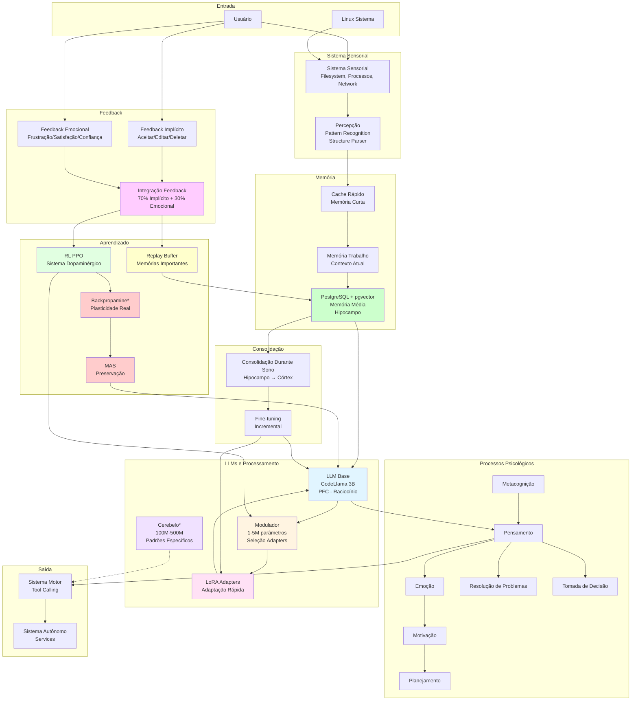
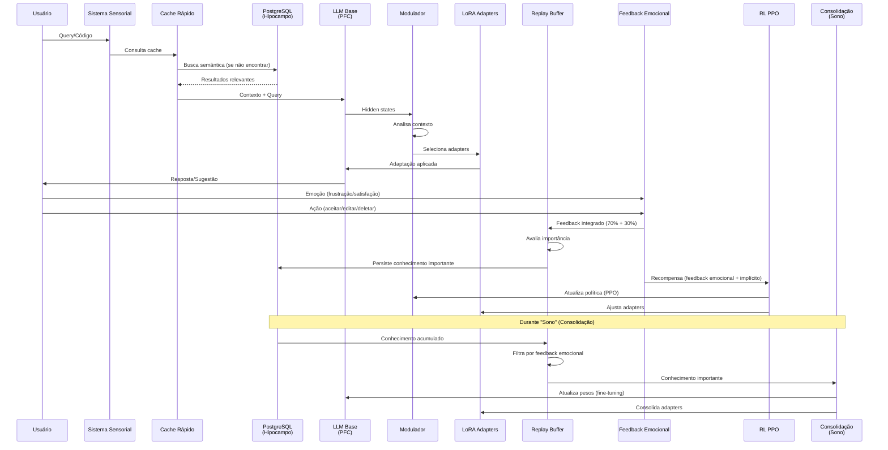

# Arquitetura Completa do Sistema npllm

**Data**: 2025-01-27  
**Versão**: 1.0  
**Status**: 📊 Arquitetura Completa Definida

---

## 📋 Sumário Executivo

Este documento apresenta a **arquitetura completa** do sistema npllm, incluindo:

1. **Todas as LLMs utilizadas** e suas funções
2. **Sistema de memória** (curto, médio, longo prazo)
3. **Sistema de aprendizado** (MAS, Replay, Backpropamine)
4. **Sistema de feedback** (emocional + implícito)
5. **Sistema de consolidação** (sono)
6. **Processos psicológicos** integrados
7. **Fluxo completo** de interação

---

## 🧠 LLMs Utilizadas no Sistema

### 1. LLM Base (CodeLlama 3B) - Córtex Pré-Frontal (PFC)

**Função**: Raciocínio principal, planejamento, controle executivo

**Características**:
- ✅ **Modelo**: CodeLlama 3B quantizado 4-bit
- ✅ **Tamanho**: ~3 bilhões de parâmetros
- ✅ **Status**: Estático (não muda durante uso)
- ✅ **Atualização**: Apenas durante "sono" (consolidação)
- ✅ **Uso**: Processamento principal de código e arquitetura

**Onde é Usado**:
- Geração de código arquitetural
- Análise de padrões
- Sugestões arquiteturais
- Raciocínio e planejamento

**Integração**:
- Recebe contexto do RAG (Hipocampo)
- Usa LoRA Adapters para adaptação rápida
- Modulado pelo Modulador (seleção de adapters)

---

### 2. Modulador (1-5M parâmetros) - Córtex Pré-Frontal (PFC)

**Função**: Seleção e modulação de adapters baseado em contexto

**Características**:
- ✅ **Modelo**: Pequeno (1-5M parâmetros)
- ✅ **Tamanho**: Muito menor que LLM Base
- ✅ **Status**: Pode usar Backpropamine (experimental)
- ✅ **Atualização**: Durante uso (se Backpropamine) ou durante sono
- ✅ **Uso**: Decisão de qual adapter usar

**Onde é Usado**:
- Análise de hidden states do LLM Base
- Geração de sinais de modulação
- Seleção de adapters apropriados
- Controle de intensidade de adaptação

**Integração**:
- Recebe hidden states do LLM Base (bottom-up)
- Gera sinais de modulação (top-down)
- Controla LoRA Adapters
- Treinado com RL (PPO)

---

### 3. Cerebelo (100M-500M parâmetros) - Experimental

**Função**: Padrões específicos, automatização, aprendizado rápido

**Características**:
- ⚠️ **Modelo**: Médio (100M-500M parâmetros)
- ⚠️ **Status**: Experimental (Fase 2)
- ⚠️ **Atualização**: Backpropamine (mudanças reais de pesos)
- ⚠️ **Uso**: Padrões específicos, automatização

**Onde é Usado**:
- Padrões arquiteturais específicos
- Automatização de tarefas repetitivas
- Aprendizado rápido de novos padrões
- Integração com sistema motor

**Integração**:
- Recebe padrões do sistema sensorial
- Aprende rapidamente com Backpropamine
- Integra com sistema motor (tool calling)
- Consolida durante sono

---

### 4. LoRA Adapters (pesos adicionais) - Adaptação Rápida

**Função**: Adaptação rápida a contextos específicos

**Características**:
- ✅ **Modelo**: Pesos adicionais (não modelo completo)
- ✅ **Tamanho**: Muito menor que modelo base
- ✅ **Status**: Múltiplos adapters por contexto
- ✅ **Atualização**: Durante uso (treinamento incremental)
- ✅ **Uso**: Especialização por contexto (ex: Odoo, Django, React)

**Onde é Usado**:
- Adaptação a contextos específicos
- Especialização por projeto
- Aprendizado rápido sem mudar modelo base

**Integração**:
- Aplicados ao LLM Base
- Selecionados pelo Modulador
- Treinados com feedback emocional
- Consolidados durante sono

---

## 🏗️ Arquitetura Completa do Sistema

**Legenda**:
- `*` = Componente experimental (Backpropamine, Cerebelo)
- Cores diferentes = Diferentes subsistemas

---

## 🔄 Fluxo Completo: Interação → Processamento → Consolidação

---

## 📊 Detalhamento: Componentes e Suas Funções

### 1. Sistema de Memória (3 Níveis)

#### Memória de Curto Prazo (Cache Rápido)
- **Componente**: Redis/Memória
- **Função**: Consultas rápidas, contexto imediato
- **Velocidade**: ⚡ Muito rápida
- **Persistência**: ⚠️ Volátil
- **Consulta**: PostgreSQL quando necessário

#### Memória de Médio Prazo (Hipocampo)
- **Componente**: PostgreSQL + pgvector
- **Função**: Consolida conhecimento, busca semântica
- **Velocidade**: 🐢 Rápida
- **Persistência**: ✅ Persistente
- **Consolidação**: Durante sono → Longo prazo

#### Memória de Longo Prazo (Córtex)
- **Componente**: Pesos da LLM Base + LoRA Adapters
- **Função**: Conhecimento consolidado
- **Velocidade**: 🐌 Lenta (consulta)
- **Persistência**: ✅ Persistente
- **Atualização**: Durante sono (consolidação)

---

### 2. Sistema de Aprendizado

#### MAS (Memory Aware Synapses)
- **Função**: Preserva conhecimento importante
- **Mecanismo**: Calcula importância de parâmetros
- **Uso**: Durante consolidação (sono)
- **Status**: ✅ Implementado

#### Replay Buffer
- **Função**: Reapresenta memórias importantes
- **Mecanismo**: Armazena experiências com feedback positivo
- **Uso**: Durante treinamento
- **Status**: ✅ Implementado

#### Backpropamine (Experimental)
- **Função**: Mudanças reais de pesos
- **Mecanismo**: Plasticidade sináptica diferenciável
- **Uso**: Modulador, Cerebelo, Atenção
- **Status**: ⚠️ Experimental (Fase 2)

#### RL PPO (Sistema Dopaminérgico)
- **Função**: Aprendizado por reforço
- **Mecanismo**: TD Learning com feedback integrado
- **Uso**: Treinamento do Modulador
- **Status**: ✅ Implementado

---

### 3. Sistema de Feedback

#### Feedback Implícito (70%)
- **Fonte**: Ações do usuário
- **Sinais**: Aceitar (+1.0), Editar (+0.3 a +0.8), Deletar (-0.5)
- **Uso**: Recompensa primária no RL

#### Feedback Emocional (30%)
- **Fonte**: Emoções do usuário
- **Sinais**: Satisfação (+0.8 a +1.0), Confiança (+0.9 a +1.0), Frustração (-1.0 a 0.0)
- **Uso**: Recompensa secundária no RL, priorização no Replay

#### Integração
- **Fórmula**: `r_total = 0.7 * r_implícito + 0.3 * r_emocional`
- **Uso**: Replay Buffer, RL, Consolidação

---

### 4. Sistema de Consolidação (Sono)

#### Processo
1. **Coleta**: Extrai conhecimento do PostgreSQL
2. **Filtragem**: Filtra por feedback emocional (prioriza satisfação)
3. **Preservação**: MAS preserva conhecimento antigo importante
4. **Treinamento**: Fine-tuning incremental
5. **Armazenamento**: Atualiza pesos da LLM Base e LoRA Adapters

#### Quando Acontece
- Durante período de inatividade
- Após acumular conhecimento suficiente
- Agendado periodicamente

---

## 🎯 Resumo: Quantas LLMs e Onde

| LLM | Tamanho | Função | Onde Usado | Atualização |
|-----|---------|--------|------------|-------------|
| **LLM Base** | 3B | Raciocínio principal | PFC, processamento principal | Durante sono |
| **Modulador** | 1-5M | Seleção de adapters | PFC, controle de adapters | Durante uso (se Backpropamine) ou sono |
| **Cerebelo** | 100M-500M | Padrões específicos | Automatização, padrões | Backpropamine (experimental) |
| **LoRA Adapters** | Pesos adicionais | Adaptação rápida | Especialização por contexto | Durante uso e sono |

**Total**: 2-3 modelos principais + múltiplos adapters

---

## 🔄 Fluxo Detalhado: Como Tudo Funciona Juntos

### Fase 1: Interação

1. **Usuário faz query/código**
2. **Sistema Sensorial** coleta dados
3. **Cache Rápido** verifica se tem resposta
4. Se não, **PostgreSQL** busca semântica
5. **LLM Base** recebe contexto + query
6. **Modulador** analisa e seleciona adapters
7. **LoRA Adapters** adaptam resposta
8. **LLM Base** gera resposta final

### Fase 2: Feedback

1. **Usuário** fornece feedback (emocional + implícito)
2. **Sistema de Feedback** integra (70% + 30%)
3. **Replay Buffer** avalia importância
4. **RL PPO** atualiza política do Modulador
5. **Conhecimento importante** é persistido no PostgreSQL

### Fase 3: Consolidação (Sono)

1. **PostgreSQL** acumula conhecimento
2. **Replay Buffer** filtra por feedback emocional
3. **MAS** preserva conhecimento antigo importante
4. **Fine-tuning** consolida conhecimento
5. **Pesos da LLM** são atualizados
6. **LoRA Adapters** são consolidados

---

## 📊 Tabela Comparativa: Componentes do Sistema

| Componente | Tipo | Função | Status | Prioridade |
|------------|------|--------|--------|------------|
| **LLM Base** | Modelo | Raciocínio principal | ✅ Implementado | 🔴 Crítica |
| **Modulador** | Modelo Pequeno | Seleção adapters | ✅ Implementado | 🔴 Crítica |
| **LoRA Adapters** | Pesos | Adaptação rápida | ✅ Implementado | 🔴 Crítica |
| **Cerebelo** | Modelo Médio | Padrões específicos | ⚠️ Experimental | 🟡 Alta |
| **RAG** | Memória | Busca semântica | ✅ Implementado | 🔴 Crítica |
| **MAS** | Aprendizado | Preservação | ✅ Implementado | 🟡 Alta |
| **Replay** | Aprendizado | Memórias importantes | ✅ Implementado | 🟡 Alta |
| **Backpropamine** | Aprendizado | Plasticidade real | ⚠️ Experimental | 🔵 Baixa |
| **RL PPO** | Aprendizado | Sistema dopaminérgico | ✅ Implementado | 🟡 Alta |
| **Feedback Emocional** | Feedback | Priorização | ⚠️ Básico | 🔴 Crítica |
| **Consolidação Sono** | Consolidação | Transferência conhecimento | ⚠️ Planejado | 🟡 Alta |

---

## 🎯 Conclusão

### Arquitetura Completa

O sistema npllm utiliza:

1. **2-3 modelos principais**:
   - LLM Base (3B) - Raciocínio principal
   - Modulador (1-5M) - Seleção de adapters
   - Cerebelo (100M-500M) - Padrões específicos (experimental)

2. **Múltiplos LoRA Adapters**:
   - Adaptação rápida por contexto
   - Especialização por projeto

3. **Sistema de memória hierárquica**:
   - Curto prazo (cache)
   - Médio prazo (PostgreSQL)
   - Longo prazo (pesos da LLM)

4. **Sistema de aprendizado integrado**:
   - MAS (preservação)
   - Replay (memórias importantes)
   - Backpropamine (plasticidade real - experimental)
   - RL PPO (sistema dopaminérgico)

5. **Sistema de feedback emocional**:
   - Feedback implícito (70%)
   - Feedback emocional (30%)
   - Integração para priorização

6. **Sistema de consolidação**:
   - Durante sono
   - Filtragem por feedback emocional
   - Transferência para pesos da LLM

---

**Data de Criação**: 2025-01-27  
**Última Atualização**: 2025-01-27  
**Status**: ✅ Completo - Arquitetura Completa Definida

