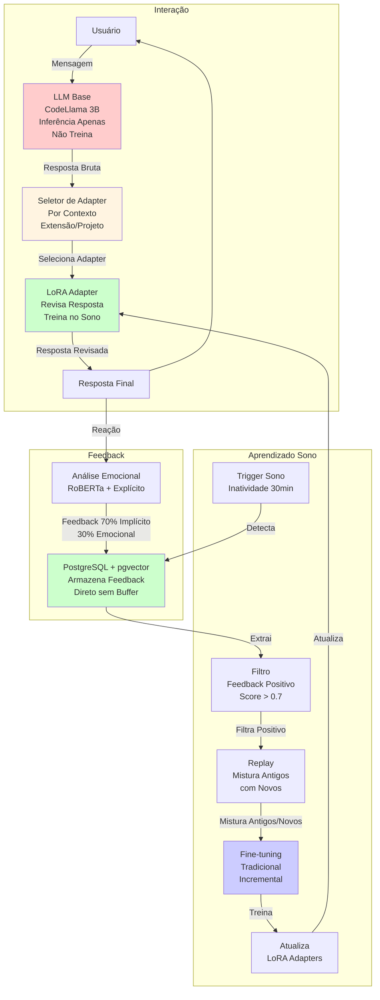
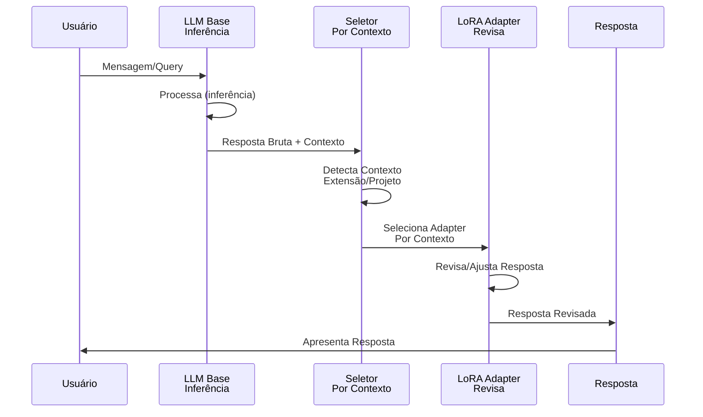
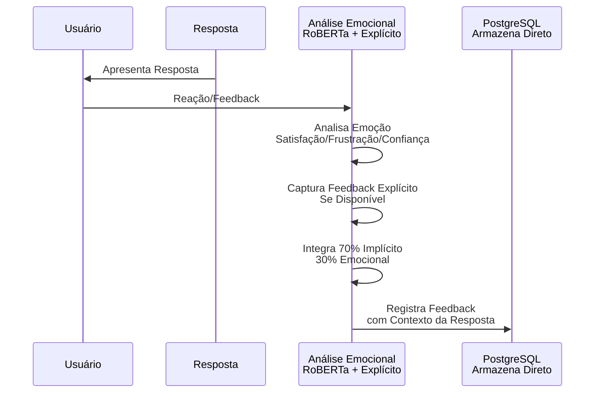
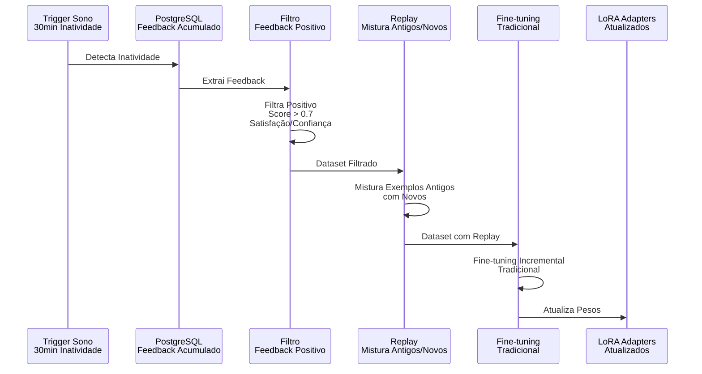

# Arquitetura Final do Sistema

**Data**: 2025-01-27  
**Versão**: 1.0  
**Status**: ✅ Arquitetura Simplificada Final

---

## 📋 Objetivo

Este documento define a arquitetura final simplificada do sistema npllm, baseada em pesquisa técnica aprofundada e decisões interativas. O sistema foi simplificado significativamente, removendo componentes desnecessários e mantendo apenas o essencial.

---

## 🎯 Decisões Finais

### ✅ Componentes Essenciais (6)

1. **LLM Base (CodeLlama 3B)**
   - Não treina (plug-and-play)
   - Pode ser trocada por qualquer LLM compatível
   - Função: Raciocínio principal e geração de código

2. **Seletor de Adapter**
   - Seleção direta por contexto (extensão de arquivo/estrutura de projeto)
   - Não treina (apenas regras/heurísticas)
   - Função: Seleciona adapter apropriado para o contexto

3. **LoRA Adapters**
   - Treina apenas durante sono
   - Especialização por contexto (Python, Odoo, Django, etc.)
   - Função: Revisa e ajusta respostas do LLM Base

4. **PostgreSQL + pgvector**
   - Armazena feedback e contexto
   - Permite busca semântica
   - Função: Memória de médio prazo

5. **Análise Emocional (RoBERTa)**
   - Captura emoção do usuário (satisfação, frustração, confiança)
   - Análise automática + feedback explícito quando disponível
   - Função: Guia aprendizado priorizando padrões satisfatórios

6. **Sistema de Sono**
   - Consolidação durante inatividade (30 minutos)
   - Fine-tuning tradicional com replay de exemplos
   - Função: Atualiza LoRA Adapters com conhecimento aprendido

### ❌ Componentes Removidos (7)

1. **Modulador**: Seleção direta de adapter é suficiente
2. **Atenção Neuromodulada**: Atenção padrão do LLM é suficiente
3. **Cerebelo**: LoRA Adapters já fazem especialização
4. **RL PPO**: Fine-tuning supervisionado é suficiente
5. **Backpropamine**: Fine-tuning tradicional é suficiente
6. **MAS**: Replay de exemplos é suficiente
7. **Replay Buffer**: Ir direto para PostgreSQL, filtrar no sono

---

## 🏗️ Arquitetura Completa

### Diagrama do Sistema



**Legenda**:
- **Vermelho**: LLM Base (não treina)
- **Verde**: Componentes que aprendem (Adapter, PostgreSQL, Fine-tuning)
- **Azul**: Processo de consolidação (sono)
- **Amarelo claro**: Seletor (não treina, apenas regras)

---

## 🔄 Fluxos Detalhados

### 1. Interação (Durante Uso)



**O Que Acontece**:
1. Usuário envia mensagem/query
2. LLM Base processa (inferência apenas, não treina)
3. Seletor detecta contexto (extensão de arquivo, estrutura de projeto)
4. Seletor seleciona adapter apropriado (ex: `.py` → Python adapter, `odoo/` → Odoo adapter)
5. Adapter revisa/ajusta resposta
6. Resposta final é apresentada

**Sem Treinamento Durante Uso**

---

### 2. Feedback (Durante Uso)



**O Que Acontece**:
1. Usuário recebe resposta
2. Sistema captura reação (análise automática de sentimento)
3. Sistema captura feedback explícito se disponível (👍/👎, rating)
4. Sistema integra feedback (70% implícito + 30% emocional)
5. Feedback vai direto para PostgreSQL (sem buffer)

**Sem Filtragem Durante Uso**

---

### 3. Consolidação (Sono)



**O Que Acontece**:
1. Sistema detecta inatividade (30 minutos sem interação)
2. Extrai feedback do PostgreSQL
3. Filtra apenas feedback positivo (satisfação/confiança, score > 0.7)
4. Mistura exemplos antigos com novos (replay)
5. Fine-tuning tradicional incremental
6. Atualiza LoRA Adapters

**Apenas Adapters São Treinados**

---

## 📊 Tabela: Componentes Finais

| Componente | Função | Treina? | Quando? | Status |
|------------|--------|---------|---------|--------|
| **LLM Base** | Raciocínio principal | ❌ Não | Nunca | ✅ Essencial |
| **Seletor de Adapter** | Seleção por contexto | ❌ Não | Nunca (regras) | ✅ Essencial |
| **LoRA Adapters** | Revisão de respostas | ✅ Sim | Apenas no sono | ✅ Essencial |
| **PostgreSQL + pgvector** | Armazenamento | ❌ Não | Persistência | ✅ Essencial |
| **Análise Emocional** | Captura emoção | ❌ Não | Inferência apenas | ✅ Essencial |
| **Sistema de Sono** | Consolidação | ❌ Não | Orquestração | ✅ Essencial |
| **Filtro** | Filtra feedback | ❌ Não | Durante sono | ✅ Essencial |
| **Replay** | Mistura exemplos | ❌ Não | Durante sono | ✅ Essencial |
| **Fine-tuning** | Treina adapters | ❌ Não | Orquestração | ✅ Essencial |

---

## 🔧 Detalhamento Técnico

### Seletor de Adapter

**Implementação**:
```python
def select_adapter(file_path: str, project_structure: dict) -> str:
    """
    Seleciona adapter baseado em contexto
    
    Heurísticas:
    - Extensão de arquivo: .py → python, .js → javascript
    - Estrutura de projeto: odoo/ → odoo, django/ → django
    - Fallback: generic adapter
    """
    # Por extensão
    if file_path.endswith('.py'):
        return 'python_adapter'
    elif file_path.endswith('.js'):
        return 'javascript_adapter'
    
    # Por estrutura de projeto
    if 'odoo' in project_structure:
        return 'odoo_adapter'
    elif 'django' in project_structure:
        return 'django_adapter'
    
    # Fallback
    return 'generic_adapter'
```

**Não Precisa Treinar**: Apenas regras/heurísticas

---

### Sistema de Feedback

**Implementação**:
```python
def capture_feedback(response: str, user_reaction: str, explicit_feedback: Optional[float]) -> dict:
    """
    Captura feedback do usuário
    
    Combina:
    - 70% feedback implícito (aceitar/editar/deletar)
    - 30% feedback emocional (análise de sentimento ou explícito)
    """
    # Análise automática
    emotion_score = roberta_sentiment_analyzer(user_reaction)
    
    # Feedback explícito (se disponível)
    if explicit_feedback is not None:
        emotion_score = explicit_feedback  # Prioriza explícito
    
    # Feedback implícito (aceitar/editar/deletar)
    implicit_score = calculate_implicit_feedback(user_action)
    
    # Integração
    total_score = 0.7 * implicit_score + 0.3 * emotion_score
    
    # Armazena direto no PostgreSQL
    postgres.store_feedback(response, total_score, context)
```

**Vai Direto para PostgreSQL**: Sem buffer intermediário

---

### Sistema de Consolidação (Sono)

**Implementação**:
```python
def consolidate_during_sleep():
    """
    Consolida conhecimento durante sono
    
    Processo:
    1. Detecta inatividade (30 minutos)
    2. Extrai feedback do PostgreSQL
    3. Filtra apenas positivo (score > 0.7)
    4. Mistura exemplos antigos com novos (replay)
    5. Fine-tuning tradicional incremental
    6. Atualiza LoRA Adapters
    """
    # 1. Detecta inatividade
    if not user_active_for(30 * 60):  # 30 minutos
        # 2. Extrai feedback
        feedbacks = postgres.get_all_feedbacks()
        
        # 3. Filtra positivo
        positive_feedbacks = [f for f in feedbacks if f['score'] > 0.7]
        
        # 4. Replay: mistura antigos com novos
        old_examples = postgres.get_important_examples()  # Exemplos antigos importantes
        dataset = mix_examples(old_examples, positive_feedbacks)
        
        # 5. Fine-tuning tradicional
        fine_tune_lora_adapters(dataset)
        
        # 6. Atualiza adapters
        update_adapters()
```

**Apenas Adapters São Treinados**: LLM Base não é tocada

---

## 📊 Comparação: Antes vs. Depois

### Antes (Complexo)

- **Componentes**: 10+ (LLM Base, Modulador, Cerebelo, Atenção, LoRA, MAS, Replay Buffer, RL, Backpropamine, etc.)
- **Treinamento**: Durante uso (Backpropamine) + Durante sono (Fine-tuning)
- **Complexidade**: Alta, muitos componentes interagindo
- **Overhead**: Alto, treinamento durante uso

### Depois (Simplificado)

- **Componentes**: 6 essenciais (LLM Base, Seletor, LoRA Adapters, PostgreSQL, Análise Emocional, Sistema de Sono)
- **Treinamento**: Apenas durante sono (Fine-tuning tradicional)
- **Complexidade**: Baixa, componentes claros e simples
- **Overhead**: Baixo, sem treinamento durante uso

---

## ✅ Benefícios da Simplificação

1. **Simplicidade**: Menos componentes, mais fácil de entender e manter
2. **Eficiência**: Sem overhead de treinamento durante uso
3. **Eficácia**: Baseado em pesquisa técnica e práticas comprovadas
4. **Escalabilidade**: Pode evoluir adicionando componentes se necessário
5. **Manutenibilidade**: Menos código, menos bugs, mais fácil de debugar

---

## 📚 Justificativas Técnicas

### Por Que Remover Modulador?

- **LoRA Papers** (Hu et al., 2021): Múltiplos adapters podem ser selecionados por heurísticas simples
- **AdapterHub** (Pfeiffer et al., 2020): Seleção direta é padrão da indústria
- **Prática Comum**: Seleção baseada em extensão de arquivo/estrutura de projeto é eficaz

### Por Que Remover Atenção Neuromodulada?

- **Attention Is All You Need** (Vaswani et al., 2017): Atenção padrão já é muito poderosa
- **Fine-Tuning Papers**: Fine-tuning com RLHF é mais eficaz que modulação de atenção
- **LoRA Papers**: LoRA adapta comportamento indiretamente, não precisa modulação explícita

### Por Que Remover Cerebelo?

- **LoRA Papers** (Hu et al., 2021): LoRA permite especialização por tarefa/domínio
- **Parameter-Efficient Transfer Learning** (Houlsby et al., 2019): Adapters são suficientes para especialização
- **Continual Learning Papers**: LoRA adapters podem aprender padrões incrementais

### Por Que Usar Apenas Fine-tuning Tradicional?

- **Fine-Tuning Papers**: Fine-tuning tradicional é comprovado e estável
- **Differentiable Plasticity Papers** (Miconi et al., 2018): Ainda experimental para LLMs grandes
- **Prática Comum**: Para produção, fine-tuning tradicional é preferido

### Por Que Replay ao Invés de MAS?

- **Experience Replay Papers** (Rolnick et al., 2019): Replay é mais simples que MAS
- **Continual Learning with LoRA**: LoRA + Replay é suficiente
- **Prática Comum**: Replay é padrão para continual learning

---

**Data de Criação**: 2025-01-27  
**Última Atualização**: 2025-01-27  
**Status**: ✅ Arquitetura Final Simplificada Definida

