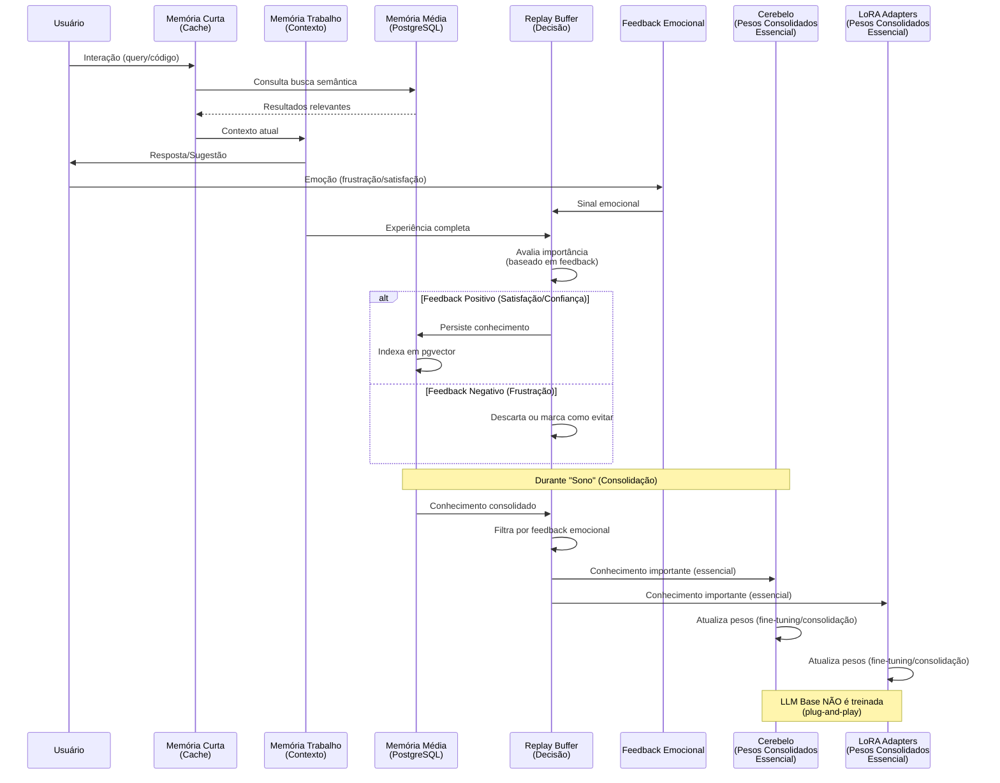
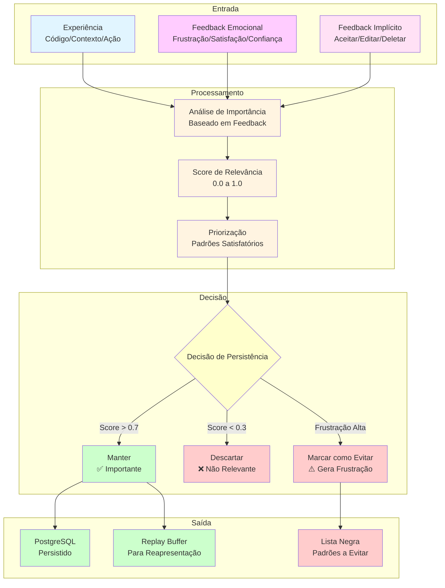
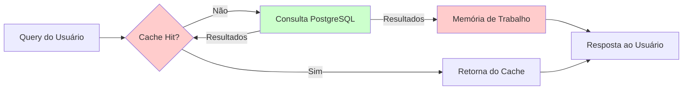
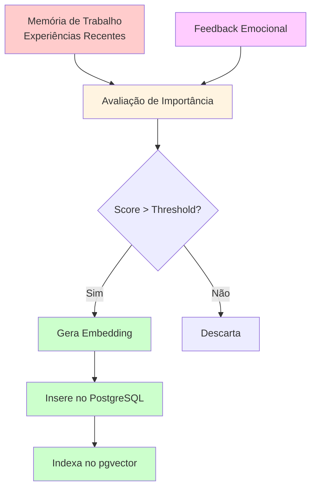
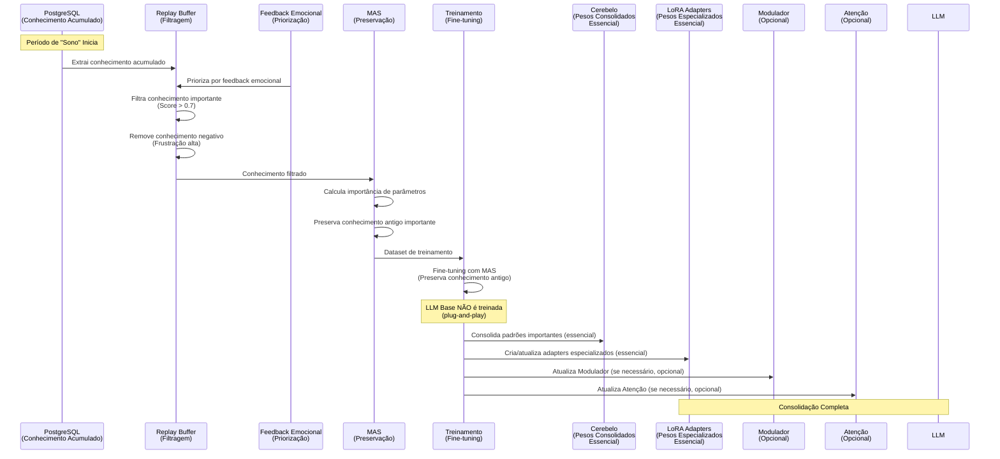
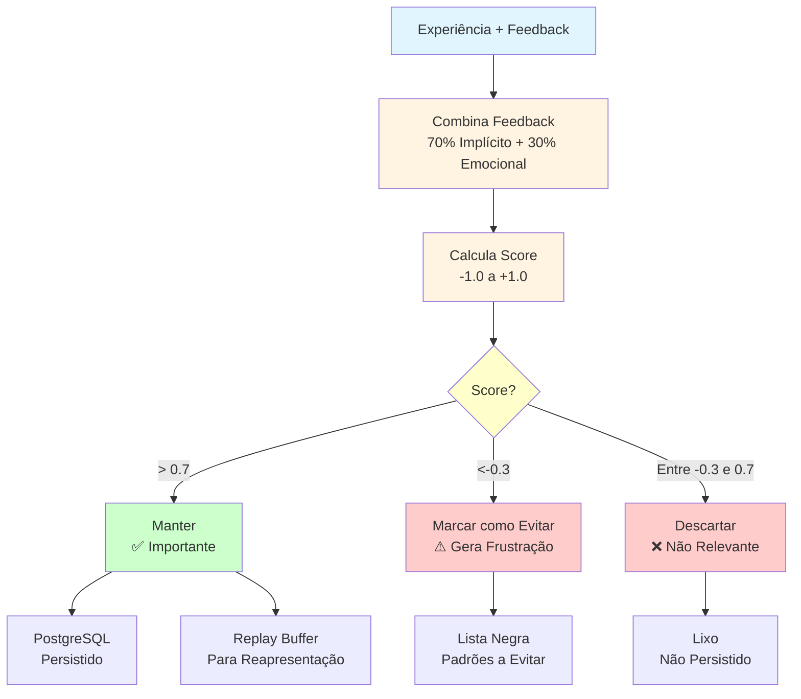

# Arquitetura de Memória e Consolidação

**Data**: 2025-01-27  
**Versão**: 1.0  
**Status**: 📊 Arquitetura Definida

---

## 📋 Sumário Executivo

Este documento diagrama a arquitetura de memória e consolidação do sistema npllm, incluindo:

1. **Memória de Curto Prazo**: Rápida, volátil, consulta PostgreSQL para eficiência
2. **Memória de Médio Prazo**: PostgreSQL + pgvector, consolida conhecimento
3. **Memória de Longo Prazo**: Cerebelo e LoRA Adapters, consolidados durante "sono" (LLM Base não é treinada)
4. **Replay com Feedback Emocional**: Decide o que persiste e o que é descartado

---

## 🧠 Arquitetura de Memória: Visão Geral

```mermaid
graph TB
    subgraph "Memória de Curto Prazo"
        CACHE[Cache Rápido<br/>Redis/Memória<br/>⚡ Muito Rápido<br/>⚠️ Esquece Rapidamente]
        WORKING[Memória de Trabalho<br/>Contexto Atual<br/>⚡ Rápido<br/>⚠️ Limitado]
    end
    
    subgraph "Memória de Médio Prazo"
        POSTGRES[PostgreSQL + pgvector<br/>Hippocampo<br/>💾 Persistente<br/>🔍 Busca Semântica]
    end
    
    subgraph "Memória de Longo Prazo"
        CEREBELO[Cerebelo<br/>100M-500M<br/>🧠 Pesos Consolidados<br/>💤 Durante Sono<br/>Essencial]
        LORA[LoRA Adapters<br/>🧠 Pesos Consolidados<br/>💤 Durante Sono<br/>Essencial]
        LLM_BASE[LLM Base<br/>CodeLlama 3B<br/>❌ NÃO Treinada<br/>Plug-and-Play]
    end
    
    subgraph "Sistema de Decisão"
        REPLAY[Replay Buffer<br/>Decisão de Persistência<br/>🎭 Feedback Emocional]
        FEEDBACK[Feedback Emocional<br/>Frustração/Satisfação/Confiança<br/>📊 Priorização]
    end
    
    CACHE -->|Consulta| POSTGRES
    WORKING -->|Consolida| POSTGRES
    POSTGRES -->|Busca| CACHE
    POSTGRES -->|Durante Sono| CEREBELO
    POSTGRES -->|Durante Sono| LORA
    
    Note over LLM_BASE: LLM Base NÃO é treinada<br/>(plug-and-play)
    
    FEEDBACK -->|Prioriza| REPLAY
    REPLAY -->|Decide| POSTGRES
    REPLAY -->|Filtra| CEREBELO
    REPLAY -->|Filtra| LORA
    
    style CACHE fill:#ffcccc
    style WORKING fill:#ffcccc
    style POSTGRES fill:#ccffcc
    style LLM_BASE fill:#ccccff
    style LORA fill:#ccccff
    style REPLAY fill:#ffffcc
    style FEEDBACK fill:#ffccff
```

---

## 🔄 Fluxo de Consolidação: Curto → Médio → Longo Prazo



---

## 💤 Processo de "Sono" (Consolidação)

```mermaid
graph LR
    subgraph "Fase 1: Coleta"
        POSTGRES[PostgreSQL<br/>Conhecimento Acumulado]
        REPLAY[Replay Buffer<br/>Experiências Importantes]
        FEEDBACK[Feedback Emocional<br/>Priorização]
    end
    
    subgraph "Fase 2: Filtragem"
        FILTER[Filtro por Feedback<br/>✅ Satisfação/Confiança<br/>❌ Frustração]
        PRIORITY[Priorização<br/>Padrões que Geram Satisfação]
    end
    
    subgraph "Fase 3: Consolidação"
        MAS[MAS<br/>Preserva Conhecimento Importante]
        TRAIN[Treinamento<br/>Fine-tuning/Consolidação]
    end
    
    subgraph "Fase 4: Armazenamento"
        CEREBELO[Cerebelo<br/>Pesos Consolidados<br/>Essencial]
        LORA[LoRA Adapters<br/>Pesos Especializados<br/>Essencial]
        MOD[Modulador<br/>Opcional]
        ATT[Atenção<br/>Opcional]
    end
    
    Note over TRAIN: LLM Base NÃO é treinada<br/>(plug-and-play)
    
    POSTGRES --> FILTER
    REPLAY --> FILTER
    FEEDBACK --> FILTER
    
    FILTER --> PRIORITY
    PRIORITY --> MAS
    MAS --> TRAIN
    TRAIN --> CEREBELO
    TRAIN --> LORA
    TRAIN --> MOD
    TRAIN --> ATT
    
    style POSTGRES fill:#ccffcc
    style REPLAY fill:#ffffcc
    style FEEDBACK fill:#ffccff
    style FILTER fill:#ffcccc
    style PRIORITY fill:#ffcccc
    style MAS fill:#ccccff
    style TRAIN fill:#ccccff
    style LLM_BASE fill:#ccccff
    style LORA fill:#ccccff
```

---

## 🎭 Replay com Feedback Emocional



---

## 📊 Detalhamento: Memória de Curto Prazo

### Componentes

1. **Cache Rápido (Redis/Memória)**
   - ⚡ **Velocidade**: Muito rápida (nanossegundos)
   - ⚠️ **Persistência**: Volátil, esquece rapidamente
   - 🎯 **Uso**: Consultas frequentes, contexto imediato
   - 📏 **Tamanho**: Limitado (MBs)

2. **Memória de Trabalho (Contexto Atual)**
   - ⚡ **Velocidade**: Rápida (milissegundos)
   - ⚠️ **Persistência**: Volátil, limitada a sessão
   - 🎯 **Uso**: Contexto da interação atual
   - 📏 **Tamanho**: Limitado (alguns MBs)

### Fluxo



---

## 💾 Detalhamento: Memória de Médio Prazo (PostgreSQL + pgvector)

### Componentes

1. **PostgreSQL**
   - 💾 **Persistência**: Disco, permanente
   - 🔍 **Busca**: SQL tradicional
   - 📊 **Estrutura**: Tabelas relacionais

2. **pgvector**
   - 🔍 **Busca Semântica**: Similaridade de embeddings
   - 📊 **Estrutura**: Vetores de alta dimensão
   - ⚡ **Performance**: Índices HNSW para busca rápida

### Estrutura de Dados

```sql
-- Tabela principal de conhecimento
CREATE TABLE code_knowledge (
    id SERIAL PRIMARY KEY,
    content TEXT NOT NULL,
    embedding vector(384),  -- Embedding semântico
    metadata JSONB,          -- Metadados (projeto, padrão, etc.)
    project_id VARCHAR(255),
    pattern_type VARCHAR(100), -- Padrão arquitetural
    created_at TIMESTAMP DEFAULT CURRENT_TIMESTAMP,
    updated_at TIMESTAMP DEFAULT CURRENT_TIMESTAMP,
    feedback_score FLOAT,     -- Score baseado em feedback emocional
    access_count INTEGER DEFAULT 0
);

-- Índice para busca semântica
CREATE INDEX code_knowledge_hnsw_idx
ON code_knowledge
USING hnsw (embedding vector_cosine_ops)
WITH (m = 16, ef_construction = 64);

-- Índice para feedback score
CREATE INDEX code_knowledge_feedback_idx
ON code_knowledge (feedback_score DESC);
```

### Fluxo de Consolidação



---

## 🧠 Detalhamento: Memória de Longo Prazo (Cerebelo e LoRA Adapters)

### Componentes

1. **Cerebelo (100M-500M)**
   - 🧠 **Pesos Consolidados**: Padrões específicos importantes
   - 💤 **Atualização**: Durante "sono" (consolidação) - ESSENCIAL
   - 📊 **Método**: Backpropamine + fine-tuning incremental
   - ✅ **Treinar**: Sim, mas apenas durante sono

2. **LoRA Adapters**
   - 🎯 **Pesos Especializados**: Contextos específicos
   - 💤 **Atualização**: Durante "sono" (consolidação) - ESSENCIAL
   - 📊 **Método**: Treinamento de adapters especializados
   - ✅ **Treinar**: Sim, mas apenas durante sono

3. **LLM Base (CodeLlama 3B)**
   - 🧠 **Pesos Estáticos**: Não são modificados
   - ❌ **Atualização**: NÃO é treinada (plug-and-play)
   - 📊 **Método**: Usa como está, pode ser trocada
   - ❌ **Treinar**: Não, permanece como modelo pré-treinado

### Processo de Consolidação Durante "Sono"



---

## 🎭 Detalhamento: Replay com Feedback Emocional

### Algoritmo de Decisão

```python
def decide_persistence(experience, emotional_feedback, implicit_feedback):
    """
    Decide se experiência deve ser persistida baseado em feedback emocional
    
    Args:
        experience: Experiência completa (código, contexto, ação)
        emotional_feedback: Feedback emocional (frustração, satisfação, confiança)
        implicit_feedback: Feedback implícito (aceitar, editar, deletar)
    
    Returns:
        decision: 'keep', 'discard', 'avoid'
        score: Score de relevância (0.0 a 1.0)
    """
    
    # Score baseado em feedback emocional
    emotional_score = 0.0
    if emotional_feedback.sentiment == "satisfaction":
        emotional_score = 0.8 + (emotional_feedback.intensity * 0.2)
    elif emotional_feedback.sentiment == "confidence":
        emotional_score = 0.9 + (emotional_feedback.intensity * 0.1)
    elif emotional_feedback.sentiment == "frustration":
        emotional_score = 0.0 - (emotional_feedback.intensity * 0.5)
    
    # Score baseado em feedback implícito
    implicit_score = 0.0
    if implicit_feedback.action == "accept":
        implicit_score = 1.0
    elif implicit_feedback.action == "edit":
        implicit_score = 0.5 - (implicit_feedback.edit_distance * 0.3)
    elif implicit_feedback.action == "delete":
        implicit_score = -0.5
    elif implicit_feedback.action == "ignore":
        implicit_score = -0.1
    
    # Score combinado (70% implícito + 30% emocional)
    combined_score = (0.7 * implicit_score) + (0.3 * emotional_score)
    
    # Decisão
    if combined_score > 0.7:
        return "keep", combined_score
    elif combined_score < -0.3:
        return "avoid", combined_score
    else:
        return "discard", combined_score
```

### Fluxo de Decisão



---

## 🔄 Fluxo Completo: Interação → Consolidação → Sono

```mermaid
graph TB
    subgraph "Fase 1: Interação"
        USER[Usuário] --> QUERY[Query/Código]
        QUERY --> CACHE{Cache Hit?}
        CACHE -->|Não| POSTGRES_QUERY[Consulta PostgreSQL]
        POSTGRES_QUERY -->|Resultados| WORKING[Memória de Trabalho]
        WORKING --> RESPONSE[Resposta/Sugestão]
        RESPONSE --> USER
    end
    
    subgraph "Fase 2: Feedback"
        USER --> FEEDBACK[Feedback Emocional<br/>+ Implícito]
        FEEDBACK --> REPLAY[Replay Buffer<br/>Avalia Importância]
        REPLAY --> DECIDE{Decisão}
        DECIDE -->|Importante| POSTGRES_STORE[Armazena no PostgreSQL]
        DECIDE -->|Negativo| BLACKLIST[Marca como Evitar]
    end
    
    subgraph "Fase 3: Sono (Consolidação)"
        TRIGGER[Trigger Sono<br/>Período de Inatividade] --> EXTRACT[Extrai do PostgreSQL]
        EXTRACT --> FILTER[Filtra por Feedback<br/>Score > 0.7]
        FILTER --> MAS[MAS<br/>Preserva Importante]
        MAS --> TRAIN[Treinamento<br/>Fine-tuning]
        TRAIN --> CEREBELO[Atualiza Cerebelo<br/>Essencial]
        TRAIN --> LORA[Atualiza LoRA Adapters<br/>Essencial]
        TRAIN --> MOD[Atualiza Modulador<br/>Opcional]
        TRAIN --> ATT[Atualiza Atenção<br/>Opcional]
        
        Note over TRAIN: LLM Base NÃO é treinada<br/>(plug-and-play)
    end
    
    POSTGRES_STORE --> EXTRACT
    
    style USER fill:#e1f5ff
    style CACHE fill:#ffcccc
    style POSTGRES_QUERY fill:#ccffcc
    style WORKING fill:#ffcccc
    style FEEDBACK fill:#ffccff
    style REPLAY fill:#ffffcc
    style POSTGRES_STORE fill:#ccffcc
    style FILTER fill:#fff4e1
    style MAS fill:#ccccff
    style TRAIN fill:#ccccff
    style LLM fill:#ccccff
```

---

## 📊 Tabela Comparativa: Tipos de Memória

| Característica | Curto Prazo | Médio Prazo | Longo Prazo |
|----------------|-------------|-------------|-------------|
| **Componente** | Cache/Working Memory | PostgreSQL + pgvector | Cerebelo + LoRA Adapters |
| **Velocidade** | ⚡ Muito Rápida | 🐢 Rápida | 🐌 Lenta (consulta) |
| **Persistência** | ⚠️ Volátil | ✅ Persistente | ✅ Persistente |
| **Capacidade** | 📏 Limitada (MBs) | 📊 Grande (GBs) | 🧠 Muito Grande (GBs) |
| **Busca** | ⚡ Instantânea | 🔍 Semântica (pgvector) | 🧠 Inferência (LLM) |
| **Atualização** | ⚡ Contínua | 🔄 Incremental | 💤 Durante Sono |
| **Esquece** | ⚠️ Rapidamente | ✅ Não esquece | ✅ Não esquece |
| **Uso** | Contexto imediato | Consolidação | Conhecimento consolidado |

---

## 🎯 Resumo da Arquitetura

### Fluxo Principal

1. **Interação**:
   - Usuário faz query/código
   - Sistema consulta cache (curto prazo)
   - Se não encontrar, consulta PostgreSQL (médio prazo)
   - Responde usando contexto atual (trabalho)

2. **Feedback**:
   - Usuário fornece feedback emocional (frustração/satisfação/confiança)
   - Sistema captura feedback implícito (aceitar/editar/deletar)
   - Replay Buffer avalia importância (70% implícito + 30% emocional)

3. **Persistência**:
   - Se importante (score > 0.7): Persiste no PostgreSQL
   - Se negativo (score < -0.3): Marca como evitar
   - Se neutro: Descarta

4. **Consolidação (Sono)**:
   - Durante período de inatividade
   - Extrai conhecimento do PostgreSQL
   - Filtra por feedback emocional (prioriza satisfação)
   - Usa MAS para preservar conhecimento importante
   - Treina/consolida apenas Cerebelo e LoRA Adapters (essencial)
   - LLM Base NÃO é treinada (plug-and-play)

### Decisões de Design

- ✅ **PostgreSQL + pgvector**: Memória de médio prazo persistente
- ✅ **Cache rápido**: Memória de curto prazo volátil
- ✅ **Feedback emocional**: Prioriza conhecimento que gera satisfação
- ✅ **Replay**: Filtra o que vai ser persistido
- ✅ **Sono**: Consolida conhecimento importante apenas em Cerebelo e LoRA Adapters (não na LLM Base)
- ✅ **MAS**: Preserva conhecimento antigo durante consolidação

---

**Data de Criação**: 2025-01-27  
**Última Atualização**: 2025-01-27  
**Status**: ✅ Completo - Arquitetura Definida

