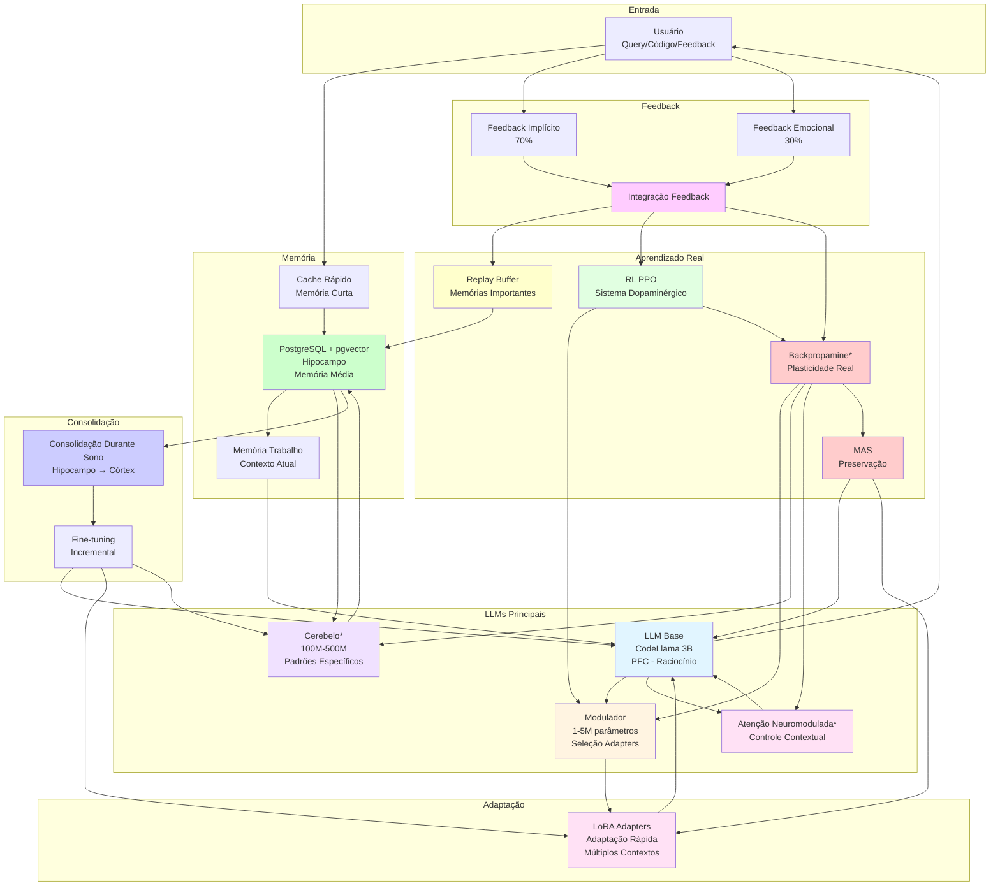
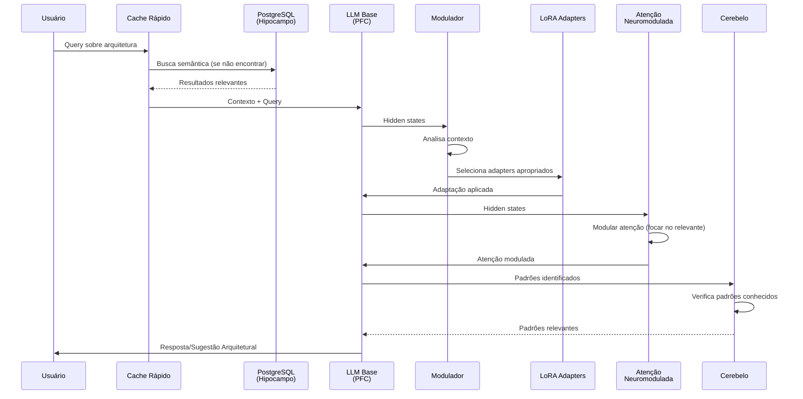
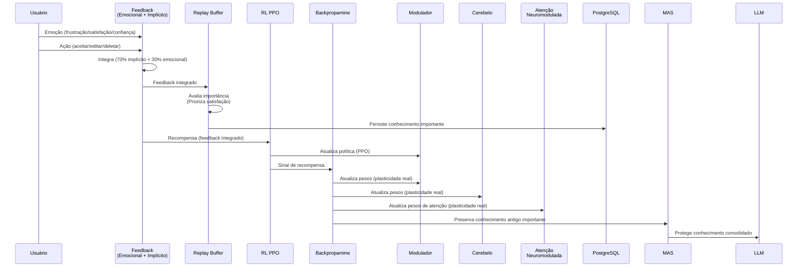
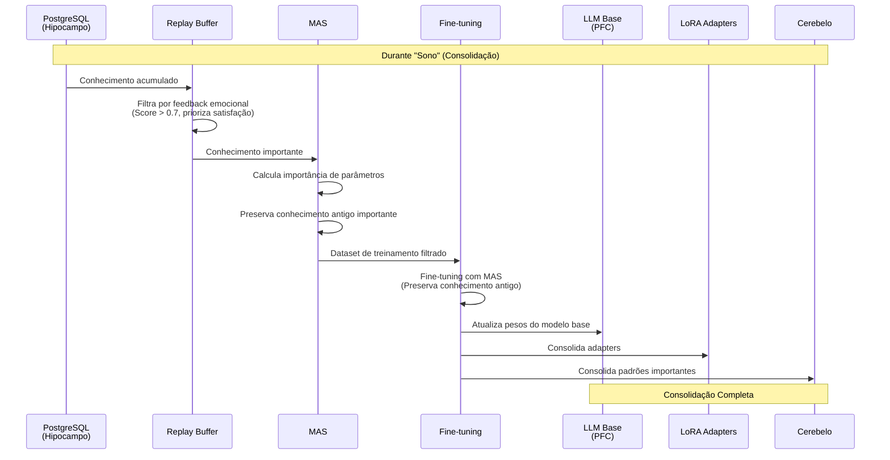

# Funcionamento do Dia-a-Dia: Arquitetura Completa com Todas as LLMs

**Data**: 2025-01-27  
**Versão**: 2.0 (Revisado - Todas as LLMs)  
**Status**: 📊 Arquitetura Completa Revisada

---

## 📋 Sumário Executivo

Este documento revisa a **arquitetura completa original** e documenta como o sistema funciona no dia-a-dia, incluindo **todas as LLMs utilizadas**:

1. **LLM Base** (CodeLlama 3B) - Córtex Pré-Frontal
2. **Modulador** (1-5M) - Córtex Pré-Frontal
3. **Cerebelo** (100M-500M) - Padrões Específicos
4. **Atenção Neuromodulada** - Controle Contextual
5. **LoRA Adapters** - Adaptação Rápida
6. **Modelos Especializados** - Processos Psicológicos

**Foco**: Aprendizado real e funcionamento diário, sem integração Linux.

---

## 🧠 Todas as LLMs Utilizadas no Sistema

### 1. LLM Base (CodeLlama 3B) - Córtex Pré-Frontal (PFC)

**Função**: Raciocínio principal, planejamento, controle executivo

**Características**:
- ✅ **Modelo**: CodeLlama 3B quantizado 4-bit
- ✅ **Tamanho**: ~3 bilhões de parâmetros
- ✅ **Status**: Estático (não muda durante uso)
- ✅ **Atualização**: Apenas durante "sono" (consolidação)
- ✅ **Uso**: Processamento principal de código e arquitetura

**Onde é Usado**:
- Geração de código arquitetural
- Análise de padrões
- Sugestões arquiteturais
- Raciocínio e planejamento
- Processos psicológicos (pensamento, linguagem, resolução de problemas)

**Integração**:
- Recebe contexto do RAG (Hipocampo)
- Usa LoRA Adapters para adaptação rápida
- Modulado pelo Modulador (seleção de adapters)
- Controlado por Atenção Neuromodulada

---

### 2. Modulador (1-5M parâmetros) - Córtex Pré-Frontal (PFC)

**Função**: Seleção e modulação de adapters baseado em contexto

**Características**:
- ✅ **Modelo**: Pequeno (1-5M parâmetros)
- ✅ **Tamanho**: Muito menor que LLM Base
- ✅ **Status**: Pode usar Backpropamine (experimental)
- ✅ **Atualização**: Durante uso (se Backpropamine) ou durante sono
- ✅ **Uso**: Decisão de qual adapter usar

**Onde é Usado**:
- Análise de hidden states do LLM Base
- Geração de sinais de modulação
- Seleção de adapters apropriados
- Controle de intensidade de adaptação
- Integração com RL (PPO)

**Integração**:
- Recebe hidden states do LLM Base (bottom-up)
- Gera sinais de modulação (top-down)
- Controla LoRA Adapters
- Treinado com RL (PPO)
- Usa Backpropamine para aprendizado rápido (experimental)

---

### 3. Cerebelo (100M-500M parâmetros) - Padrões Específicos

**Função**: Padrões específicos, automatização, aprendizado rápido

**Características**:
- ⚠️ **Modelo**: Médio (100M-500M parâmetros)
- ⚠️ **Status**: Experimental (Fase 2)
- ⚠️ **Atualização**: Backpropamine (mudanças reais de pesos)
- ⚠️ **Uso**: Padrões específicos, automatização

**Onde é Usado**:
- Padrões arquiteturais específicos frequentes
- Automatização de tarefas repetitivas
- Aprendizado rápido de novos padrões
- Padrões que geram satisfação (priorizados)

**Integração**:
- Recebe padrões do sistema de memória
- Aprende rapidamente com Backpropamine
- Consolida durante sono
- Transfere conhecimento importante para LLM Base

---

### 4. Atenção Neuromodulada - Controle Contextual

**Função**: Modular onde focar baseado em contexto e feedback

**Características**:
- ⚠️ **Modelo**: Não é modelo separado, mas mecanismo de atenção
- ⚠️ **Status**: Experimental (Fase 2)
- ⚠️ **Atualização**: Backpropamine (mudanças reais de pesos de atenção)
- ⚠️ **Uso**: Controle contextual de atenção

**Onde é Usado**:
- Modular atenção do LLM Base
- Focar em partes relevantes do contexto
- Filtrar informação irrelevante
- Priorizar conhecimento importante

**Integração**:
- Integrado com mecanismo de atenção do LLM Base
- Controlado por feedback emocional
- Usa Backpropamine para adaptação rápida
- Consolida durante sono

---

### 5. LoRA Adapters (pesos adicionais) - Adaptação Rápida

**Função**: Adaptação rápida a contextos específicos

**Características**:
- ✅ **Modelo**: Pesos adicionais (não modelo completo)
- ✅ **Tamanho**: Muito menor que modelo base
- ✅ **Status**: Múltiplos adapters por contexto
- ✅ **Atualização**: Durante uso (treinamento incremental)
- ✅ **Uso**: Especialização por contexto (ex: Odoo, Django, React)

**Onde é Usado**:
- Adaptação a contextos específicos
- Especialização por projeto
- Aprendizado rápido sem mudar modelo base
- Múltiplos adapters simultâneos

**Integração**:
- Aplicados ao LLM Base
- Selecionados pelo Modulador
- Treinados com feedback emocional
- Consolidados durante sono

---

### 6. Modelos Especializados (Futuro) - Processos Psicológicos

**Função**: Processos psicológicos específicos

**Características**:
- ⚠️ **Modelo**: Modelos pequenos especializados
- ⚠️ **Status**: Planejado (Fase 3)
- ⚠️ **Uso**: Processos psicológicos específicos

**Onde Serão Usados**:
- Percepção (pattern recognition)
- Emoção (análise emocional)
- Metacognição (monitoramento)
- Criatividade (exploração)

**Integração**:
- Integrados com LLM Base
- Usam feedback emocional
- Consolidam durante sono

---

## 🏗️ Arquitetura Completa: Todas as LLMs



**Legenda**:
- `*` = Componente experimental (Backpropamine, Cerebelo, Atenção Neuromodulada)
- Cores diferentes = Diferentes subsistemas

---

## 🔄 Funcionamento do Dia-a-Dia: Fluxo Completo

### Manhã: Primeiras Interações



**O Que Acontece**:
1. Usuário faz query sobre arquitetura
2. Cache verifica se tem resposta
3. Se não, PostgreSQL busca semântica
4. LLM Base processa com contexto
5. Modulador seleciona adapters apropriados
6. Atenção Neuromodulada foca no relevante
7. Cerebelo verifica padrões conhecidos
8. Resposta é gerada e apresentada

---

### Durante o Dia: Aprendizado Contínuo



**O Que Acontece**:
1. Usuário interage, recebe sugestões
2. Feedback é capturado (emocional + implícito)
3. Replay Buffer avalia importância (prioriza satisfação)
4. Conhecimento importante é persistido no PostgreSQL
5. RL PPO atualiza política do Modulador
6. Backpropamine atualiza Modulador, Cerebelo e Atenção
7. MAS preserva conhecimento antigo importante

---

### Noite: Consolidação (Sono)



**O Que Acontece**:
1. Sistema detecta inatividade
2. PostgreSQL acumulou conhecimento suficiente
3. Replay Buffer filtra por feedback emocional (prioriza satisfação)
4. MAS preserva conhecimento antigo importante
5. Fine-tuning consolida conhecimento
6. Pesos da LLM Base são atualizados
7. LoRA Adapters são consolidados
8. Cerebelo consolida padrões importantes

---

### Próximo Dia: Conhecimento Consolidado

**O Que Mudou**:
1. **LLM Base** tem conhecimento consolidado
2. **LoRA Adapters** estão atualizados
3. **Modulador** aprendeu padrões de seleção
4. **Cerebelo** tem padrões importantes consolidados
5. **Atenção Neuromodulada** foca melhor no relevante
6. **Sistema** está mais inteligente

---

## 📊 Tabela: Todas as LLMs e Suas Funções

| LLM | Tamanho | Função | Onde Usado | Atualização | Status |
|-----|---------|--------|------------|-------------|--------|
| **LLM Base** | 3B | Raciocínio principal | PFC, processamento principal | Durante sono | ✅ Implementado |
| **Modulador** | 1-5M | Seleção de adapters | PFC, controle de adapters | Durante uso (Backpropamine) ou sono | ✅ Implementado |
| **Cerebelo** | 100M-500M | Padrões específicos | Automatização, padrões | Backpropamine (experimental) | ⚠️ Experimental |
| **Atenção Neuromodulada** | Mecanismo | Controle contextual | Atenção do LLM Base | Backpropamine (experimental) | ⚠️ Experimental |
| **LoRA Adapters** | Pesos adicionais | Adaptação rápida | Especialização por contexto | Durante uso e sono | ✅ Implementado |
| **Modelos Especializados** | Pequenos | Processos psicológicos | Percepção, emoção, etc. | Durante sono | ⚠️ Planejado |

**Total**: 3-4 modelos principais + múltiplos adapters + mecanismos especializados

---

## 🎯 Resumo: Como Funciona no Dia-a-Dia

### Ciclo Completo

```
Manhã: Interação
  ↓
Durante o Dia: Aprendizado Contínuo
  ↓
Noite: Consolidação (Sono)
  ↓
Próximo Dia: Conhecimento Consolidado
  ↓
Repete...
```

### Componentes em Ação

1. **LLM Base**: Processamento principal, raciocínio
2. **Modulador**: Seleção inteligente de adapters
3. **Cerebelo**: Padrões específicos, automatização
4. **Atenção Neuromodulada**: Foco no relevante
5. **LoRA Adapters**: Adaptação rápida por contexto
6. **Backpropamine**: Aprendizado real (experimental)
7. **MAS**: Preservação de conhecimento
8. **Replay**: Priorização de satisfação
9. **Feedback Emocional**: Guia aprendizado

### Fluxo de Aprendizado

```
Interação → Feedback → Aprendizado → Consolidação → Melhoria
    ↓           ↓            ↓              ↓            ↓
  Query    Emoção +    Backpropamine    Sono      LLM Mais
  Código   Ação        + MAS + Replay            Inteligente
```

---

## 🔬 Detalhamento: Como Cada LLM Aprende

### LLM Base (CodeLlama 3B)

**Aprendizado**:
- ⚠️ **Não durante uso**: Estático, não muda
- ✅ **Durante sono**: Fine-tuning incremental com MAS
- ✅ **Preservação**: MAS protege conhecimento antigo

**Quando Aprende**:
- Durante consolidação (sono)
- Conhecimento importante do PostgreSQL
- Filtrado por feedback emocional

---

### Modulador (1-5M)

**Aprendizado**:
- ✅ **Durante uso**: Backpropamine (experimental)
- ✅ **Durante sono**: Fine-tuning com RL (PPO)
- ✅ **Preservação**: MAS protege conhecimento antigo

**Quando Aprende**:
- A cada interação (se Backpropamine ativo)
- Durante consolidação (sono)
- Baseado em feedback emocional + implícito

---

### Cerebelo (100M-500M)

**Aprendizado**:
- ✅ **Durante uso**: Backpropamine (mudanças reais)
- ✅ **Durante sono**: Consolidação de padrões
- ✅ **Preservação**: MAS protege padrões importantes

**Quando Aprende**:
- A cada padrão identificado (se Backpropamine ativo)
- Durante consolidação (sono)
- Padrões que geram satisfação (priorizados)

---

### Atenção Neuromodulada

**Aprendizado**:
- ✅ **Durante uso**: Backpropamine (mudanças reais)
- ✅ **Durante sono**: Consolidação de padrões de atenção
- ✅ **Preservação**: MAS protege padrões importantes

**Quando Aprende**:
- A cada interação (se Backpropamine ativo)
- Durante consolidação (sono)
- Baseado em feedback emocional (focar no que gera satisfação)

---

### LoRA Adapters

**Aprendizado**:
- ✅ **Durante uso**: Treinamento incremental
- ✅ **Durante sono**: Consolidação
- ✅ **Preservação**: MAS protege conhecimento importante

**Quando Aprende**:
- A cada interação (treinamento incremental)
- Durante consolidação (sono)
- Baseado em feedback emocional + implícito

---

## 🎯 Conclusão: Funcionamento do Dia-a-Dia

### Arquitetura Completa com Todas as LLMs

O sistema npllm utiliza:

1. **3-4 modelos principais**:
   - LLM Base (3B) - Raciocínio principal
   - Modulador (1-5M) - Seleção de adapters
   - Cerebelo (100M-500M) - Padrões específicos (experimental)
   - Atenção Neuromodulada - Controle contextual (experimental)

2. **Múltiplos LoRA Adapters**:
   - Adaptação rápida por contexto
   - Especialização por projeto

3. **Sistema de aprendizado integrado**:
   - MAS (preservação)
   - Replay (memórias importantes, prioriza satisfação)
   - Backpropamine (plasticidade real - experimental)
   - RL PPO (sistema dopaminérgico)

4. **Sistema de feedback emocional**:
   - Feedback implícito (70%)
   - Feedback emocional (30%)
   - Integração para priorização

5. **Sistema de consolidação**:
   - Durante sono
   - Filtragem por feedback emocional
   - Transferência para pesos de todas as LLMs

### Funcionamento Diário

- **Manhã**: Interações, processamento com todas as LLMs
- **Durante o Dia**: Aprendizado contínuo, Backpropamine atualiza modelos pequenos
- **Noite**: Consolidação, conhecimento vai para todas as LLMs
- **Próximo Dia**: Sistema mais inteligente, todas as LLMs melhoradas

---

**Data de Criação**: 2025-01-27  
**Última Atualização**: 2025-01-27  
**Status**: ✅ Completo - Arquitetura Completa Revisada com Todas as LLMs

