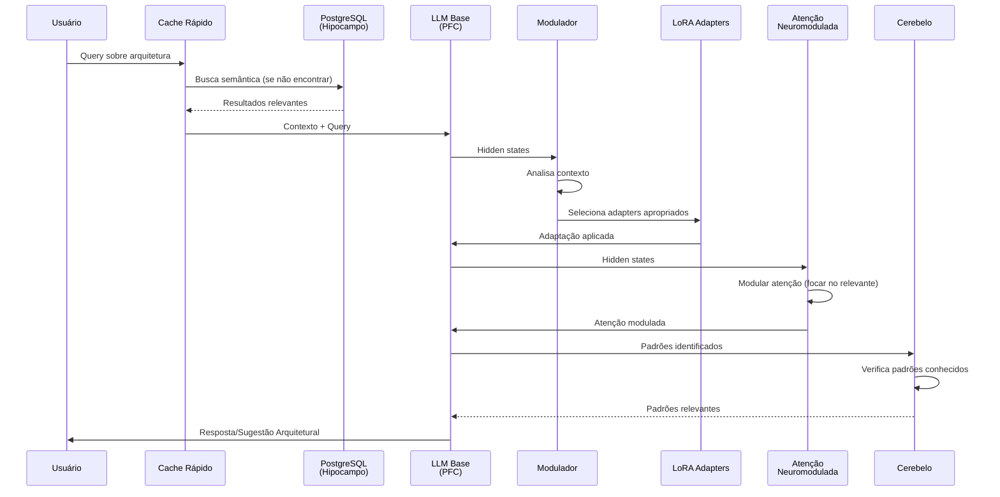
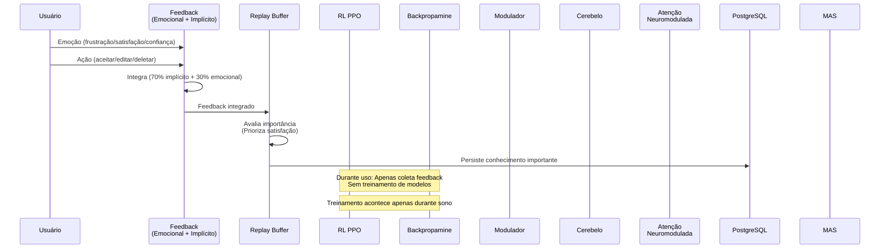
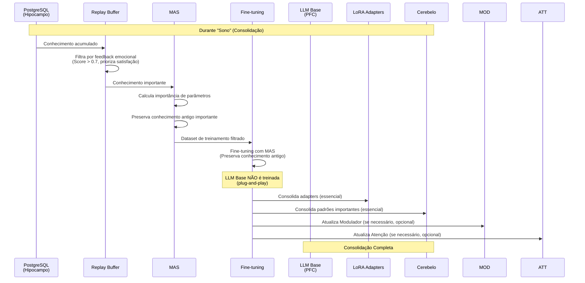

# Funcionamento do Dia-a-Dia: Arquitetura Completa com Todas as LLMs

**Data**: 2025-01-27  
**Versão**: 2.0 (Revisado - Todas as LLMs)  
**Status**: 📊 Arquitetura Completa Revisada

---

## 📋 Sumário Executivo

Este documento revisa a **arquitetura completa original** e documenta como o sistema funciona no dia-a-dia, incluindo **todas as LLMs utilizadas**:

1. **LLM Base** (CodeLlama 3B) - Córtex Pré-Frontal
2. **Modulador** (1-5M) - Córtex Pré-Frontal
3. **Cerebelo** (100M-500M) - Padrões Específicos
4. **Atenção Neuromodulada** - Controle Contextual
5. **LoRA Adapters** - Adaptação Rápida
6. **Modelos Especializados** - Processos Psicológicos

**Foco**: Aprendizado real e funcionamento diário, sem integração Linux.

---

## 🧠 Todas as LLMs Utilizadas no Sistema

### 1. LLM Base (CodeLlama 3B) - Córtex Pré-Frontal (PFC)

**Função**: Raciocínio principal, planejamento, controle executivo

**Características**:
- ✅ **Modelo**: CodeLlama 3B quantizado 4-bit
- ✅ **Tamanho**: ~3 bilhões de parâmetros
- ✅ **Status**: Estático (não muda nunca)
- ❌ **Atualização**: NÃO é treinada (plug-and-play)
- ✅ **Uso**: Processamento principal de código e arquitetura
- ✅ **Pode ser trocada**: Por qualquer LLM compatível sem perder conhecimento

**Onde é Usado**:
- Geração de código arquitetural
- Análise de padrões
- Sugestões arquiteturais
- Raciocínio e planejamento
- Processos psicológicos (pensamento, linguagem, resolução de problemas)

**Integração**:
- Recebe contexto do RAG (Hipocampo)
- Usa LoRA Adapters para adaptação rápida
- Modulado pelo Modulador (seleção de adapters)
- Controlado por Atenção Neuromodulada

---

### 2. Modulador (1-5M parâmetros) - Córtex Pré-Frontal (PFC)

**Função**: Seleção e modulação de adapters baseado em contexto

**Características**:
- ✅ **Modelo**: Pequeno (1-5M parâmetros)
- ✅ **Tamanho**: Muito menor que LLM Base
- ⚠️ **Status**: Pode funcionar apenas com inferência
- ⚠️ **Atualização**: Opcional, apenas durante sono (se necessário)
- ✅ **Uso**: Decisão de qual adapter usar

**Onde é Usado**:
- Análise de hidden states do LLM Base
- Geração de sinais de modulação
- Seleção de adapters apropriados
- Controle de intensidade de adaptação
- Integração com RL (PPO)

**Integração**:
- Recebe hidden states do LLM Base (bottom-up)
- Gera sinais de modulação (top-down)
- Controla LoRA Adapters
- Pode ser treinado com RL (PPO) apenas durante sono (opcional)
- Não treina durante uso (apenas inferência)

---

### 3. Cerebelo (100M-500M parâmetros) - Padrões Específicos

**Função**: Padrões específicos, automatização, aprendizado rápido

**Características**:
- ⚠️ **Modelo**: Médio (100M-500M parâmetros)
- ⚠️ **Status**: Experimental (Fase 2)
- ✅ **Atualização**: Essencial treinar, mas apenas durante sono
- ⚠️ **Uso**: Padrões específicos, automatização

**Onde é Usado**:
- Padrões arquiteturais específicos frequentes
- Automatização de tarefas repetitivas
- Aprendizado rápido de novos padrões
- Padrões que geram satisfação (priorizados)

**Integração**:
- Recebe padrões do sistema de memória
- Aprende apenas durante sono (Backpropamine + consolidação)
- Não treina durante uso (evita overhead)
- Conhecimento importante é consolidado durante sono

---

### 4. Atenção Neuromodulada - Controle Contextual

**Função**: Modular onde focar baseado em contexto e feedback

**Características**:
- ⚠️ **Modelo**: Não é modelo separado, mas mecanismo de atenção
- ⚠️ **Status**: Experimental (Fase 2)
- ⚠️ **Atualização**: Opcional, apenas durante sono (se necessário)
- ⚠️ **Uso**: Controle contextual de atenção (pode usar atenção padrão)

**Onde é Usado**:
- Modular atenção do LLM Base
- Focar em partes relevantes do contexto
- Filtrar informação irrelevante
- Priorizar conhecimento importante

**Integração**:
- Integrado com mecanismo de atenção do LLM Base
- Controlado por feedback emocional
- Pode usar Backpropamine apenas durante sono (opcional)
- Não treina durante uso (evita overhead)

---

### 5. LoRA Adapters (pesos adicionais) - Adaptação Rápida

**Função**: Adaptação rápida a contextos específicos

**Características**:
- ✅ **Modelo**: Pesos adicionais (não modelo completo)
- ✅ **Tamanho**: Muito menor que modelo base
- ✅ **Status**: Múltiplos adapters por contexto
- ✅ **Atualização**: Essencial treinar, mas apenas durante sono
- ✅ **Uso**: Especialização por contexto (ex: Odoo, Django, React)

**Onde é Usado**:
- Adaptação a contextos específicos
- Especialização por projeto
- Aprendizado rápido sem mudar modelo base
- Múltiplos adapters simultâneos

**Integração**:
- Aplicados ao LLM Base
- Selecionados pelo Modulador
- Treinados apenas durante sono (com feedback emocional)
- Não treinam durante uso (evita overhead)

---

### 6. Modelos Especializados (Futuro) - Processos Psicológicos

**Função**: Processos psicológicos específicos

**Características**:
- ⚠️ **Modelo**: Modelos pequenos especializados
- ⚠️ **Status**: Planejado (Fase 3)
- ⚠️ **Uso**: Processos psicológicos específicos

**Onde Serão Usados**:
- Percepção (pattern recognition)
- Emoção (análise emocional)
- Metacognição (monitoramento)
- Criatividade (exploração)

**Integração**:
- Integrados com LLM Base
- Usam feedback emocional
- Consolidam durante sono

---

## 🏗️ Arquitetura Completa: Todas as LLMs

```mermaid
graph TB
    subgraph "Entrada"
        USER[Usuário<br/>Query/Código/Feedback]
    end
    
    subgraph "Memória"
        CACHE[Cache Rápido<br/>Memória Curta]
        WORKING[Memória Trabalho<br/>Contexto Atual]
        POSTGRES[PostgreSQL + pgvector<br/>Hipocampo<br/>Memória Média]
    end
    
    subgraph "LLMs Principais"
        LLM_BASE[LLM Base<br/>CodeLlama 3B<br/>PFC - Raciocínio<br/>Nao Treinada]
        MODULATOR[Modulador<br/>1-5M parâmetros<br/>Seleção Adapters<br/>Opcional]
        CEREBELO[Cerebelo*<br/>100M-500M<br/>Padrões Específicos<br/>Essencial]
        ATTENTION[Atenção Neuromodulada*<br/>Controle Contextual<br/>Opcional]
    end
    
    subgraph "Adaptação"
        LORA[LoRA Adapters<br/>Adaptação Rápida<br/>Múltiplos Contextos<br/>Essencial]
    end
    
    subgraph "Aprendizado Real"
        MAS[MAS<br/>Preservação<br/>Durante Sono]
        REPLAY[Replay Buffer<br/>Memórias Importantes<br/>Coleta Durante Uso]
        BACKPROP[Backpropamine*<br/>Plasticidade Real<br/>Apenas Durante Sono]
        RL[RL PPO<br/>Sistema Dopaminérgico<br/>Apenas Durante Sono]
    end
    
    subgraph "Feedback"
        IMPLICIT[Feedback Implícito<br/>70%]
        EMOTIONAL[Feedback Emocional<br/>30%]
        INTEGRATE[Integração Feedback]
    end
    
    subgraph "Consolidação Apenas Durante Sono"
        SLEEP[Consolidação Durante Sono<br/>Hipocampo para Cerebelo/LoRA]
        FT[Fine-tuning Incremental<br/>Cerebelo + LoRA<br/>Modulador + Atenção opcional]
    end
    
    USER --> CACHE
    CACHE --> POSTGRES
    POSTGRES --> WORKING
    WORKING --> LLM_BASE
    
    LLM_BASE --> MODULATOR
    MODULATOR --> LORA
    LORA --> LLM_BASE
    
    LLM_BASE --> ATTENTION
    ATTENTION --> LLM_BASE
    
    POSTGRES --> CEREBELO
    CEREBELO --> POSTGRES
    
    USER --> IMPLICIT
    USER --> EMOTIONAL
    IMPLICIT --> INTEGRATE
    EMOTIONAL --> INTEGRATE
    INTEGRATE --> REPLAY
    
    REPLAY --> POSTGRES
    
    POSTGRES --> SLEEP
    SLEEP --> FT
    FT --> CEREBELO
    FT --> LORA
    FT --> MODULATOR
    FT --> ATTENTION
    
    MAS --> FT
    RL --> FT
    BACKPROP --> FT
    
    Note over FT: LLM Base nao é treinada<br/>plug-and-play
    Note over RL,BACKPROP: RL e Backpropamine<br/>só durante sono
    Note over REPLAY: Durante uso: Apenas coleta feedback<br/>Sem treinamento de modelos
    
    LLM_BASE --> USER
    
    style LLM_BASE fill:#ffcccc
    style MODULATOR fill:#fff4e1
    style CEREBELO fill:#ccffcc
    style ATTENTION fill:#fff4e1
    style LORA fill:#ccffcc
    style POSTGRES fill:#ccffcc
    style MAS fill:#ccccff
    style REPLAY fill:#ffffcc
    style BACKPROP fill:#ccccff
    style RL fill:#ccccff
    style INTEGRATE fill:#ffccff
    style SLEEP fill:#ccccff
    style FT fill:#ccccff
```

**Legenda**:
- `*` = Componente experimental (Backpropamine, Cerebelo, Atenção Neuromodulada)
- Cores diferentes = Diferentes subsistemas

---

## 🔄 Funcionamento do Dia-a-Dia: Fluxo Completo

### Manhã: Primeiras Interações



**O Que Acontece**:
1. Usuário faz query sobre arquitetura
2. Cache verifica se tem resposta
3. Se não, PostgreSQL busca semântica
4. LLM Base processa com contexto
5. Modulador seleciona adapters apropriados
6. Atenção Neuromodulada foca no relevante
7. Cerebelo verifica padrões conhecidos
8. Resposta é gerada e apresentada

---

### Durante o Dia: Aprendizado Contínuo



**O Que Acontece**:
1. Usuário interage, recebe sugestões
2. Feedback é capturado (emocional + implícito)
3. Replay Buffer avalia importância (prioriza satisfação)
4. Conhecimento importante é persistido no PostgreSQL
5. **Nenhum treinamento durante uso** (apenas coleta de feedback)
6. Treinamento acontece apenas durante sono (consolidação)

---

### Noite: Consolidação (Sono)



**O Que Acontece**:
1. Sistema detecta inatividade
2. PostgreSQL acumulou conhecimento suficiente
3. Replay Buffer filtra por feedback emocional (prioriza satisfação)
4. MAS preserva conhecimento antigo importante
5. Fine-tuning consolida conhecimento
6. **LLM Base NÃO é treinada** (permanece plug-and-play)
7. LoRA Adapters são consolidados (essencial)
8. Cerebelo consolida padrões importantes (essencial)
9. Modulador e Atenção são atualizados apenas se necessário (opcional)

---

### Próximo Dia: Conhecimento Consolidado

**O Que Mudou**:
1. **LLM Base** permanece igual (plug-and-play, não treinada)
2. **LoRA Adapters** estão atualizados (treinados durante sono)
3. **Cerebelo** tem padrões importantes consolidados (treinado durante sono)
4. **Modulador** pode ter aprendido padrões (se treinado, opcional)
5. **Atenção Neuromodulada** pode focar melhor (se treinada, opcional)
6. **Sistema** está mais inteligente (Cerebelo e LoRA melhorados)

---

## 📊 Tabela: Todas as LLMs e Suas Funções

| LLM | Tamanho | Função | Onde Usado | Treinar? | Quando? | Status |
|-----|---------|--------|------------|---------|---------|--------|
| **LLM Base** | 3B | Raciocínio principal | PFC, processamento principal | ❌ **NÃO** | Nunca (plug-and-play) | ✅ Implementado |
| **Modulador** | 1-5M | Seleção de adapters | PFC, controle de adapters | ⚠️ **OPCIONAL** | Apenas no sono (se necessário) | ✅ Implementado |
| **Cerebelo** | 100M-500M | Padrões específicos | Automatização, padrões | ✅ **SIM** | Apenas no sono | ⚠️ Experimental |
| **Atenção Neuromodulada** | Mecanismo | Controle contextual | Atenção do LLM Base | ⚠️ **OPCIONAL** | Apenas no sono (se necessário) | ⚠️ Experimental |
| **LoRA Adapters** | Pesos adicionais | Adaptação rápida | Especialização por contexto | ✅ **SIM** | Apenas no sono | ✅ Implementado |
| **Modelos Especializados** | Pequenos | Processos psicológicos | Percepção, emoção, etc. | ⚠️ **OPCIONAL** | Apenas no sono (se necessário) | ⚠️ Planejado |

**Total**: 3-4 modelos principais + múltiplos adapters + mecanismos especializados

---

## 🎯 Resumo: Como Funciona no Dia-a-Dia

### Ciclo Completo

```
Manhã: Interação
  ↓
Durante o Dia: Aprendizado Contínuo
  ↓
Noite: Consolidação (Sono)
  ↓
Próximo Dia: Conhecimento Consolidado
  ↓
Repete...
```

### Componentes em Ação

1. **LLM Base**: Processamento principal, raciocínio
2. **Modulador**: Seleção inteligente de adapters
3. **Cerebelo**: Padrões específicos, automatização
4. **Atenção Neuromodulada**: Foco no relevante
5. **LoRA Adapters**: Adaptação rápida por contexto
6. **Backpropamine**: Aprendizado real (experimental)
7. **MAS**: Preservação de conhecimento
8. **Replay**: Priorização de satisfação
9. **Feedback Emocional**: Guia aprendizado

### Fluxo de Aprendizado

```
Interação → Feedback → Coleta → Consolidação (Sono) → Melhoria
    ↓           ↓          ↓            ↓                  ↓
  Query    Emoção +    PostgreSQL    Cerebelo +      Sistema Mais
  Código   Ação        (sem treino)  LoRA treinam    Inteligente
                                      (LLM Base não)
```

---

## 📊 Classificação: O Que Treinar e O Que Não Treinar

### Resumo da Classificação

| LLM | Treinar? | Quando? | Justificativa |
|-----|----------|---------|---------------|
| **LLM Base** | ❌ **NÃO** | Nunca | Plug-and-play, pode ser trocada |
| **Cerebelo** | ✅ **SIM** | Apenas no sono | Essencial para padrões específicos |
| **Modulador** | ⚠️ **OPCIONAL** | Apenas no sono (se necessário) | Pode funcionar apenas com inferência |
| **Atenção Neuromodulada** | ⚠️ **OPCIONAL** | Apenas no sono (se necessário) | Pode usar atenção padrão do LLM |
| **LoRA Adapters** | ✅ **SIM** | Apenas no sono | Essencial para adaptação por contexto |

---

## 🔬 Detalhamento: Como Cada LLM Aprende

### LLM Base (CodeLlama 3B)

**Aprendizado**:
- ❌ **NÃO TREINAR**: Plug-and-play, não modificar
- ✅ **Usar como está**: Modelo pré-treinado
- ✅ **Pode ser trocada**: Por qualquer LLM compatível

**Justificativa**:
- É componente base, não deve ser modificado
- Permite trocar por modelos melhores sem perder conhecimento
- Conhecimento fica no PostgreSQL (Hipocampo) e LoRA Adapters

**Quando Usa**:
- Durante uso: Inferência apenas
- Conhecimento vem do RAG (PostgreSQL) e LoRA Adapters

---

### Modulador (1-5M)

**Aprendizado**:
- ⚠️ **OPCIONAL**: Pode funcionar apenas com inferência
- ⚠️ **Se treinar**: Apenas durante sono (consolidação)
- ❌ **Não treinar durante uso**: Evita overhead

**Justificativa**:
- Pode funcionar apenas com inferência baseada em contexto
- Se necessário aprender, apenas no sono para evitar overhead
- Treinamento durante uso pode ser muito custoso

**Quando Aprende** (se necessário):
- Durante consolidação (sono)
- Baseado em feedback emocional + implícito
- Fine-tuning com RL (PPO) apenas no sono

---

### Cerebelo (100M-500M)

**Aprendizado**:
- ✅ **ESSENCIAL TREINAR**: Mas apenas durante sono
- ❌ **Não treinar durante uso**: Evita overhead
- ✅ **Durante sono**: Backpropamine + consolidação de padrões
- ✅ **Preservação**: MAS protege padrões importantes

**Justificativa**:
- É essencial para padrões específicos e automatização
- Treinar apenas no sono evita overhead durante uso
- Backpropamine pode ser usado, mas apenas durante consolidação

**Quando Aprende**:
- Durante consolidação (sono) apenas
- Padrões que geram satisfação (priorizados)
- Backpropamine aplicado apenas durante sono

---

### Atenção Neuromodulada

**Aprendizado**:
- ⚠️ **OPCIONAL**: Pode usar atenção padrão do LLM
- ⚠️ **Se treinar**: Apenas durante sono (consolidação)
- ❌ **Não treinar durante uso**: Evita overhead

**Justificativa**:
- Atenção padrão do LLM pode ser suficiente
- Se necessário neuromodulação, apenas no sono
- Treinamento durante uso pode ser muito custoso

**Quando Aprende** (se necessário):
- Durante consolidação (sono) apenas
- Baseado em feedback emocional (focar no que gera satisfação)
- Backpropamine aplicado apenas durante sono

---

### LoRA Adapters

**Aprendizado**:
- ✅ **ESSENCIAL TREINAR**: Mas apenas durante sono
- ❌ **Não treinar durante uso**: Evita overhead
- ✅ **Durante sono**: Consolidação e fine-tuning
- ✅ **Preservação**: MAS protege conhecimento importante

**Justificativa**:
- É essencial para adaptação por contexto
- Treinar apenas no sono evita overhead durante uso
- Conhecimento importante é consolidado durante sono

**Quando Aprende**:
- Durante consolidação (sono) apenas
- Baseado em feedback emocional + implícito
- Fine-tuning incremental apenas durante sono

---

## 🎯 Conclusão: Funcionamento do Dia-a-Dia

### Arquitetura Completa com Todas as LLMs

O sistema npllm utiliza:

1. **3-4 modelos principais**:
   - LLM Base (3B) - Raciocínio principal
   - Modulador (1-5M) - Seleção de adapters
   - Cerebelo (100M-500M) - Padrões específicos (experimental)
   - Atenção Neuromodulada - Controle contextual (experimental)

2. **Múltiplos LoRA Adapters**:
   - Adaptação rápida por contexto
   - Especialização por projeto

3. **Sistema de aprendizado integrado**:
   - MAS (preservação)
   - Replay (memórias importantes, prioriza satisfação)
   - Backpropamine (plasticidade real - experimental)
   - RL PPO (sistema dopaminérgico)

4. **Sistema de feedback emocional**:
   - Feedback implícito (70%)
   - Feedback emocional (30%)
   - Integração para priorização

5. **Sistema de consolidação**:
   - Durante sono
   - Filtragem por feedback emocional
   - Transferência apenas para Cerebelo e LoRA Adapters (não para LLM Base)

### Funcionamento Diário

- **Manhã**: Interações, processamento com todas as LLMs (inferência apenas)
- **Durante o Dia**: Feedback coletado, conhecimento armazenado no PostgreSQL (sem treinamento)
- **Noite**: Consolidação (sono), apenas Cerebelo e LoRA Adapters são treinados
- **Próximo Dia**: Sistema mais inteligente, Cerebelo e LoRA Adapters melhorados (LLM Base permanece igual)

---

**Data de Criação**: 2025-01-27  
**Última Atualização**: 2025-01-27  
**Status**: ✅ Completo - Arquitetura Completa Revisada com Todas as LLMs

