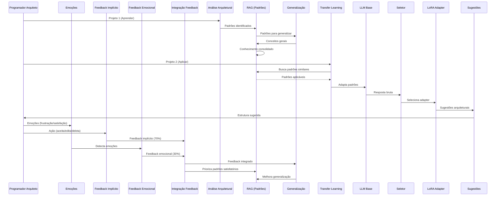

# Plano de Implementação MVP

**Data**: 2025-01-27  
**Versão**: 1.0  
**Status**: 🟡 Plano de Implementação

---

## 📋 Sumário Executivo

Este documento define o plano de implementação do MVP para um assistente de código geral que:

1. **Aprende padrões arquiteturais** de qualquer projeto
2. **Aprende em um projeto e aplica em outro** (transfer learning)
3. **Foca em arquitetura e engenharia**, não código de baixo nível
4. **Aprende continuamente** e melhora com o tempo
5. **Processa feedback emocional** para guiar aprendizado

**Filosofia**: O futuro é de quem sabe arquitetar e gerenciar IA, não de quem escreve código de baixo/médio nível.

---

## ⚠️ Decisão Arquitetural: Começar do Zero

**Justificativa**:
- Código existente não foi testado nem validado
- Testes falham por dependências e problemas de estrutura
- Mais eficiente começar do zero com testes desde o início
- Permite arquitetura limpa e bem testada

**Abordagem**:
- ✅ **Começar do zero** com arquitetura limpa
- ✅ **Testes desde o início** (TDD)
- ✅ **Validação contínua** de cada componente
- ⚠️ **Reaproveitar conceitos**, não código

---

## 🎯 Funcionalidades Essenciais para MVP

### 1. Análise Arquitetural de Projetos

**Descrição**: Analisar estrutura e padrões arquiteturais de qualquer projeto

**Funcionalidades**:
- ✅ Analisar estrutura de diretórios
- ✅ Identificar padrões de design
- ✅ Identificar padrões de comunicação
- ✅ Identificar padrões de dados
- ✅ Extrair decisões arquiteturais

**Tecnologias**:
- RAG para indexar estrutura
- LLM para análise
- Parser de estrutura

**Prioridade**: 🔴 **CRÍTICA**

---

### 2. Aprendizado de Padrões Arquiteturais

**Descrição**: Aprender padrões arquiteturais de projetos e generalizar

**Funcionalidades**:
- ✅ Identificar padrões comuns
- ✅ Generalizar para conceitos aplicáveis
- ✅ Consolidar conhecimento
- ✅ Preservar conhecimento importante (Replay)

**Tecnologias**:
- RAG para indexar
- Replay para preservar
- Generalização

**Prioridade**: 🔴 **CRÍTICA**

---

### 3. Transfer Learning Entre Projetos

**Descrição**: Aplicar padrões aprendidos em um projeto em outro

**Funcionalidades**:
- ✅ Identificar projetos similares
- ✅ Aplicar padrões aprendidos
- ✅ Adaptar padrões ao novo contexto
- ✅ Sugerir estrutura arquitetural

**Tecnologias**:
- RAG para busca
- LLM para adaptação
- Transfer learning

**Prioridade**: 🔴 **CRÍTICA**

---

### 4. Processamento de Feedback Emocional

**Descrição**: Processar feedback baseado em emoções do usuário para melhorar aprendizado

**Funcionalidades**:
- ✅ Detectar emoções do usuário (frustração, satisfação, confiança)
- ✅ Analisar sentimento de comentários/texto
- ✅ Integrar feedback emocional com feedback implícito
- ✅ Ajustar aprendizado baseado em emoções
- ✅ Priorizar padrões que geram satisfação

**Tecnologias**:
- Análise de sentimento (RoBERTa)
- Detecção de emoções
- Integração com feedback implícito

**Prioridade**: 🔴 **CRÍTICA**

---

### 5. Sugestões Arquiteturais

**Descrição**: Sugerir estrutura e padrões para novos projetos

**Funcionalidades**:
- ✅ Sugerir estrutura de diretórios
- ✅ Sugerir padrões de design
- ✅ Sugerir organização de módulos
- ✅ Sugerir decisões arquiteturais

**Tecnologias**:
- LLM Base
- RAG para contexto
- Templates arquiteturais

**Prioridade**: 🟡 **ALTA**

---

### 6. Geração de Código Arquitetural

**Descrição**: Gerar código que implementa decisões arquiteturais

**Funcionalidades**:
- ✅ Gerar estrutura de projeto
- ✅ Gerar módulos base
- ✅ Gerar interfaces
- ✅ Gerar configurações

**Tecnologias**:
- LLM Base
- Templates
- Contexto arquitetural

**Prioridade**: 🟡 **ALTA**

---

## 📦 Funcionalidades Futuras (Pós-MVP)

### 1. Fine-tuning Específico

**Descrição**: Fine-tuning do modelo com padrões arquiteturais aprendidos

**Quando**: Após MVP, quando tiver dados suficientes

**Prioridade**: 🔵 **BAIXA**

---

### 2. Consolidação Durante "Sono"

**Descrição**: Consolidar padrões aprendidos periodicamente

**Quando**: Após MVP estável

**Prioridade**: 🔵 **BAIXA**

---

### 3. Backpropamine

**Descrição**: Plasticidade sináptica real

**Quando**: Após validação

**Prioridade**: 🔵 **BAIXA** (experimental)

---

## 🎯 Plano de Implementação MVP

### Fase 1: Base e Feedback Emocional (Sprint 1-2)

**Objetivo**: Base sólida com feedback emocional funcionando

**Tarefas**:
1. ✅ **Setup do Zero**
   - Estrutura de projeto limpa
   - Dependências mínimas
   - Testes configurados (pytest)
   - CI/CD básico

2. ✅ **LLM Base (Do Zero)**
   - Integração CodeLlama 3B
   - Testes de carregamento
   - Testes de geração
   - Validação de qualidade

3. ✅ **RAG (Do Zero)**
   - PostgreSQL + pgvector setup
   - Testes de conexão
   - Testes de indexação
   - Testes de busca

4. ✅ **Feedback Emocional (Do Zero)**
   - Análise de sentimento (RoBERTa)
   - Detecção de emoções (frustração, satisfação, confiança)
   - Integração com feedback implícito
   - Testes de precisão

5. ✅ **Feedback Implícito (Do Zero)**
   - Captura de ações (aceitar/editar/deletar)
   - Cálculo de recompensas
   - Integração com emocional
   - Testes de integração

**Entregas**:
- ✅ Base sólida e testada
- ✅ Feedback emocional funcionando
- ✅ Feedback implícito funcionando
- ✅ Integração feedback emocional + implícito

**Duração**: 3-4 semanas

---

### Fase 2: Análise Arquitetural (Sprint 3-4)

**Objetivo**: Analisar estrutura e padrões de projetos

**Tarefas**:
1. ✅ **Parser de Estrutura (Do Zero)**
   - Analisar estrutura de diretórios
   - Identificar organização de módulos
   - Extrair dependências
   - Testes de precisão

2. ✅ **Identificação de Padrões (Do Zero)**
   - Padrões de design (MVC, Repository, etc.)
   - Padrões de comunicação (API, Events)
   - Padrões de dados (ORM, Migrations)
   - Testes de identificação

3. ✅ **Indexação no RAG (Do Zero)**
   - Indexar estrutura
   - Indexar padrões identificados
   - Indexar decisões arquiteturais
   - Testes de indexação

4. ✅ **Integração com Feedback**
   - Usar feedback emocional para priorizar padrões
   - Aprender de padrões que geram satisfação
   - Evitar padrões que geram frustração
   - Testes de integração

**Entregas**:
- ✅ Análise arquitetural funcionando e testada
- ✅ Padrões identificados e indexados
- ✅ RAG com conhecimento arquitetural
- ✅ Feedback emocional integrado

**Duração**: 2-3 semanas

---

### Fase 3: Aprendizado e Generalização (Sprint 5-6)

**Objetivo**: Aprender padrões e generalizar para múltiplos projetos

**Tarefas**:
1. ✅ **Generalização de Padrões (Do Zero)**
   - Identificar padrões comuns entre projetos
   - Extrair conceitos gerais
   - Criar abstrações
   - Testes de generalização

2. ✅ **Replay (Do Zero)**
   - Reapresentar exemplos importantes
   - Priorizar padrões que geram satisfação
   - Balanceamento replay vs. novos dados
   - Testes de replay

3. ✅ **Transfer Learning (Do Zero)**
   - Identificação de projetos similares
   - Aplicação de padrões aprendidos
   - Adaptação ao novo contexto
   - Testes de transferência

4. ✅ **Seletor de Adapter (Do Zero)**
   - Seleção por extensão de arquivo
   - Seleção por estrutura de projeto
   - Fallback para adapter genérico
   - Testes de seleção

5. ✅ **LoRA Adapters (Do Zero)**
   - Criação de adapters por contexto
   - Integração com LLM Base
   - Testes de revisão de respostas

**Entregas**:
- ✅ Generalização funcionando e testada
- ✅ Transfer learning entre projetos
- ✅ Replay integrado
- ✅ Feedback emocional guiando aprendizado
- ✅ Seletor e Adapters funcionando

**Duração**: 3-4 semanas

---

### Fase 4: Geração e Refinamento (Sprint 7-8)

**Objetivo**: Gerar código arquitetural e refinar sistema

**Tarefas**:
1. ✅ **Sugestões Arquiteturais (Do Zero)**
   - Sugerir estrutura para novos projetos
   - Sugerir padrões aplicáveis
   - Sugerir decisões arquiteturais
   - Testes de sugestões

2. ✅ **Geração de Código Arquitetural (Do Zero)**
   - Gerar estrutura de projeto
   - Gerar módulos base
   - Gerar interfaces e configurações
   - Testes de geração

3. ✅ **Templates Arquiteturais (Do Zero)**
   - Templates para estruturas comuns
   - Templates para padrões
   - Templates para configurações
   - Testes de templates

4. ✅ **Sistema de Sono (Do Zero)**
   - Detecção de inatividade (30 minutos)
   - Extração de feedback do PostgreSQL
   - Filtragem de feedback positivo (score > 0.7)
   - Replay de exemplos antigos
   - Fine-tuning tradicional incremental
   - Atualização de LoRA Adapters
   - Testes de consolidação

5. ✅ **Otimização e Validação**
   - Performance
   - Precisão de sugestões
   - Qualidade de generalização
   - Testes end-to-end
   - Validação com desenvolvedores

**Entregas**:
- ✅ MVP completo e estável
- ✅ Geração de código arquitetural
- ✅ Sistema de sono funcionando
- ✅ Sistema testado e validado
- ✅ Feedback emocional integrado em todo o fluxo

**Duração**: 2-3 semanas

---

## 📋 Checklist MVP

### ⏳ Componentes a Implementar do Zero

- [ ] **Setup Base**
  - [ ] Estrutura de projeto limpa
  - [ ] Dependências mínimas
  - [ ] Testes configurados (pytest)
  - [ ] CI/CD básico
  
- [ ] **LLM Base (Do Zero)**
  - [ ] Integração CodeLlama 3B
  - [ ] Testes de carregamento
  - [ ] Testes de geração
  - [ ] Validação de qualidade
  
- [ ] **RAG (Do Zero)**
  - [ ] PostgreSQL + pgvector setup
  - [ ] Testes de conexão
  - [ ] Testes de indexação
  - [ ] Testes de busca
  
- [ ] **Feedback Emocional (Do Zero)**
  - [ ] Análise de sentimento (RoBERTa)
  - [ ] Detecção de emoções (frustração, satisfação, confiança)
  - [ ] Integração com feedback implícito
  - [ ] Testes de precisão
  
- [ ] **Feedback Implícito (Do Zero)**
  - [ ] Captura de ações (aceitar/editar/deletar)
  - [ ] Cálculo de recompensas
  - [ ] Integração com emocional
  - [ ] Testes de integração
  
- [ ] **Análise Arquitetural (Do Zero)**
  - [ ] Parser de estrutura de diretórios
  - [ ] Identificação de padrões de design
  - [ ] Identificação de padrões de comunicação
  - [ ] Identificação de padrões de dados
  - [ ] Extração de decisões arquiteturais
  - [ ] Testes de precisão
  
- [ ] **Generalização (Do Zero)**
  - [ ] Identificação de padrões comuns
  - [ ] Extração de conceitos gerais
  - [ ] Criação de abstrações
  - [ ] Consolidação de conhecimento
  - [ ] Testes de generalização
  
- [ ] **Replay (Do Zero)**
  - [ ] Reapresentar exemplos importantes
  - [ ] Priorizar padrões que geram satisfação
  - [ ] Balanceamento replay vs. novos dados
  - [ ] Testes de replay
  
- [ ] **Transfer Learning (Do Zero)**
  - [ ] Identificação de projetos similares
  - [ ] Aplicação de padrões aprendidos
  - [ ] Adaptação ao novo contexto
  - [ ] Sugestões arquiteturais
  - [ ] Testes de transferência
  
- [ ] **Seletor de Adapter (Do Zero)**
  - [ ] Seleção por extensão de arquivo
  - [ ] Seleção por estrutura de projeto
  - [ ] Fallback para adapter genérico
  - [ ] Testes de seleção
  
- [ ] **LoRA Adapters (Do Zero)**
  - [ ] Criação de adapters por contexto
  - [ ] Integração com LLM Base
  - [ ] Testes de revisão de respostas
  
- [ ] **Geração Arquitetural (Do Zero)**
  - [ ] Geração de estrutura
  - [ ] Geração de módulos base
  - [ ] Templates arquiteturais
  - [ ] Geração de configurações
  - [ ] Testes de geração
  
- [ ] **Sistema de Sono (Do Zero)**
  - [ ] Detecção de inatividade (30 minutos)
  - [ ] Extração de feedback do PostgreSQL
  - [ ] Filtragem de feedback positivo (score > 0.7)
  - [ ] Replay de exemplos antigos
  - [ ] Fine-tuning tradicional incremental
  - [ ] Atualização de LoRA Adapters
  - [ ] Testes de consolidação

---

## 🎨 Diagrama de Fluxo MVP

---

## 🎯 Diferenciais do MVP

### 1. Feedback Emocional Integrado

**Outros Assistentes**:
- ❌ Não processam emoções explicitamente
- ❌ Não priorizam padrões por satisfação
- ❌ Não evitam padrões que geram frustração

**Nosso MVP**:
- ✅ Detecta emoções do usuário (frustração, satisfação, confiança)
- ✅ Prioriza padrões que geram satisfação
- ✅ Evita padrões que geram frustração
- ✅ Integra feedback emocional (30%) + implícito (70%)

---

### 2. Foco em Arquitetura, Não Código

**Outros Assistentes**:
- ❌ Focam em código de baixo nível
- ❌ Sugestões de sintaxe
- ❌ Completamento de funções

**Nosso MVP**:
- ✅ Foca em padrões arquiteturais
- ✅ Sugestões de estrutura
- ✅ Decisões arquiteturais

---

### 3. Transfer Learning Entre Projetos

**Outros Assistentes**:
- ❌ Aprendizado limitado a projeto atual
- ❌ Não transfere entre projetos
- ❌ Não generaliza padrões

**Nosso MVP**:
- ✅ Aprende de múltiplos projetos
- ✅ Transfere conhecimento entre projetos
- ✅ Generaliza padrões arquiteturais

---

### 4. Aprendizado Contínuo Explícito

**Outros Assistentes**:
- ⚠️ Aprendizado implícito
- ⚠️ Não preserva conhecimento explicitamente
- ⚠️ Não consolida aprendizado

**Nosso MVP**:
- ✅ Aprendizado explícito de padrões
- ✅ Preservação com Replay
- ✅ Consolidação de conhecimento durante sono

---

## 📚 Tecnologias e Dependências

### Core

- **Python 3.10+**
- **PyTorch**: Para LLM e LoRA
- **Transformers (Hugging Face)**: Para modelos pré-treinados
- **PEFT**: Para LoRA adapters
- **PostgreSQL 14+**: Banco de dados
- **pgvector**: Extensão para busca vetorial

### ML/AI

- **CodeLlama 3B**: LLM Base
- **RoBERTa**: Análise de sentimento
- **sentence-transformers**: Embeddings para RAG

### Testes

- **pytest**: Framework de testes
- **pytest-cov**: Cobertura de código
- **pytest-asyncio**: Testes assíncronos

### DevOps

- **Docker**: Containerização
- **GitHub Actions**: CI/CD
- **Black**: Formatação de código
- **mypy**: Type checking

---

## ⏱️ Esforço Estimado

### Fase 1 (Base + Feedback Emocional): 3-4 semanas
- Setup do zero: 1 semana
- LLM Base: 1 semana
- RAG: 1 semana
- Feedback Emocional + Implícito: 1 semana

### Fase 2 (Análise Arquitetural): 2-3 semanas
- Parser de estrutura: 1 semana
- Identificação de padrões: 1 semana
- Indexação: 1 semana

### Fase 3 (Aprendizado e Generalização): 3-4 semanas
- Generalização: 1-2 semanas
- Replay: 1 semana
- Transfer Learning: 1 semana
- Seletor e Adapters: 1 semana

### Fase 4 (Geração e Refinamento): 2-3 semanas
- Sugestões: 1 semana
- Geração: 1 semana
- Sistema de Sono: 1 semana
- Otimização e validação: 1 semana

### Total MVP: 10-14 semanas (2.5-3.5 meses)

**Nota**: Tempo maior porque estamos começando do zero com testes desde o início.

---

## 🚀 Próximos Passos

1. ✅ Arquitetura final definida
2. ✅ Plano de implementação criado
3. ⏳ Iniciar Fase 1: Setup e Base
4. ⏳ Configurar ambiente de desenvolvimento
5. ⏳ Começar implementação com testes

---

**Data de Criação**: 2025-01-27  
**Última Atualização**: 2025-01-27  
**Status**: 🟡 Plano de Implementação MVP - Pronto para Execução

