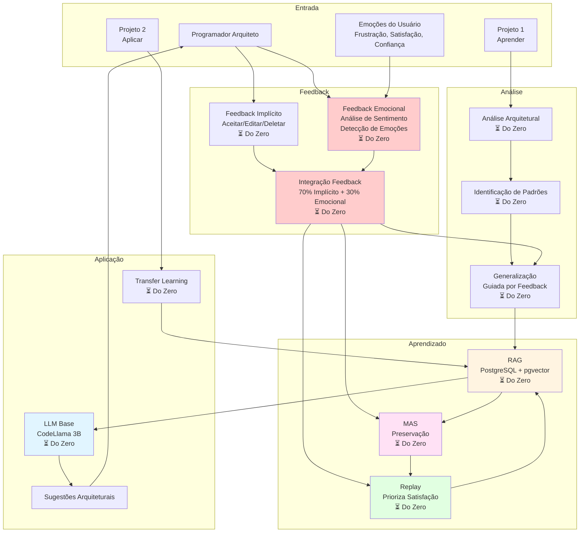
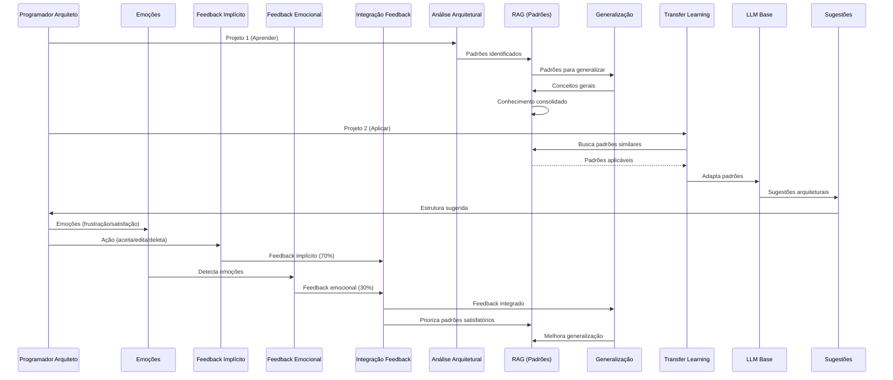

# MVP: Assistente Geral de Código com Aprendizado Arquitetural

**Data**: 2025-01-27  
**Versão**: 1.0  
**Status**: 🟡 Proposta MVP

---

## 📋 Sumário Executivo

Este documento define o **MVP (Minimum Viable Product)** para um assistente de código **geral** que:

1. **Aprende padrões arquiteturais** de qualquer projeto
2. **Aprende em um projeto e aplica em outro** (transfer learning)
3. **Foca em arquitetura e engenharia**, não código de baixo nível
4. **Aprende continuamente** e melhora com o tempo
5. **Prepara para o futuro**: Programadores que arquitetam e gerenciam IA

**Filosofia**: O futuro é de quem sabe arquitetar e gerenciar IA, não de quem escreve código de baixo/médio nível.

---

## 🔍 Pesquisa Profunda: Estado da Arte

### 0. Feedback Emocional em Assistentes de Código

#### 0.1 Abordagens Existentes

**RLHF (Reinforcement Learning from Human Feedback)**:
- ✅ Técnica padrão para usar feedback humano
- ✅ Usado em ChatGPT, Claude, etc.
- ✅ Combina feedback explícito e implícito
- ⚠️ Não foca especificamente em emoções

**Análise de Sentimento**:
- ✅ Modelos como RoBERTa para análise de sentimento
- ✅ Identifica positivo/negativo/neutro
- ✅ Amplamente usado em NLP
- ⚠️ Não detecta emoções específicas (frustração, satisfação)

**Detecção de Emoções**:
- ✅ Modelos especializados em emoções
- ✅ Identifica frustração, satisfação, confiança, etc.
- ✅ Mais granular que sentimento
- ⚠️ Menos comum em assistentes de código

**Relevância para MVP**:
- ✅ **Essencial**: Feedback emocional guia aprendizado
- ✅ **Diferencial**: Poucos assistentes usam emoções explicitamente
- ✅ **Valor**: Priorizar padrões que geram satisfação

---

#### 0.2 Integração de Feedback Emocional

**Abordagem Proposta**:
1. **Detecção de Emoções**:
   - Frustração (negativo) → Evitar padrões similares
   - Satisfação (positivo) → Priorizar padrões similares
   - Confiança (positivo) → Consolidar padrões

2. **Análise de Sentimento**:
   - Comentários do usuário
   - Texto de feedback
   - Comunicação durante desenvolvimento

3. **Integração com Feedback Implícito**:
   - 70% Feedback Implícito (aceitar/editar/deletar)
   - 30% Feedback Emocional (emoções detectadas)
   - Fórmula: `r_total = 0.7 * r_implícito + 0.3 * r_emocional`

4. **Aplicação no Aprendizado**:
   - Priorizar padrões que geram satisfação
   - Evitar padrões que geram frustração
   - Consolidar padrões que geram confiança

**Tecnologias**:
- **RoBERTa Sentiment**: Análise de sentimento
- **Emotion Detection Models**: Detecção de emoções específicas
- **Integração RL**: Usar feedback emocional no RL

---

### 1. Transfer Learning Entre Projetos

#### 1.1 Abordagens Existentes

**GitHub Copilot**:
- ✅ Aprende de código no contexto
- ⚠️ Não aprende explicitamente entre projetos
- ⚠️ Não foca em padrões arquiteturais

**Amazon CodeWhisperer**:
- ✅ Sugestões baseadas em comentários
- ⚠️ Aprendizado limitado a sessão
- ⚠️ Não transfere conhecimento entre projetos

**Tabnine**:
- ✅ Aprendizado de padrões do código
- ⚠️ Aprendizado geral, não específico por projeto
- ⚠️ Não foca em arquitetura

**Relevância para MVP**:
- ✅ **Inspiração**: Aprender de código no contexto
- ✅ **Diferencial**: Transfer learning explícito entre projetos
- ✅ **Diferencial**: Foco em padrões arquiteturais

---

#### 1.2 Transfer Learning em IA

**Conceito**:
- Aplicar conhecimento aprendido em uma tarefa para outra
- Transferir padrões entre domínios diferentes
- Reutilizar conhecimento adquirido

**Técnicas**:
- **Fine-tuning**: Adaptar modelo pré-treinado
- **Feature Extraction**: Usar representações aprendidas
- **Multi-task Learning**: Treinar em múltiplas tarefas
- **Domain Adaptation**: Adaptar de um domínio para outro

**Para MVP**:
- ✅ **Aprender padrões arquiteturais** de um projeto
- ✅ **Aplicar padrões** em outro projeto
- ✅ **Identificar conceitos gerais** que se aplicam a múltiplos projetos

---

### 2. Aprendizado de Padrões Arquiteturais

#### 2.1 Padrões Arquiteturais vs. Código de Baixo Nível

**Padrões Arquiteturais**:
- Estrutura de projeto
- Organização de módulos
- Padrões de design (MVC, Repository, etc.)
- Padrões de comunicação (API, Events, etc.)
- Padrões de dados (ORM, Migrations, etc.)

**Código de Baixo Nível**:
- Sintaxe específica
- Implementação detalhada
- Funções pequenas
- Lógica de negócio específica

**Foco do MVP**: **Padrões Arquiteturais** (alto nível)

---

#### 2.2 Como Aprender Padrões Arquiteturais

**Abordagens**:
1. **Análise de Estrutura**:
   - Estrutura de diretórios
   - Organização de módulos
   - Dependências entre componentes

2. **Análise de Padrões**:
   - Padrões de design identificados
   - Padrões de comunicação
   - Padrões de dados

3. **Análise de Decisões**:
   - Decisões arquiteturais tomadas
   - Trade-offs considerados
   - Justificativas

4. **Abstração**:
   - Extrair conceitos gerais
   - Identificar princípios aplicáveis
   - Generalizar padrões

**Para MVP**:
- ✅ **RAG**: Indexar estrutura e padrões
- ✅ **LLM**: Identificar padrões arquiteturais
- ✅ **Aprendizado**: Generalizar para múltiplos projetos

---

### 3. Futuro da Programação: Arquitetura vs. Código

#### 3.1 Tendências Identificadas

**Programadores do Futuro**:
- ✅ **Arquitetam** sistemas
- ✅ **Gerenciam** IA
- ✅ **Decidem** sobre estrutura
- ❌ **Não escrevem** código de baixo nível

**IA do Futuro**:
- ✅ **Escreve** código de baixo/médio nível
- ✅ **Implementa** decisões arquiteturais
- ✅ **Aprende** padrões do projeto

**Relevância para MVP**:
- ✅ **Foco**: Assistir em arquitetura, não código
- ✅ **Objetivo**: Programador arquiteta, IA implementa
- ✅ **Aprendizado**: Padrões arquiteturais, não sintaxe

---

#### 3.2 Habilidades Necessárias

**Programador do Futuro**:
1. **Arquitetura de Software**
   - Decisões de estrutura
   - Padrões de design
   - Escalabilidade

2. **Engenharia de Software**
   - Processos de desenvolvimento
   - Qualidade de código
   - Manutenibilidade

3. **Gestão de IA**
   - Treinar modelos
   - Ajustar parâmetros
   - Gerenciar aprendizado

4. **Comunicação**
   - Especificar requisitos
   - Descrever arquitetura
   - Validar resultados

**Para MVP**:
- ✅ **Assistente foca** em ajudar nessas habilidades
- ✅ **Aprende** padrões arquiteturais
- ✅ **Aplica** em novos projetos

---

### 4. Aprendizado Contínuo Geral

#### 4.1 Aprendizado de Múltiplos Projetos

**Desafio**:
- Cada projeto tem estrutura diferente
- Padrões variam entre projetos
- Conceitos gerais são raros

**Solução**:
- ✅ **Abstração**: Identificar conceitos gerais
- ✅ **Generalização**: Aplicar padrões em novos contextos
- ✅ **Transfer Learning**: Usar conhecimento de um projeto em outro

**Para MVP**:
- ✅ **RAG**: Indexar múltiplos projetos
- ✅ **Identificação**: Padrões arquiteturais comuns
- ✅ **Aplicação**: Aplicar em novos projetos

---

#### 4.2 Consolidação de Conhecimento

**Processo**:
1. **Aprender** de projeto específico
2. **Identificar** padrões arquiteturais
3. **Generalizar** para conceitos aplicáveis
4. **Consolidar** em conhecimento reutilizável
5. **Aplicar** em novos projetos

**Tecnologias**:
- ✅ **RAG**: Armazenar padrões aprendidos
- ✅ **MAS**: Preservar conhecimento importante
- ✅ **Consolidação**: Transferir para conhecimento geral

---

## 🎯 Funcionalidades Essenciais para MVP

### 1. Análise Arquitetural de Projetos

**Descrição**: Analisar estrutura e padrões arquiteturais de qualquer projeto

**Funcionalidades**:
- ✅ Analisar estrutura de diretórios
- ✅ Identificar padrões de design
- ✅ Identificar padrões de comunicação
- ✅ Identificar padrões de dados
- ✅ Extrair decisões arquiteturais

**Tecnologias**:
- RAG para indexar estrutura - ⚠️ **Código existe mas não testado**
- LLM para análise - ⚠️ **Código existe mas não testado**
- Parser de estrutura - ⏳ A implementar do zero

**Prioridade**: 🔴 **CRÍTICA**

**Status Real**: ⚠️ **Código não testado - considerar começar do zero**

---

### 2. Aprendizado de Padrões Arquiteturais

**Descrição**: Aprender padrões arquiteturais de projetos e generalizar

**Funcionalidades**:
- ✅ Identificar padrões comuns
- ✅ Generalizar para conceitos aplicáveis
- ✅ Consolidar conhecimento
- ✅ Preservar conhecimento importante (MAS)

**Tecnologias**:
- RAG para indexar - ⚠️ **Código existe mas não testado**
- MAS para preservar - ⚠️ **Código existe mas não testado**
- Generalização - ⏳ A implementar do zero

**Prioridade**: 🔴 **CRÍTICA**

**Status Real**: ⚠️ **Código não testado - considerar começar do zero**

---

### 3. Transfer Learning Entre Projetos

**Descrição**: Aplicar padrões aprendidos em um projeto em outro

**Funcionalidades**:
- ✅ Identificar projetos similares
- ✅ Aplicar padrões aprendidos
- ✅ Adaptar padrões ao novo contexto
- ✅ Sugerir estrutura arquitetural

**Tecnologias**:
- RAG para busca - ⚠️ **Código existe mas não testado**
- LLM para adaptação - ⚠️ **Código existe mas não testado**
- Transfer learning - ⏳ A implementar do zero

**Prioridade**: 🔴 **CRÍTICA**

**Status Real**: ⚠️ **Código não testado - considerar começar do zero**

---

### 4. Processamento de Feedback Emocional

**Descrição**: Processar feedback baseado em emoções do usuário para melhorar aprendizado

**Funcionalidades**:
- ✅ Detectar emoções do usuário (frustração, satisfação, confiança)
- ✅ Analisar sentimento de comentários/texto
- ✅ Integrar feedback emocional com feedback implícito
- ✅ Ajustar aprendizado baseado em emoções
- ✅ Priorizar padrões que geram satisfação

**Tecnologias**:
- Análise de sentimento - ⚠️ **Código existe mas não testado**
- Detecção de emoções - ⏳ A implementar do zero
- Integração com RL - ⏳ A implementar do zero
- Processamento de feedback - ⏳ A implementar do zero

**Prioridade**: 🔴 **CRÍTICA** (adicionado baseado em feedback)

**Status Real**: ⚠️ **Código básico existe mas não testado - considerar começar do zero**

**Pesquisa Encontrada**:
- **RLHF (Reinforcement Learning from Human Feedback)**: Técnica padrão para usar feedback humano
- **Análise de Sentimento**: Modelos como RoBERTa para análise de sentimento
- **Detecção de Emoções**: Identificar frustração, satisfação, confiança
- **Integração**: Combinar feedback implícito (70%) + emocional (30%)

---

### 5. Sugestões Arquiteturais

**Descrição**: Sugerir estrutura e padrões para novos projetos

**Funcionalidades**:
- ✅ Sugerir estrutura de diretórios
- ✅ Sugerir padrões de design
- ✅ Sugerir organização de módulos
- ✅ Sugerir decisões arquiteturais

**Tecnologias**:
- LLM Base - ⚠️ **Código existe mas não testado**
- RAG para contexto - ⚠️ **Código existe mas não testado**
- Templates arquiteturais - ⏳ A implementar do zero

**Prioridade**: 🟡 **ALTA**

**Status Real**: ⚠️ **Código não testado - considerar começar do zero**

---

### 6. Geração de Código Arquitetural

**Descrição**: Gerar código que implementa decisões arquiteturais

**Funcionalidades**:
- ✅ Gerar estrutura de projeto
- ✅ Gerar módulos base
- ✅ Gerar interfaces
- ✅ Gerar configurações

**Tecnologias**:
- LLM Base - ⚠️ **Código existe mas não testado**
- Templates - ⏳ A implementar do zero
- Contexto arquitetural - ⏳ A implementar do zero

**Prioridade**: 🟡 **ALTA**

**Status Real**: ⚠️ **Código não testado - considerar começar do zero**

---

## 📦 Funcionalidades Futuras (Pós-MVP)

### 1. Fine-tuning Específico

**Descrição**: Fine-tuning do modelo com padrões arquiteturais aprendidos

**Quando**: Após MVP, quando tiver dados suficientes

**Prioridade**: 🔵 **BAIXA**

---

### 2. Consolidação Durante "Sono"

**Descrição**: Consolidar padrões aprendidos periodicamente

**Quando**: Após MVP estável

**Prioridade**: 🔵 **BAIXA**

---

### 3. Backpropamine

**Descrição**: Plasticidade sináptica real

**Quando**: Após validação

**Prioridade**: 🔵 **BAIXA** (experimental)

---

### 4. Processos Psicológicos Completos

**Descrição**: Todos os 15 processos psicológicos

**Quando**: Após MVP estável

**Prioridade**: 🔵 **BAIXA**

---

## 🔧 Arquitetura MVP Simplificada

### Arquitetura do MVP

---

## 📊 Matriz de Componentes: Essencial vs. Futuro

| Componente | Status Atual | Uso no MVP | Prioridade | Esforço | Observação |
|------------|--------------|------------|------------|---------|------------|
| **LLM Base (CodeLlama 3B)** | ⚠️ Código existe | ✅ Essencial | 🔴 Crítica | - | **Não testado - considerar do zero** |
| **RAG (PostgreSQL + pgvector)** | ⚠️ Código existe | ✅ Essencial | 🔴 Crítica | - | **Não testado - considerar do zero** |
| **MAS (Preservação)** | ⚠️ Código existe | ✅ Essencial | 🟡 Alta | - | **Não testado - considerar do zero** |
| **Replay Buffer** | ⚠️ Código existe | ✅ Essencial | 🟡 Alta | - | **Não testado - considerar do zero** |
| **Feedback Emocional** | ⚠️ Código básico | ✅ Essencial | 🔴 Crítica | Médio | **Não testado - implementar do zero** |
| **Análise Arquitetural** | ❌ Não existe | ✅ Essencial | 🔴 Crítica | Médio | **Implementar do zero** |
| **Identificação de Padrões** | ❌ Não existe | ✅ Essencial | 🔴 Crítica | Médio | **Implementar do zero** |
| **Generalização** | ❌ Não existe | ✅ Essencial | 🔴 Crítica | Alto | **Implementar do zero** |
| **Transfer Learning** | ❌ Não existe | ✅ Essencial | 🔴 Crítica | Alto | **Implementar do zero** |
| **Templates Arquiteturais** | ❌ Não existe | ✅ Essencial | 🟡 Alta | Baixo | **Implementar do zero** |
| **Fine-tuning** | ⏳ Planejado | ⚠️ Futuro | 🔵 Baixa | Alto | Futuro |
| **Consolidação Sono** | ⏳ Planejado | ⚠️ Futuro | 🔵 Baixa | Alto | Futuro |
| **Backpropamine** | ❌ Não existe | ⚠️ Futuro | 🔵 Baixa | Muito Alto | Futuro |

**⚠️ IMPORTANTE**: Código existente não foi testado nem validado. **Recomendação: Começar do zero** com testes desde o início.

---

## 🎯 Plano de Implementação MVP

### ⚠️ Decisão Arquitetural: Começar do Zero

**Justificativa**:
- Código existente não foi testado nem validado
- Testes falham por dependências e problemas de estrutura
- Mais eficiente começar do zero com testes desde o início
- Permite arquitetura limpa e bem testada

**Abordagem**:
- ✅ **Começar do zero** com arquitetura limpa
- ✅ **Testes desde o início** (TDD)
- ✅ **Validação contínua** de cada componente
- ⚠️ **Reaproveitar conceitos**, não código

---

### Fase 1: Base e Feedback Emocional (Sprint 1-2)

**Objetivo**: Base sólida com feedback emocional funcionando

**Tarefas**:
1. ✅ **Setup do Zero**
   - Estrutura de projeto limpa
   - Dependências mínimas
   - Testes configurados (pytest)
   - CI/CD básico

2. ✅ **LLM Base (Do Zero)**
   - Integração CodeLlama 3B
   - Testes de carregamento
   - Testes de geração
   - Validação de qualidade

3. ✅ **RAG (Do Zero)**
   - PostgreSQL + pgvector setup
   - Testes de conexão
   - Testes de indexação
   - Testes de busca

4. ✅ **Feedback Emocional (Do Zero)**
   - Análise de sentimento (RoBERTa)
   - Detecção de emoções (frustração, satisfação, confiança)
   - Integração com feedback implícito
   - Testes de precisão

5. ✅ **Feedback Implícito (Do Zero)**
   - Captura de ações (aceitar/editar/deletar)
   - Cálculo de recompensas
   - Integração com emocional
   - Testes de integração

**Entregas**:
- ✅ Base sólida e testada
- ✅ Feedback emocional funcionando
- ✅ Feedback implícito funcionando
- ✅ Integração feedback emocional + implícito

---

### Fase 2: Análise Arquitetural (Sprint 3-4)

**Objetivo**: Analisar estrutura e padrões de projetos

**Tarefas**:
1. ✅ **Parser de Estrutura (Do Zero)**
   - Analisar estrutura de diretórios
   - Identificar organização de módulos
   - Extrair dependências
   - Testes de precisão

2. ✅ **Identificação de Padrões (Do Zero)**
   - Padrões de design (MVC, Repository, etc.)
   - Padrões de comunicação (API, Events)
   - Padrões de dados (ORM, Migrations)
   - Testes de identificação

3. ✅ **Indexação no RAG (Do Zero)**
   - Indexar estrutura
   - Indexar padrões identificados
   - Indexar decisões arquiteturais
   - Testes de indexação

4. ✅ **Integração com Feedback**
   - Usar feedback emocional para priorizar padrões
   - Aprender de padrões que geram satisfação
   - Evitar padrões que geram frustração
   - Testes de integração

**Entregas**:
- ✅ Análise arquitetural funcionando e testada
- ✅ Padrões identificados e indexados
- ✅ RAG com conhecimento arquitetural
- ✅ Feedback emocional integrado

---

### Fase 3: Aprendizado e Generalização (Sprint 5-6)

**Objetivo**: Aprender padrões e generalizar para múltiplos projetos

**Tarefas**:
1. ✅ **Generalização de Padrões (Do Zero)**
   - Identificar padrões comuns entre projetos
   - Extrair conceitos gerais
   - Criar abstrações
   - Testes de generalização

2. ✅ **MAS (Do Zero)**
   - Preservar conhecimento importante
   - Regularização durante aprendizado
   - Integração com feedback emocional
   - Testes de preservação

3. ✅ **Replay (Do Zero)**
   - Reapresentar exemplos importantes
   - Priorizar padrões que geram satisfação
   - Balanceamento replay vs. novos dados
   - Testes de replay

4. ✅ **Transfer Learning (Do Zero)**
   - Identificar projetos similares
   - Aplicar padrões aprendidos
   - Adaptar ao novo contexto
   - Testes de transferência

**Entregas**:
- ✅ Generalização funcionando e testada
- ✅ Transfer learning entre projetos
- ✅ MAS e Replay integrados
- ✅ Feedback emocional guiando aprendizado

---

### Fase 4: Geração e Refinamento (Sprint 7-8)

**Objetivo**: Gerar código arquitetural e refinar sistema

**Tarefas**:
1. ✅ **Sugestões Arquiteturais (Do Zero)**
   - Sugerir estrutura para novos projetos
   - Sugerir padrões aplicáveis
   - Sugerir decisões arquiteturais
   - Testes de sugestões

2. ✅ **Geração de Código Arquitetural (Do Zero)**
   - Gerar estrutura de projeto
   - Gerar módulos base
   - Gerar interfaces e configurações
   - Testes de geração

3. ✅ **Templates Arquiteturais (Do Zero)**
   - Templates para estruturas comuns
   - Templates para padrões
   - Templates para configurações
   - Testes de templates

4. ✅ **Otimização e Validação**
   - Performance
   - Precisão de sugestões
   - Qualidade de generalização
   - Testes end-to-end
   - Validação com desenvolvedores

**Entregas**:
- ✅ MVP completo e estável
- ✅ Geração de código arquitetural
- ✅ Sistema testado e validado
- ✅ Feedback emocional integrado em todo o fluxo

---

## 📋 Checklist MVP

### ⚠️ Componentes Existentes (Não Testados - Considerar do Zero)

- [ ] **LLM Base (CodeLlama 3B)** - ⚠️ Código existe mas não testado
- [ ] **RAG (PostgreSQL + pgvector)** - ⚠️ Código existe mas não testado
- [ ] **MAS (Preservação)** - ⚠️ Código existe mas não testado
- [ ] **Replay Buffer** - ⚠️ Código existe mas não testado
- [ ] **Feedback Emocional** - ⚠️ Código básico existe mas não testado
- [ ] **Feedback Implícito** - ⚠️ Código existe mas não testado

**Decisão**: ⚠️ **Começar do zero** com testes desde o início

### ⏳ Componentes a Implementar do Zero

- [ ] **Setup Base**
  - [ ] Estrutura de projeto limpa
  - [ ] Dependências mínimas
  - [ ] Testes configurados (pytest)
  - [ ] CI/CD básico
  
- [ ] **LLM Base (Do Zero)**
  - [ ] Integração CodeLlama 3B
  - [ ] Testes de carregamento
  - [ ] Testes de geração
  - [ ] Validação de qualidade
  
- [ ] **RAG (Do Zero)**
  - [ ] PostgreSQL + pgvector setup
  - [ ] Testes de conexão
  - [ ] Testes de indexação
  - [ ] Testes de busca
  
- [ ] **Feedback Emocional (Do Zero)**
  - [ ] Análise de sentimento (RoBERTa)
  - [ ] Detecção de emoções (frustração, satisfação, confiança)
  - [ ] Integração com feedback implícito
  - [ ] Testes de precisão
  
- [ ] **Feedback Implícito (Do Zero)**
  - [ ] Captura de ações (aceitar/editar/deletar)
  - [ ] Cálculo de recompensas
  - [ ] Integração com emocional
  - [ ] Testes de integração
  
- [ ] **Análise Arquitetural (Do Zero)**
  - [ ] Parser de estrutura de diretórios
  - [ ] Identificação de padrões de design
  - [ ] Identificação de padrões de comunicação
  - [ ] Identificação de padrões de dados
  - [ ] Extração de decisões arquiteturais
  - [ ] Testes de precisão
  
- [ ] **Generalização (Do Zero)**
  - [ ] Identificação de padrões comuns
  - [ ] Extração de conceitos gerais
  - [ ] Criação de abstrações
  - [ ] Consolidação de conhecimento
  - [ ] Testes de generalização
  
- [ ] **MAS (Do Zero)**
  - [ ] Preservar conhecimento importante
  - [ ] Regularização durante aprendizado
  - [ ] Integração com feedback emocional
  - [ ] Testes de preservação
  
- [ ] **Replay (Do Zero)**
  - [ ] Reapresentar exemplos importantes
  - [ ] Priorizar padrões que geram satisfação
  - [ ] Balanceamento replay vs. novos dados
  - [ ] Testes de replay
  
- [ ] **Transfer Learning (Do Zero)**
  - [ ] Identificação de projetos similares
  - [ ] Aplicação de padrões aprendidos
  - [ ] Adaptação ao novo contexto
  - [ ] Sugestões arquiteturais
  - [ ] Testes de transferência
  
- [ ] **Geração Arquitetural (Do Zero)**
  - [ ] Geração de estrutura
  - [ ] Geração de módulos base
  - [ ] Templates arquiteturais
  - [ ] Geração de configurações
  - [ ] Testes de geração

---

## 🎨 Diagrama de Fluxo MVP

---

## 🎯 Diferenciais do MVP

### 1. Feedback Emocional Integrado

**Outros Assistentes**:
- ❌ Não processam emoções explicitamente
- ❌ Não priorizam padrões por satisfação
- ❌ Não evitam padrões que geram frustração

**Nosso MVP**:
- ✅ Detecta emoções do usuário (frustração, satisfação, confiança)
- ✅ Prioriza padrões que geram satisfação
- ✅ Evita padrões que geram frustração
- ✅ Integra feedback emocional (30%) + implícito (70%)

---

### 2. Foco em Arquitetura, Não Código

**Outros Assistentes**:
- ❌ Focam em código de baixo nível
- ❌ Sugestões de sintaxe
- ❌ Completamento de funções

**Nosso MVP**:
- ✅ Foca em padrões arquiteturais
- ✅ Sugestões de estrutura
- ✅ Decisões arquiteturais

---

### 3. Transfer Learning Entre Projetos

**Outros Assistentes**:
- ❌ Aprendizado limitado a projeto atual
- ❌ Não transfere entre projetos
- ❌ Não generaliza padrões

**Nosso MVP**:
- ✅ Aprende de múltiplos projetos
- ✅ Transfere conhecimento entre projetos
- ✅ Generaliza padrões arquiteturais

---

### 4. Aprendizado Contínuo Explícito

**Outros Assistentes**:
- ⚠️ Aprendizado implícito
- ⚠️ Não preserva conhecimento explicitamente
- ⚠️ Não consolida aprendizado

**Nosso MVP**:
- ✅ Aprendizado explícito de padrões
- ✅ Preservação com MAS
- ✅ Consolidação de conhecimento

---

### 5. Preparação para o Futuro

**Outros Assistentes**:
- ❌ Focam em código atual
- ❌ Não preparam para mudanças
- ❌ Não evoluem com tendências

**Nosso MVP**:
- ✅ Foca em arquitetura (futuro)
- ✅ Prepara programadores para gerenciar IA
- ✅ Evolui com aprendizado contínuo

---

## 📚 Referências e Fontes

### Assistentes de Código Existentes

1. **GitHub Copilot**: [github.com/features/copilot](https://github.com/features/copilot)
2. **Amazon CodeWhisperer**: [aws.amazon.com/codewhisperer](https://aws.amazon.com/codewhisperer)
3. **Tabnine**: [tabnine.com](https://www.tabnine.com/)

### Transfer Learning

- **Transfer Learning Survey**: Papers sobre transfer learning em IA
- **Domain Adaptation**: Adaptação entre domínios

### Arquitetura de Software

- **Design Patterns**: Padrões de design
- **Software Architecture**: Arquitetura de software
- **Clean Architecture**: Arquitetura limpa

---

## 🎯 Resumo Executivo

### O Que É Essencial (MVP)

1. ✅ **Feedback Emocional** - Processar emoções do usuário (frustração, satisfação, confiança)
2. ✅ **Análise Arquitetural** - Analisar estrutura e padrões
3. ✅ **Aprendizado de Padrões** - Aprender e generalizar (guiado por feedback emocional)
4. ✅ **Transfer Learning** - Aplicar em novos projetos
5. ✅ **Sugestões Arquiteturais** - Sugerir estrutura e padrões
6. ✅ **Geração Arquitetural** - Gerar código que implementa decisões

### ⚠️ Decisão Importante: Começar do Zero

**Justificativa**:
- Código existente não foi testado nem validado
- Testes falham por dependências e problemas de estrutura
- Mais eficiente começar do zero com testes desde o início
- Permite arquitetura limpa e bem testada

**Abordagem**:
- ✅ **Começar do zero** com arquitetura limpa
- ✅ **Testes desde o início** (TDD)
- ✅ **Validação contínua** de cada componente
- ✅ **Reaproveitar conceitos**, não código

### O Que Pode Ser Futuro

1. ⚠️ **Fine-tuning Específico** - Após dados suficientes
2. ⚠️ **Consolidação Durante Sono** - Após MVP estável
3. ⚠️ **Backpropamine** - Experimental, futuro
4. ⚠️ **Processos Psicológicos** - Após MVP

### Tecnologias e Conceitos Reaproveitáveis

**⚠️ IMPORTANTE**: Código existente não foi testado. **Reaproveitar conceitos, não código**.

**Conceitos que podemos reaproveitar**:
- ✅ **Arquitetura RAG** - Conceito de PostgreSQL + pgvector
- ✅ **Conceito MAS** - Preservação de conhecimento importante
- ✅ **Conceito Replay** - Reapresentar exemplos importantes
- ✅ **Conceito Feedback Emocional** - Análise de sentimento + emoções
- ✅ **Conceito Feedback Implícito** - Ações do usuário (aceitar/editar/deletar)

**Código a reescrever do zero**:
- ⚠️ **LLM Base** - Reescrever com testes
- ⚠️ **RAG** - Reescrever com testes
- ⚠️ **MAS** - Reescrever com testes
- ⚠️ **Replay** - Reescrever com testes
- ⚠️ **Feedback Emocional** - Reescrever com testes (com foco em emoções)
- ⚠️ **Feedback Implícito** - Reescrever com testes

### Esforço Estimado (Começando do Zero)

- **Fase 1 (Base + Feedback Emocional)**: 3-4 semanas
  - Setup do zero: 1 semana
  - LLM Base: 1 semana
  - RAG: 1 semana
  - Feedback Emocional + Implícito: 1 semana
  
- **Fase 2 (Análise Arquitetural)**: 2-3 semanas
  - Parser de estrutura: 1 semana
  - Identificação de padrões: 1 semana
  - Indexação: 1 semana
  
- **Fase 3 (Aprendizado e Generalização)**: 3-4 semanas
  - Generalização: 1-2 semanas
  - MAS: 1 semana
  - Replay: 1 semana
  - Transfer Learning: 1 semana
  
- **Fase 4 (Geração e Refinamento)**: 2-3 semanas
  - Sugestões: 1 semana
  - Geração: 1 semana
  - Otimização e validação: 1 semana
  
- **Total MVP**: 10-14 semanas (2.5-3.5 meses)

**Nota**: Tempo maior porque estamos começando do zero com testes desde o início.

---

## 🚀 Visão de Futuro

### Programador do Futuro

**Habilidades**:
- ✅ Arquitetura de software
- ✅ Engenharia de software
- ✅ Gestão de IA
- ✅ Comunicação e especificação

**Não Precisa**:
- ❌ Escrever código de baixo nível
- ❌ Conhecer sintaxe detalhada
- ❌ Implementar funções pequenas

### Assistente do Futuro

**Capacidades**:
- ✅ Implementa decisões arquiteturais
- ✅ Aprende padrões do projeto
- ✅ Aplica conhecimento entre projetos
- ✅ Evolui continuamente

**Foco**:
- ✅ Padrões arquiteturais
- ✅ Estrutura de projetos
- ✅ Decisões de design
- ✅ Engenharia de software

---

---

## 📝 Notas de Implementação

### ⚠️ Decisão: Começar do Zero

**Justificativa**:
- Código existente não foi testado nem validado
- Testes falham por dependências e problemas de estrutura
- Mais eficiente começar do zero com testes desde o início
- Permite arquitetura limpa e bem testada

**Abordagem**:
- ✅ **Começar do zero** com arquitetura limpa
- ✅ **Testes desde o início** (TDD - Test-Driven Development)
- ✅ **Validação contínua** de cada componente
- ✅ **Reaproveitar conceitos**, não código

**Componentes a Reescrever**:
- ⚠️ LLM Base - Reescrever com testes
- ⚠️ RAG - Reescrever com testes
- ⚠️ MAS - Reescrever com testes
- ⚠️ Replay - Reescrever com testes
- ⚠️ Feedback Emocional - Reescrever com foco em emoções
- ⚠️ Feedback Implícito - Reescrever com testes

---

## 🔬 Pesquisa sobre Feedback Emocional

### Papers Encontrados

1. **RLHF (Reinforcement Learning from Human Feedback)**:
   - Ouyang, L., et al. (2022). "Training language models to follow instructions with human feedback"
   - Usado em ChatGPT, Claude
   - Combina feedback explícito e implícito

2. **Affective Computing**:
   - Picard, R. (1997). "Affective Computing"
   - Detecção de emoções em sistemas computacionais
   - Aplicação em interação humano-computador

3. **Emotion Detection in Text**:
   - Alm, C. O., et al. (2005). "Emotions from text: machine learning for text-based emotion prediction"
   - Detecção de emoções em texto
   - Modelos especializados

### Tecnologias para Feedback Emocional

1. **Análise de Sentimento**:
   - RoBERTa Sentiment Models
   - Cardoso NLP Twitter-RoBERTa
   - VADER Sentiment

2. **Detecção de Emoções**:
   - Emotion Detection Models
   - Multi-label emotion classification
   - Fine-tuned models para código

3. **Integração com RL**:
   - RLHF (Reinforcement Learning from Human Feedback)
   - Reward shaping com emoções
   - Policy gradient com feedback emocional

---

**Data**: 2025-01-27  
**Versão**: 1.1 (Atualizado com Feedback Emocional e Decisão de Começar do Zero)  
**Status**: 🟡 Proposta MVP - Aguardando Aprovação

