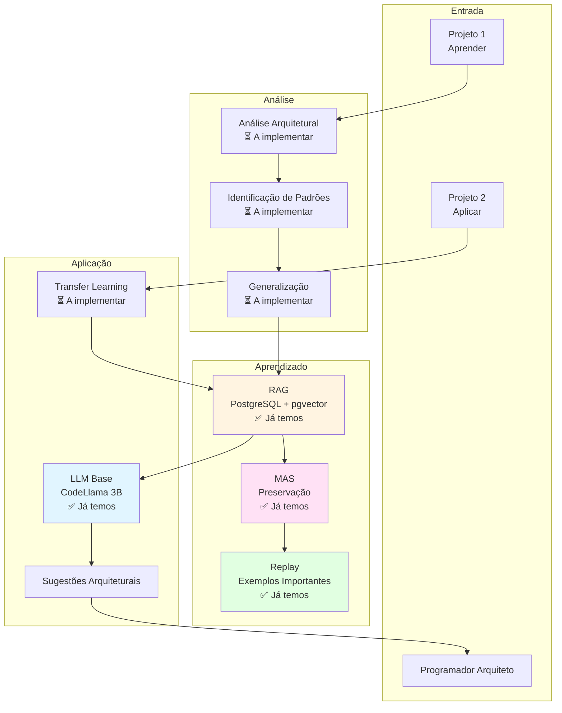
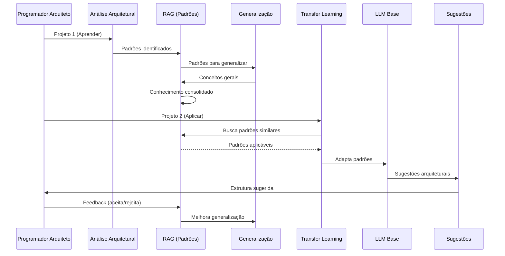

# MVP: Assistente Geral de Código com Aprendizado Arquitetural

**Data**: 2025-01-27  
**Versão**: 1.0  
**Status**: 🟡 Proposta MVP

---

## 📋 Sumário Executivo

Este documento define o **MVP (Minimum Viable Product)** para um assistente de código **geral** que:

1. **Aprende padrões arquiteturais** de qualquer projeto
2. **Aprende em um projeto e aplica em outro** (transfer learning)
3. **Foca em arquitetura e engenharia**, não código de baixo nível
4. **Aprende continuamente** e melhora com o tempo
5. **Prepara para o futuro**: Programadores que arquitetam e gerenciam IA

**Filosofia**: O futuro é de quem sabe arquitetar e gerenciar IA, não de quem escreve código de baixo/médio nível.

---

## 🔍 Pesquisa Profunda: Estado da Arte

### 1. Transfer Learning Entre Projetos

#### 1.1 Abordagens Existentes

**GitHub Copilot**:
- ✅ Aprende de código no contexto
- ⚠️ Não aprende explicitamente entre projetos
- ⚠️ Não foca em padrões arquiteturais

**Amazon CodeWhisperer**:
- ✅ Sugestões baseadas em comentários
- ⚠️ Aprendizado limitado a sessão
- ⚠️ Não transfere conhecimento entre projetos

**Tabnine**:
- ✅ Aprendizado de padrões do código
- ⚠️ Aprendizado geral, não específico por projeto
- ⚠️ Não foca em arquitetura

**Relevância para MVP**:
- ✅ **Inspiração**: Aprender de código no contexto
- ✅ **Diferencial**: Transfer learning explícito entre projetos
- ✅ **Diferencial**: Foco em padrões arquiteturais

---

#### 1.2 Transfer Learning em IA

**Conceito**:
- Aplicar conhecimento aprendido em uma tarefa para outra
- Transferir padrões entre domínios diferentes
- Reutilizar conhecimento adquirido

**Técnicas**:
- **Fine-tuning**: Adaptar modelo pré-treinado
- **Feature Extraction**: Usar representações aprendidas
- **Multi-task Learning**: Treinar em múltiplas tarefas
- **Domain Adaptation**: Adaptar de um domínio para outro

**Para MVP**:
- ✅ **Aprender padrões arquiteturais** de um projeto
- ✅ **Aplicar padrões** em outro projeto
- ✅ **Identificar conceitos gerais** que se aplicam a múltiplos projetos

---

### 2. Aprendizado de Padrões Arquiteturais

#### 2.1 Padrões Arquiteturais vs. Código de Baixo Nível

**Padrões Arquiteturais**:
- Estrutura de projeto
- Organização de módulos
- Padrões de design (MVC, Repository, etc.)
- Padrões de comunicação (API, Events, etc.)
- Padrões de dados (ORM, Migrations, etc.)

**Código de Baixo Nível**:
- Sintaxe específica
- Implementação detalhada
- Funções pequenas
- Lógica de negócio específica

**Foco do MVP**: **Padrões Arquiteturais** (alto nível)

---

#### 2.2 Como Aprender Padrões Arquiteturais

**Abordagens**:
1. **Análise de Estrutura**:
   - Estrutura de diretórios
   - Organização de módulos
   - Dependências entre componentes

2. **Análise de Padrões**:
   - Padrões de design identificados
   - Padrões de comunicação
   - Padrões de dados

3. **Análise de Decisões**:
   - Decisões arquiteturais tomadas
   - Trade-offs considerados
   - Justificativas

4. **Abstração**:
   - Extrair conceitos gerais
   - Identificar princípios aplicáveis
   - Generalizar padrões

**Para MVP**:
- ✅ **RAG**: Indexar estrutura e padrões
- ✅ **LLM**: Identificar padrões arquiteturais
- ✅ **Aprendizado**: Generalizar para múltiplos projetos

---

### 3. Futuro da Programação: Arquitetura vs. Código

#### 3.1 Tendências Identificadas

**Programadores do Futuro**:
- ✅ **Arquitetam** sistemas
- ✅ **Gerenciam** IA
- ✅ **Decidem** sobre estrutura
- ❌ **Não escrevem** código de baixo nível

**IA do Futuro**:
- ✅ **Escreve** código de baixo/médio nível
- ✅ **Implementa** decisões arquiteturais
- ✅ **Aprende** padrões do projeto

**Relevância para MVP**:
- ✅ **Foco**: Assistir em arquitetura, não código
- ✅ **Objetivo**: Programador arquiteta, IA implementa
- ✅ **Aprendizado**: Padrões arquiteturais, não sintaxe

---

#### 3.2 Habilidades Necessárias

**Programador do Futuro**:
1. **Arquitetura de Software**
   - Decisões de estrutura
   - Padrões de design
   - Escalabilidade

2. **Engenharia de Software**
   - Processos de desenvolvimento
   - Qualidade de código
   - Manutenibilidade

3. **Gestão de IA**
   - Treinar modelos
   - Ajustar parâmetros
   - Gerenciar aprendizado

4. **Comunicação**
   - Especificar requisitos
   - Descrever arquitetura
   - Validar resultados

**Para MVP**:
- ✅ **Assistente foca** em ajudar nessas habilidades
- ✅ **Aprende** padrões arquiteturais
- ✅ **Aplica** em novos projetos

---

### 4. Aprendizado Contínuo Geral

#### 4.1 Aprendizado de Múltiplos Projetos

**Desafio**:
- Cada projeto tem estrutura diferente
- Padrões variam entre projetos
- Conceitos gerais são raros

**Solução**:
- ✅ **Abstração**: Identificar conceitos gerais
- ✅ **Generalização**: Aplicar padrões em novos contextos
- ✅ **Transfer Learning**: Usar conhecimento de um projeto em outro

**Para MVP**:
- ✅ **RAG**: Indexar múltiplos projetos
- ✅ **Identificação**: Padrões arquiteturais comuns
- ✅ **Aplicação**: Aplicar em novos projetos

---

#### 4.2 Consolidação de Conhecimento

**Processo**:
1. **Aprender** de projeto específico
2. **Identificar** padrões arquiteturais
3. **Generalizar** para conceitos aplicáveis
4. **Consolidar** em conhecimento reutilizável
5. **Aplicar** em novos projetos

**Tecnologias**:
- ✅ **RAG**: Armazenar padrões aprendidos
- ✅ **MAS**: Preservar conhecimento importante
- ✅ **Consolidação**: Transferir para conhecimento geral

---

## 🎯 Funcionalidades Essenciais para MVP

### 1. Análise Arquitetural de Projetos

**Descrição**: Analisar estrutura e padrões arquiteturais de qualquer projeto

**Funcionalidades**:
- ✅ Analisar estrutura de diretórios
- ✅ Identificar padrões de design
- ✅ Identificar padrões de comunicação
- ✅ Identificar padrões de dados
- ✅ Extrair decisões arquiteturais

**Tecnologias**:
- RAG para indexar estrutura - ✅ Já temos
- LLM para análise - ✅ Já temos
- Parser de estrutura - ⏳ A implementar

**Prioridade**: 🔴 **CRÍTICA**

---

### 2. Aprendizado de Padrões Arquiteturais

**Descrição**: Aprender padrões arquiteturais de projetos e generalizar

**Funcionalidades**:
- ✅ Identificar padrões comuns
- ✅ Generalizar para conceitos aplicáveis
- ✅ Consolidar conhecimento
- ✅ Preservar conhecimento importante (MAS)

**Tecnologias**:
- RAG para indexar - ✅ Já temos
- MAS para preservar - ✅ Já temos
- Generalização - ⏳ A implementar

**Prioridade**: 🔴 **CRÍTICA**

---

### 3. Transfer Learning Entre Projetos

**Descrição**: Aplicar padrões aprendidos em um projeto em outro

**Funcionalidades**:
- ✅ Identificar projetos similares
- ✅ Aplicar padrões aprendidos
- ✅ Adaptar padrões ao novo contexto
- ✅ Sugerir estrutura arquitetural

**Tecnologias**:
- RAG para busca - ✅ Já temos
- LLM para adaptação - ✅ Já temos
- Transfer learning - ⏳ A implementar

**Prioridade**: 🔴 **CRÍTICA**

---

### 4. Sugestões Arquiteturais

**Descrição**: Sugerir estrutura e padrões para novos projetos

**Funcionalidades**:
- ✅ Sugerir estrutura de diretórios
- ✅ Sugerir padrões de design
- ✅ Sugerir organização de módulos
- ✅ Sugerir decisões arquiteturais

**Tecnologias**:
- LLM Base - ✅ Já temos
- RAG para contexto - ✅ Já temos
- Templates arquiteturais - ⏳ A implementar

**Prioridade**: 🟡 **ALTA**

---

### 5. Geração de Código Arquitetural

**Descrição**: Gerar código que implementa decisões arquiteturais

**Funcionalidades**:
- ✅ Gerar estrutura de projeto
- ✅ Gerar módulos base
- ✅ Gerar interfaces
- ✅ Gerar configurações

**Tecnologias**:
- LLM Base - ✅ Já temos
- Templates - ⏳ A implementar
- Contexto arquitetural - ⏳ A implementar

**Prioridade**: 🟡 **ALTA**

---

## 📦 Funcionalidades Futuras (Pós-MVP)

### 1. Fine-tuning Específico

**Descrição**: Fine-tuning do modelo com padrões arquiteturais aprendidos

**Quando**: Após MVP, quando tiver dados suficientes

**Prioridade**: 🔵 **BAIXA**

---

### 2. Consolidação Durante "Sono"

**Descrição**: Consolidar padrões aprendidos periodicamente

**Quando**: Após MVP estável

**Prioridade**: 🔵 **BAIXA**

---

### 3. Backpropamine

**Descrição**: Plasticidade sináptica real

**Quando**: Após validação

**Prioridade**: 🔵 **BAIXA** (experimental)

---

### 4. Processos Psicológicos Completos

**Descrição**: Todos os 15 processos psicológicos

**Quando**: Após MVP estável

**Prioridade**: 🔵 **BAIXA**

---

## 🔧 Arquitetura MVP Simplificada

### Arquitetura do MVP

---

## 📊 Matriz de Componentes: Essencial vs. Futuro

| Componente | Status Atual | Uso no MVP | Prioridade | Esforço |
|------------|--------------|------------|------------|---------|
| **LLM Base (CodeLlama 3B)** | ✅ Implementado | ✅ Essencial | 🔴 Crítica | - |
| **RAG (PostgreSQL + pgvector)** | ✅ Implementado | ✅ Essencial | 🔴 Crítica | - |
| **MAS (Preservação)** | ✅ Implementado | ✅ Essencial | 🟡 Alta | - |
| **Replay Buffer** | ✅ Implementado | ✅ Essencial | 🟡 Alta | - |
| **Análise Arquitetural** | ❌ Não existe | ✅ Essencial | 🔴 Crítica | Médio |
| **Identificação de Padrões** | ❌ Não existe | ✅ Essencial | 🔴 Crítica | Médio |
| **Generalização** | ❌ Não existe | ✅ Essencial | 🔴 Crítica | Alto |
| **Transfer Learning** | ❌ Não existe | ✅ Essencial | 🔴 Crítica | Alto |
| **Templates Arquiteturais** | ❌ Não existe | ✅ Essencial | 🟡 Alta | Baixo |
| **Fine-tuning** | ⏳ Planejado | ⚠️ Futuro | 🔵 Baixa | Alto |
| **Consolidação Sono** | ⏳ Planejado | ⚠️ Futuro | 🔵 Baixa | Alto |
| **Backpropamine** | ❌ Não existe | ⚠️ Futuro | 🔵 Baixa | Muito Alto |

---

## 🎯 Plano de Implementação MVP

### Fase 1: Análise Arquitetural (Sprint 1-2)

**Objetivo**: Analisar estrutura e padrões de projetos

**Tarefas**:
1. ✅ **Parser de Estrutura**
   - Analisar estrutura de diretórios
   - Identificar organização de módulos
   - Extrair dependências

2. ✅ **Identificação de Padrões**
   - Padrões de design (MVC, Repository, etc.)
   - Padrões de comunicação (API, Events)
   - Padrões de dados (ORM, Migrations)

3. ✅ **Indexação no RAG**
   - Indexar estrutura
   - Indexar padrões identificados
   - Indexar decisões arquiteturais

4. ✅ **Feedback System**
   - Capturar aceitação/rejeição
   - Aprender de feedback
   - Melhorar identificação

**Entregas**:
- ✅ Análise arquitetural funcionando
- ✅ Padrões identificados e indexados
- ✅ RAG com conhecimento arquitetural

---

### Fase 2: Aprendizado e Generalização (Sprint 3-4)

**Objetivo**: Aprender padrões e generalizar para múltiplos projetos

**Tarefas**:
1. ✅ **Generalização de Padrões**
   - Identificar padrões comuns entre projetos
   - Extrair conceitos gerais
   - Criar abstrações

2. ✅ **Consolidação**
   - Consolidar padrões aprendidos
   - Preservar conhecimento importante (MAS)
   - Reapresentar exemplos importantes (Replay)

3. ✅ **Transfer Learning**
   - Identificar projetos similares
   - Aplicar padrões aprendidos
   - Adaptar ao novo contexto

4. ✅ **Sugestões Arquiteturais**
   - Sugerir estrutura para novos projetos
   - Sugerir padrões aplicáveis
   - Sugerir decisões arquiteturais

**Entregas**:
- ✅ Generalização funcionando
- ✅ Transfer learning entre projetos
- ✅ Sugestões arquiteturais

---

### Fase 3: Geração e Refinamento (Sprint 5-6)

**Objetivo**: Gerar código arquitetural e refinar sistema

**Tarefas**:
1. ✅ **Geração de Código Arquitetural**
   - Gerar estrutura de projeto
   - Gerar módulos base
   - Gerar interfaces e configurações

2. ✅ **Templates Arquiteturais**
   - Templates para estruturas comuns
   - Templates para padrões
   - Templates para configurações

3. ✅ **Otimização**
   - Performance
   - Precisão de sugestões
   - Qualidade de generalização

4. ✅ **Testes**
   - Testes end-to-end
   - Validação com desenvolvedores
   - Ajustes baseados em feedback

**Entregas**:
- ✅ MVP completo e estável
- ✅ Geração de código arquitetural
- ✅ Sistema testado e validado

---

## 📋 Checklist MVP

### ✅ Componentes Reaproveitáveis

- [x] **LLM Base (CodeLlama 3B)** - ✅ Já temos
- [x] **RAG (PostgreSQL + pgvector)** - ✅ Já temos
- [x] **MAS (Preservação)** - ✅ Já temos
- [x] **Replay Buffer** - ✅ Já temos
- [x] **Feedback System** - ✅ Estrutura existe

### ⏳ Componentes a Implementar

- [ ] **Análise Arquitetural**
  - [ ] Parser de estrutura de diretórios
  - [ ] Identificação de padrões de design
  - [ ] Identificação de padrões de comunicação
  - [ ] Identificação de padrões de dados
  - [ ] Extração de decisões arquiteturais
  
- [ ] **Generalização**
  - [ ] Identificação de padrões comuns
  - [ ] Extração de conceitos gerais
  - [ ] Criação de abstrações
  - [ ] Consolidação de conhecimento
  
- [ ] **Transfer Learning**
  - [ ] Identificação de projetos similares
  - [ ] Aplicação de padrões aprendidos
  - [ ] Adaptação ao novo contexto
  - [ ] Sugestões arquiteturais
  
- [ ] **Geração Arquitetural**
  - [ ] Geração de estrutura
  - [ ] Geração de módulos base
  - [ ] Templates arquiteturais
  - [ ] Geração de configurações

---

## 🎨 Diagrama de Fluxo MVP

---

## 🎯 Diferenciais do MVP

### 1. Foco em Arquitetura, Não Código

**Outros Assistentes**:
- ❌ Focam em código de baixo nível
- ❌ Sugestões de sintaxe
- ❌ Completamento de funções

**Nosso MVP**:
- ✅ Foca em padrões arquiteturais
- ✅ Sugestões de estrutura
- ✅ Decisões arquiteturais

---

### 2. Transfer Learning Entre Projetos

**Outros Assistentes**:
- ❌ Aprendizado limitado a projeto atual
- ❌ Não transfere entre projetos
- ❌ Não generaliza padrões

**Nosso MVP**:
- ✅ Aprende de múltiplos projetos
- ✅ Transfere conhecimento entre projetos
- ✅ Generaliza padrões arquiteturais

---

### 3. Aprendizado Contínuo Explícito

**Outros Assistentes**:
- ⚠️ Aprendizado implícito
- ⚠️ Não preserva conhecimento explicitamente
- ⚠️ Não consolida aprendizado

**Nosso MVP**:
- ✅ Aprendizado explícito de padrões
- ✅ Preservação com MAS
- ✅ Consolidação de conhecimento

---

### 4. Preparação para o Futuro

**Outros Assistentes**:
- ❌ Focam em código atual
- ❌ Não preparam para mudanças
- ❌ Não evoluem com tendências

**Nosso MVP**:
- ✅ Foca em arquitetura (futuro)
- ✅ Prepara programadores para gerenciar IA
- ✅ Evolui com aprendizado contínuo

---

## 📚 Referências e Fontes

### Assistentes de Código Existentes

1. **GitHub Copilot**: [github.com/features/copilot](https://github.com/features/copilot)
2. **Amazon CodeWhisperer**: [aws.amazon.com/codewhisperer](https://aws.amazon.com/codewhisperer)
3. **Tabnine**: [tabnine.com](https://www.tabnine.com/)

### Transfer Learning

- **Transfer Learning Survey**: Papers sobre transfer learning em IA
- **Domain Adaptation**: Adaptação entre domínios

### Arquitetura de Software

- **Design Patterns**: Padrões de design
- **Software Architecture**: Arquitetura de software
- **Clean Architecture**: Arquitetura limpa

---

## 🎯 Resumo Executivo

### O Que É Essencial (MVP)

1. ✅ **Análise Arquitetural** - Analisar estrutura e padrões
2. ✅ **Aprendizado de Padrões** - Aprender e generalizar
3. ✅ **Transfer Learning** - Aplicar em novos projetos
4. ✅ **Sugestões Arquiteturais** - Sugerir estrutura e padrões
5. ✅ **Geração Arquitetural** - Gerar código que implementa decisões

### O Que Pode Ser Futuro

1. ⚠️ **Fine-tuning Específico** - Após dados suficientes
2. ⚠️ **Consolidação Durante Sono** - Após MVP estável
3. ⚠️ **Backpropamine** - Experimental, futuro
4. ⚠️ **Processos Psicológicos** - Após MVP

### Tecnologias Reaproveitáveis

- ✅ **LLM Base** - Já temos
- ✅ **RAG** - Já temos
- ✅ **MAS** - Já temos
- ✅ **Replay** - Já temos
- ✅ **Feedback** - Estrutura existe

### Esforço Estimado

- **Fase 1 (Análise)**: 2-3 semanas
- **Fase 2 (Aprendizado)**: 2-3 semanas
- **Fase 3 (Geração)**: 1-2 semanas
- **Total MVP**: 5-8 semanas

---

## 🚀 Visão de Futuro

### Programador do Futuro

**Habilidades**:
- ✅ Arquitetura de software
- ✅ Engenharia de software
- ✅ Gestão de IA
- ✅ Comunicação e especificação

**Não Precisa**:
- ❌ Escrever código de baixo nível
- ❌ Conhecer sintaxe detalhada
- ❌ Implementar funções pequenas

### Assistente do Futuro

**Capacidades**:
- ✅ Implementa decisões arquiteturais
- ✅ Aprende padrões do projeto
- ✅ Aplica conhecimento entre projetos
- ✅ Evolui continuamente

**Foco**:
- ✅ Padrões arquiteturais
- ✅ Estrutura de projetos
- ✅ Decisões de design
- ✅ Engenharia de software

---

**Data**: 2025-01-27  
**Versão**: 1.0  
**Status**: 🟡 Proposta MVP - Aguardando Aprovação

