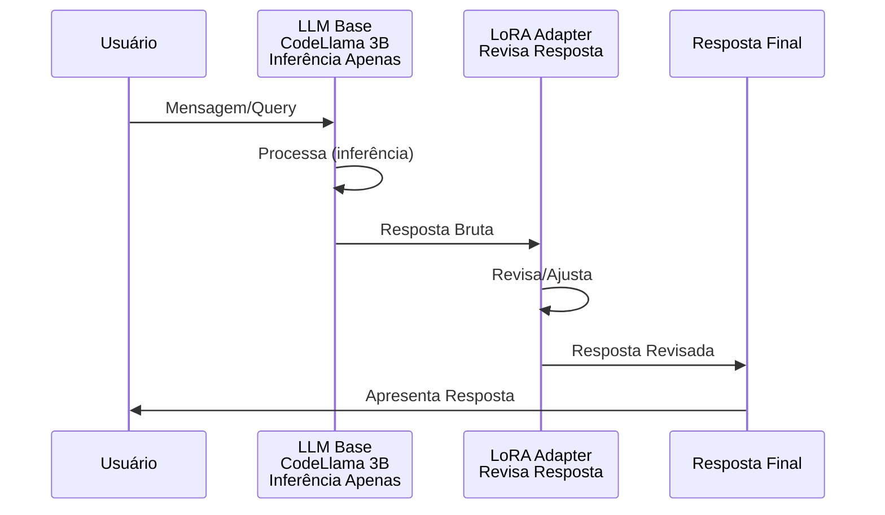
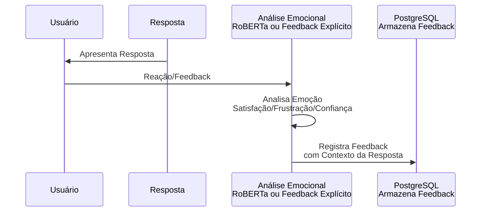
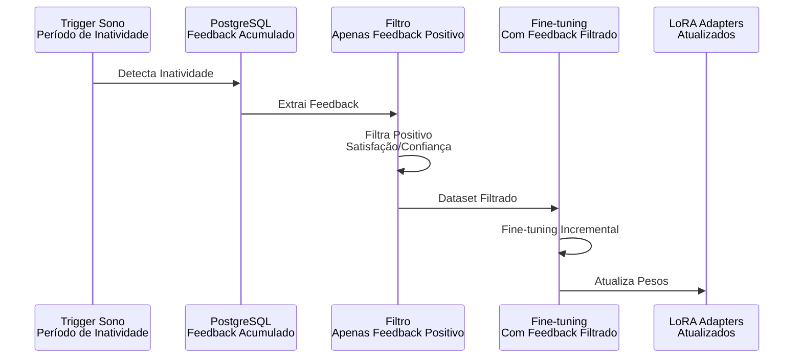
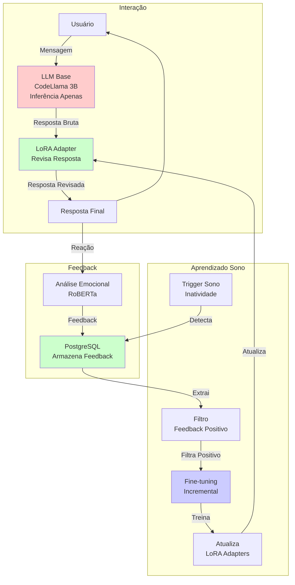

# Revisão Interativa do Sistema

**Data**: 2025-01-27  
**Versão**: 1.0  
**Status**: 🔄 Em Revisão

---

## 📋 Objetivo

Revisar o sistema de forma interativa, parte por parte, simplificando o fluxo e garantindo que apenas o essencial tenha aprendizado.

**Fluxo Correto Identificado**:
1. Usuário manda mensagem
2. Mensagem vai para LLM Base (inferência apenas)
3. Resposta do LLM Base é revisada pelo Adapter (LoRA)
4. Emoção do usuário é registrada no banco (PostgreSQL)
5. No sono, feedback é persistido nos adapters (LoRA)

---

## 🔄 1. Fluxo Principal de Interação

### Fluxo Correto Identificado pelo Usuário

```
1. Usuário manda mensagem
2. Mensagem vai para LLM Base (inferência apenas)
3. Resposta do LLM Base é revisada pelo Adapter (LoRA)
4. Resposta final é apresentada ao usuário
```

### Diagrama do Fluxo Simplificado



### Questões para Revisar

#### 1.1. Precisa de Modulador?

**Situação Atual**: Modulador seleciona qual adapter usar baseado em contexto

**Alternativas**:
- **A) Manter Modulador**: Seleciona adapter baseado em contexto (ex: Odoo, Django, React)
- **B) Seleção Direta**: Adapter selecionado diretamente pelo contexto do projeto/código
- **C) Múltiplos Adapters Simultâneos**: Aplicar múltiplos adapters com pesos

**Recomendação Inicial**: **B) Seleção Direta** - Mais simples, adapter pode ser selecionado pelo contexto do arquivo/projeto atual

**Pergunta para o Usuário**: 
- Como o adapter é selecionado? Por contexto do arquivo (ex: `.py` → Python adapter)? Por projeto (ex: `odoo/` → Odoo adapter)?
- Ou sempre usa o mesmo adapter?

---

#### 1.2. Precisa de Atenção Neuromodulada?

**Situação Atual**: Mecanismo de atenção que modula onde focar baseado em contexto

**Alternativas**:
- **A) Manter Atenção Neuromodulada**: Modula atenção do LLM Base
- **B) Atenção Padrão**: Usar atenção padrão do LLM Base (mais simples)

**Recomendação Inicial**: **B) Atenção Padrão** - LLM Base já tem atenção, não precisa modular

**Pergunta para o Usuário**: 
- A atenção padrão do LLM Base é suficiente? Ou há casos onde precisa focar em partes específicas do contexto?

---

#### 1.3. Precisa de Cerebelo?

**Situação Atual**: Cerebelo para padrões específicos e automatização

**Alternativas**:
- **A) Manter Cerebelo**: Modelo separado para padrões específicos
- **B) LoRA Adapters Fazem Isso**: Adapters já aprendem padrões específicos por contexto

**Recomendação Inicial**: **B) LoRA Adapters Fazem Isso** - Adapters já especializam por contexto, não precisa de modelo separado

**Pergunta para o Usuário**: 
- LoRA Adapters já aprendem padrões específicos por contexto. Precisa de um modelo separado (Cerebelo) para padrões mais complexos? Ou adapters são suficientes?

---

## 💾 2. Sistema de Feedback

### Fluxo Correto Identificado pelo Usuário

```
1. Usuário recebe resposta
2. Emoção do usuário é capturada (análise de sentimento ou feedback explícito)
3. Emoção é registrada no banco (PostgreSQL)
```

### Diagrama do Fluxo de Feedback



### Questões para Revisar

#### 2.1. Como Capturar Emoção do Usuário?

**Alternativas**:
- **A) Análise de Sentimento**: Modelo de sentimento (RoBERTa) analisa texto do usuário
- **B) Feedback Explícito**: Usuário fornece feedback explícito (👍/👎, rating)
- **C) Ambos**: Análise automática + feedback explícito quando disponível

**Recomendação Inicial**: **C) Ambos** - Análise automática como padrão, feedback explícito quando disponível

---

#### 2.2. Onde Armazenar?

**Situação Atual**: PostgreSQL + pgvector

**Alternativas**:
- **A) PostgreSQL + pgvector**: Armazena embeddings e feedback
- **B) PostgreSQL Simples**: Apenas feedback, sem embeddings
- **C) Arquivo JSON**: Mais simples, mas menos escalável

**Recomendação Inicial**: **A) PostgreSQL + pgvector** - Já implementado, permite busca semântica

---

#### 2.3. Precisa de Replay Buffer?

**Situação Atual**: Replay Buffer filtra o que vai ser persistido

**Alternativas**:
- **A) Manter Replay Buffer**: Filtra feedback antes de persistir
- **B) Ir Direto para PostgreSQL**: Feedback vai direto, filtra apenas no sono

**Recomendação Inicial**: **B) Ir Direto para PostgreSQL** - Mais simples, filtra apenas no sono quando necessário

**Pergunta para o Usuário**: 
- Feedback vai direto para PostgreSQL? Ou precisa de algum buffer/filtro antes?

---

#### 2.4. Precisa de Integração 70%/30%?

**Situação Atual**: 70% feedback implícito (aceitar/editar/deletar) + 30% emocional

**Alternativas**:
- **A) Manter 70%/30%**: Combina feedback implícito e emocional
- **B) Apenas Emoção**: Foca apenas em feedback emocional
- **C) Apenas Implícito**: Foca apenas em ações (aceitar/editar/deletar)

**Recomendação Inicial**: **A) Manter 70%/30%** - Feedback implícito é mais objetivo, emocional é importante para satisfação

---

## 🧠 3. Sistema de Aprendizado

### Fluxo Correto Identificado pelo Usuário

```
1. Sistema detecta período de inatividade (sono)
2. Extrai feedback do PostgreSQL
3. Filtra feedback positivo (satisfação/confiança)
4. Fine-tuning com feedback filtrado
5. Atualiza LoRA Adapters
```

### Diagrama do Fluxo de Aprendizado (Sono)



### Questões para Revisar

#### 3.1. O Que Realmente Precisa Aprender?

**Situação Atual**: Cerebelo, LoRA Adapters, Modulador, Atenção

**Alternativas**:
- **A) Apenas LoRA Adapters**: Mais simples, adapters aprendem padrões
- **B) LoRA + Modulador**: Adapters + seleção de adapters
- **C) LoRA + Cerebelo**: Adapters + padrões específicos

**Recomendação Inicial**: **A) Apenas LoRA Adapters** - Adapters já fazem adaptação por contexto

**Pergunta para o Usuário**: 
- Apenas LoRA Adapters precisam aprender? Ou há outros componentes que precisam aprender também?

---

#### 3.2. Precisa de MAS?

**Situação Atual**: MAS preserva conhecimento antigo importante

**Alternativas**:
- **A) Manter MAS**: Preserva conhecimento antigo durante fine-tuning
- **B) Fine-tuning Simples**: Apenas fine-tuning incremental sem preservação explícita
- **C) Replay de Exemplos Antigos**: Mistura exemplos antigos com novos

**Recomendação Inicial**: **C) Replay de Exemplos Antigos** - Mais simples que MAS, mistura exemplos antigos com novos

**Pergunta para o Usuário**: 
- Precisa preservar conhecimento antigo? Ou pode apenas adicionar novo conhecimento incrementalmente?

---

#### 3.3. Precisa de RL?

**Situação Atual**: RL PPO treina Modulador

**Alternativas**:
- **A) Manter RL**: Se Modulador for mantido, RL pode treinar seleção
- **B) Fine-tuning com Feedback**: Apenas fine-tuning supervisionado com feedback
- **C) Sem RL**: Se Modulador for removido, RL não é necessário

**Recomendação Inicial**: **C) Sem RL** - Se Modulador for removido, RL não é necessário

---

#### 3.4. Precisa de Backpropamine?

**Situação Atual**: Backpropamine para plasticidade real

**Alternativas**:
- **A) Manter Backpropamine**: Plasticidade real durante uso
- **B) Fine-tuning Tradicional**: Apenas fine-tuning durante sono
- **C) Ambos**: Backpropamine experimental, fine-tuning como base

**Recomendação Inicial**: **B) Fine-tuning Tradicional** - Mais simples e comprovado, Backpropamine pode ser experimental futuro

**Pergunta para o Usuário**: 
- Fine-tuning tradicional durante sono é suficiente? Ou precisa de aprendizado mais rápido (Backpropamine) durante uso?

---

## 💤 4. Sistema de Consolidação (Sono)

### Fluxo Correto Identificado pelo Usuário

```
1. Sistema detecta período de inatividade
2. Extrai feedback do PostgreSQL
3. Filtra apenas feedback positivo (satisfação/confiança)
4. Fine-tuning com feedback filtrado
5. Atualiza LoRA Adapters
```

### Questões para Revisar

#### 4.1. Como Funciona o Sono?

**Alternativas**:
- **A) Período de Inatividade**: Detecta quando usuário não está usando
- **B) Agendado**: Executa em horário específico (ex: meia-noite)
- **C) Manual**: Usuário pode acionar manualmente

**Recomendação Inicial**: **A) Período de Inatividade** - Automático, não requer intervenção

**Pergunta para o Usuário**: 
- Como detectar período de inatividade? Tempo sem interação? Horário específico? Ambos?

---

#### 4.2. O Que é Persistido nos Adapters?

**Alternativas**:
- **A) Apenas Feedback Positivo**: Persiste apenas conhecimento que gerou satisfação
- **B) Tudo com Peso**: Persiste tudo, mas com peso baseado em feedback
- **C) Tudo**: Persiste tudo, sem filtro

**Recomendação Inicial**: **A) Apenas Feedback Positivo** - Foca no que funciona, evita aprender padrões ruins

**Pergunta para o Usuário**: 
- Apenas feedback positivo (satisfação/confiança) vai para adapters? Ou também feedback negativo para evitar padrões ruins?

---

#### 4.3. Precisa Filtrar por Feedback Emocional?

**Alternativas**:
- **A) Filtrar**: Apenas feedback positivo (satisfação/confiança) vai para adapters
- **B) Não Filtrar**: Tudo vai, mas com peso baseado em feedback
- **C) Filtrar Apenas Negativo**: Remove apenas feedback muito negativo

**Recomendação Inicial**: **A) Filtrar** - Apenas conhecimento que gerou satisfação deve ser aprendido

---

#### 4.4. Precisa de MAS para Preservar?

**Alternativas**:
- **A) Manter MAS**: Preserva conhecimento antigo importante
- **B) Replay de Exemplos**: Mistura exemplos antigos com novos
- **C) Fine-tuning Incremental Simples**: Apenas adiciona novo conhecimento

**Recomendação Inicial**: **B) Replay de Exemplos** - Mais simples, mistura exemplos antigos com novos durante treinamento

**Pergunta para o Usuário**: 
- Precisa preservar conhecimento antigo durante fine-tuning? Ou pode apenas adicionar novo conhecimento?

---

## 🔍 5. Componentes Opcionais - Revisão

### 5.1. Modulador

**Status**: ⚠️ Questionável

**Função**: Seleciona qual adapter usar baseado em contexto

**Alternativa**: Seleção direta pelo contexto do projeto/arquivo

**Decisão**: Aguardando revisão do fluxo principal

---

### 5.2. Atenção Neuromodulada

**Status**: ⚠️ Questionável

**Função**: Modula atenção do LLM Base

**Alternativa**: Atenção padrão do LLM Base

**Decisão**: Aguardando revisão do fluxo principal

---

### 5.3. Cerebelo

**Status**: ⚠️ Questionável

**Função**: Padrões específicos e automatização

**Alternativa**: LoRA Adapters já fazem isso

**Decisão**: Aguardando revisão do fluxo principal

---

### 5.4. RL PPO

**Status**: ⚠️ Questionável

**Função**: Treina Modulador

**Alternativa**: Não necessário se Modulador for removido

**Decisão**: Aguardando revisão do sistema de aprendizado

---

### 5.5. Backpropamine

**Status**: ⚠️ Questionável

**Função**: Plasticidade real durante uso

**Alternativa**: Fine-tuning tradicional durante sono

**Decisão**: Aguardando revisão do sistema de aprendizado

---

### 5.6. MAS

**Status**: ⚠️ Questionável

**Função**: Preserva conhecimento antigo importante

**Alternativa**: Replay de exemplos antigos

**Decisão**: Aguardando revisão do sistema de consolidação

---

### 5.7. Replay Buffer

**Status**: ⚠️ Questionável

**Função**: Filtra feedback antes de persistir

**Alternativa**: Ir direto para PostgreSQL, filtrar apenas no sono

**Decisão**: Aguardando revisão do sistema de feedback

---

## 📊 Resumo das Recomendações Iniciais

### Fluxo Simplificado Proposto

1. **Interação**:
   - Usuário → LLM Base → LoRA Adapter → Resposta
   - Sem Modulador (seleção direta)
   - Sem Atenção Neuromodulada (atenção padrão)
   - Sem Cerebelo (adapters fazem isso)

2. **Feedback**:
   - Emoção → PostgreSQL (direto, sem Replay Buffer)
   - Feedback implícito + emocional (70%/30%)

3. **Aprendizado**:
   - Apenas LoRA Adapters
   - Fine-tuning tradicional (sem Backpropamine)
   - Replay de exemplos antigos (sem MAS)
   - Sem RL (sem Modulador)

4. **Consolidação (Sono)**:
   - PostgreSQL → Filtrar feedback positivo → Fine-tuning → LoRA Adapters
   - Replay de exemplos antigos misturados com novos

---

## 📊 Resumo: Componentes Necessários vs. Opcionais (Baseado em Recomendações)

### ✅ Componentes Essenciais (MVP)

1. **LLM Base (CodeLlama 3B)**
   - Função: Raciocínio principal, geração de código
   - Status: Não treina (plug-and-play)
   - Justificativa: Base do sistema, pode ser trocada

2. **LoRA Adapters**
   - Função: Adaptação por contexto, revisão de respostas
   - Status: Treina apenas durante sono
   - Justificativa: Essencial para aprendizado e especialização

3. **PostgreSQL + pgvector**
   - Função: Armazenar feedback e contexto
   - Status: Persistência
   - Justificativa: Memória de médio prazo, busca semântica

4. **Análise Emocional (RoBERTa)**
   - Função: Capturar emoção do usuário
   - Status: Inferência apenas
   - Justificativa: Feedback emocional é essencial

5. **Sistema de Sono**
   - Função: Consolidação durante inatividade
   - Status: Fine-tuning incremental
   - Justificativa: Aprendizado sem overhead durante uso

### ⚠️ Componentes Opcionais (Avaliar Necessidade)

1. **Modulador**
   - Status: Questionável
   - Alternativa: Seleção direta de adapter
   - Decisão: Aguardando resposta do usuário

2. **Atenção Neuromodulada**
   - Status: Questionável
   - Alternativa: Atenção padrão do LLM
   - Decisão: Aguardando resposta do usuário

3. **Cerebelo**
   - Status: Questionável
   - Alternativa: LoRA Adapters já fazem isso
   - Decisão: Aguardando resposta do usuário

4. **Replay Buffer**
   - Status: Questionável
   - Alternativa: Ir direto para PostgreSQL
   - Decisão: Aguardando resposta do usuário

5. **MAS (Memory Aware Synapses)**
   - Status: Questionável
   - Alternativa: Replay de exemplos antigos
   - Decisão: Aguardando resposta do usuário

6. **RL PPO**
   - Status: Questionável
   - Alternativa: Fine-tuning supervisionado
   - Decisão: Aguardando resposta do usuário

7. **Backpropamine**
   - Status: Questionável
   - Alternativa: Fine-tuning tradicional
   - Decisão: Aguardando resposta do usuário

### ❌ Componentes Removidos (Não Necessários)

- Nenhum ainda (aguardando decisões do usuário)

---

## 🎯 Próximos Passos

1. ✅ Criar documento de revisão interativa
2. ✅ Revisar fluxo principal com perguntas
3. ✅ Revisar sistema de feedback com perguntas
4. ✅ Revisar sistema de aprendizado com perguntas
5. ⏳ **Aguardar respostas do usuário** para identificar componentes realmente necessários
6. ⏳ Simplificar arquitetura baseado nas respostas
7. ⏳ Atualizar diagramas com fluxo simplificado
8. ⏳ Documentar decisões finais e justificativas

---

---

## 🎨 Diagrama do Fluxo Simplificado Proposto (Baseado em Recomendações)



**Legenda**:
- **Vermelho**: LLM Base (não treina)
- **Verde**: Componentes que aprendem (Adapter, PostgreSQL, Fine-tuning)
- **Azul**: Processo de consolidação (sono)

---

## 📝 Checklist de Decisões Pendentes

### Fluxo Principal
- [ ] Modulador: Manter ou remover?
- [ ] Atenção Neuromodulada: Manter ou remover?
- [ ] Cerebelo: Manter ou remover?
- [ ] Seleção de Adapter: Como funciona?

### Sistema de Feedback
- [ ] Replay Buffer: Manter ou remover?
- [ ] Integração 70%/30%: Manter ou simplificar?
- [ ] Captura de Emoção: Apenas automática ou também explícita?

### Sistema de Aprendizado
- [ ] MAS: Manter ou usar Replay de Exemplos?
- [ ] RL PPO: Manter ou remover?
- [ ] Backpropamine: Manter ou apenas Fine-tuning tradicional?

### Sistema de Consolidação
- [ ] Filtro de Feedback: Apenas positivo ou tudo com peso?
- [ ] Preservação: MAS ou Replay de Exemplos?

---

**Data de Criação**: 2025-01-27  
**Última Atualização**: 2025-01-27  
**Status**: 🔄 Em Revisão - Aguardando Decisões do Usuário

