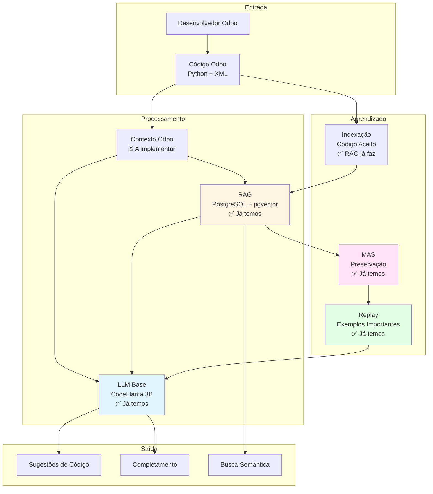
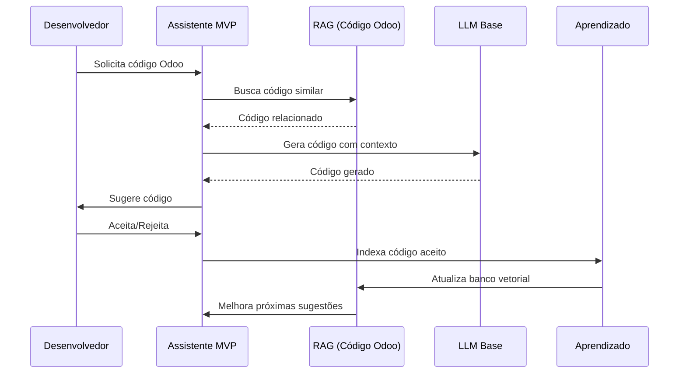

# MVP: Assistente de Código Odoo com Aprendizado Contínuo

**Data**: 2025-01-27  
**Versão**: 1.0  
**Status**: 🟡 Proposta MVP

---

## 📋 Sumário Executivo

Este documento define o **MVP (Minimum Viable Product)** para um assistente de código Odoo que aprende com o tempo, identificando:

1. **Funcionalidades Essenciais**: O que é crítico para o MVP
2. **Funcionalidades Futuras**: O que pode ser implementado depois
3. **Tecnologias Reaproveitáveis**: O que já temos no projeto
4. **Recomendações**: Baseadas em pesquisa profunda

**Objetivo do MVP**: Assistente de código que ajuda desenvolvedores Odoo, aprendendo com padrões de código e melhorando sugestões ao longo do tempo.

---

## 🔍 Pesquisa Profunda: Estado da Arte

### 1. Assistentes de Código Odoo Existentes

#### 1.1 Assista Code (Cybrosys)

**Fonte**: [docs.cybrosys.com](https://docs.cybrosys.com/assista-ide/features/assista-code)

**Características**:
- ✅ Integrado ao IDE (Assista IDE)
- ✅ Assistência contextual em desenvolvimento Odoo
- ✅ Escrita de código e depuração
- ✅ Baseado em IA

**Funcionalidades**:
- Sugestões de código
- Detecção de erros
- Completamento automático
- Depuração assistida

**Relevância para MVP**:
- ✅ **Inspiração**: Funcionalidades essenciais identificadas
- ⚠️ **Diferencial**: Nosso foco em aprendizado contínuo

---

#### 1.2 Odoo Expert

**Fonte**: [github.com/MFYDev/odoo-expert](https://github.com/MFYDev/odoo-expert)

**Características**:
- ✅ Assistente de documentação
- ✅ Busca semântica na documentação técnica
- ✅ Interface de chat interativa
- ✅ Suporte a múltiplas versões do Odoo
- ✅ Alimentado por LLMs

**Funcionalidades**:
- Conversão e processamento de documentação
- Busca semântica
- Chat interativo
- Suporte multi-versão

**Relevância para MVP**:
- ✅ **RAG**: Usa busca semântica (similar ao nosso RAG)
- ✅ **Documentação**: Acesso a documentação Odoo
- ⚠️ **Diferencial**: Foco em código, não apenas documentação

---

#### 1.3 OdooSense

**Fonte**: [github.com/Shamlan321/OdooSense](https://github.com/Shamlan321/OdooSense)

**Características**:
- ✅ Assistente AI integrado ao Odoo ERP
- ✅ Interações em linguagem natural
- ✅ Consulta e gerenciamento de módulos
- ✅ Acesso a dados em tempo real

**Funcionalidades**:
- Consultas em linguagem natural
- Gerenciamento de módulos
- Acesso a dados do Odoo
- Execução de ações

**Relevância para MVP**:
- ⚠️ **Foco diferente**: ERP vs. Desenvolvimento
- ✅ **Inspiração**: Integração com Odoo

---

#### 1.4 Odoo AI Assistant (v18)

**Fonte**: [odoo-assistant.com](https://odoo-assistant.com/)

**Características**:
- ✅ Assistente de desenvolvimento
- ✅ Respostas contextuais e específicas
- ✅ Baseado em código-fonte e documentação
- ✅ Atualizado para versão 18

**Funcionalidades**:
- Respostas precisas sobre desenvolvimento
- Busca em código-fonte
- Busca em documentação
- Assistência contextual

**Relevância para MVP**:
- ✅ **Similar**: Assistente de desenvolvimento
- ✅ **RAG**: Busca em código-fonte (similar ao nosso)
- ⚠️ **Diferencial**: Aprendizado contínuo

---

### 2. Arquitetura Odoo: Padrões e Estrutura

#### 2.1 Estrutura de Módulos Odoo

**Componentes Principais**:
- **Models** (Python): Classes que herdam de `models.Model`
- **Views** (XML): Definições de interface
- **Controllers** (Python): Rotas HTTP
- **Security** (CSV/XML): Regras de acesso
- **Data** (XML/CSV): Dados iniciais
- **Manifest** (`__manifest__.py`): Metadados do módulo

**Padrões Comuns**:
- Herança de modelos (`_inherit`)
- Extensão de views (`inherit`)
- Computed fields (`@api.depends`)
- Constraints (`@api.constrains`)
- Onchange methods (`@api.onchange`)

**Relevância para MVP**:
- ✅ **Foco**: Assistir na criação desses componentes
- ✅ **Padrões**: Aprender padrões Odoo específicos
- ✅ **Contexto**: Entender estrutura de módulos

---

#### 2.2 Linguagens e Tecnologias

**Stack Odoo**:
- **Python 3.8+**: Lógica de negócio
- **XML**: Definições de views e dados
- **PostgreSQL**: Banco de dados
- **JavaScript/OWL**: Frontend (versões recentes)
- **QWeb**: Template engine

**Relevância para MVP**:
- ✅ **Modelo Base**: CodeLlama 3B suporta Python e XML
- ✅ **RAG**: Pode indexar código Python e XML
- ✅ **Contexto**: Entender stack completa

---

### 3. Aprendizado Contínuo em Assistentes de Código

#### 3.1 Abordagens Existentes

**GitHub Copilot**:
- ✅ Aprende de código no contexto
- ✅ Sugestões baseadas em padrões do repositório
- ⚠️ Não aprende explicitamente com feedback do usuário

**Amazon CodeWhisperer**:
- ✅ Recomendações baseadas em comentários
- ✅ Aprende de código no IDE
- ⚠️ Aprendizado limitado a sessão

**Tabnine**:
- ✅ Aprendizado de padrões do código
- ✅ Sugestões contextuais
- ⚠️ Aprendizado geral, não específico por projeto

**Relevância para MVP**:
- ✅ **Inspiração**: Aprender de código no contexto
- ✅ **Diferencial**: Aprendizado contínuo explícito (nossa proposta)

---

#### 3.2 Técnicas de Aprendizado Contínuo

**Fine-tuning Incremental**:
- ✅ Adapta modelo a padrões específicos
- ⚠️ Requer dados suficientes
- ⚠️ Pode causar esquecimento

**RAG com Atualização**:
- ✅ Adiciona novos exemplos ao banco vetorial
- ✅ Não modifica modelo base
- ✅ Aprendizado rápido

**LoRA Adapters**:
- ✅ Adaptação eficiente
- ✅ Múltiplos adapters por contexto
- ✅ Preserva modelo base

**Relevância para MVP**:
- ✅ **RAG**: Já implementado, pode ser usado
- ✅ **LoRA**: Pode ser implementado para adaptação Odoo
- ⚠️ **Fine-tuning**: Pode ser futuro

---

### 4. Tecnologias Reaproveitáveis do Projeto Atual

#### 4.1 Componentes Já Implementados

**✅ RAG (PostgreSQL + pgvector)**:
- **Localização**: `src/rag/vector_db.py`
- **Status**: ✅ Implementado e funcional
- **Uso no MVP**: Indexar código Odoo, documentação, exemplos
- **Vantagem**: Já funciona, só precisa adaptar para Odoo

**✅ MAS (Memory Aware Synapses)**:
- **Localização**: `src/learning/continual_learning.py`
- **Status**: ✅ Implementado
- **Uso no MVP**: Preservar conhecimento importante durante aprendizado
- **Vantagem**: Já implementado, pode ser usado

**✅ LLM Base (CodeLlama 3B)**:
- **Localização**: `src/models/base_model.py`
- **Status**: ✅ Implementado
- **Uso no MVP**: Geração de código Odoo
- **Vantagem**: Já funciona, suporta Python e XML

**✅ Replay Buffer**:
- **Localização**: `src/learning/continual_learning.py`
- **Status**: ✅ Implementado
- **Uso no MVP**: Reapresentar exemplos importantes
- **Vantagem**: Já implementado

**✅ Feedback System**:
- **Localização**: `src/feedback/`
- **Status**: ✅ Estrutura implementada
- **Uso no MVP**: Aprender de aceitação/rejeição de sugestões
- **Vantagem**: Base já existe

---

#### 4.2 Componentes Parcialmente Implementados

**⚠️ LoRA Adapters**:
- **Status**: ⏳ Planejado, não implementado
- **Uso no MVP**: Adaptação específica para Odoo
- **Esforço**: Médio (já temos estrutura)

**⚠️ Consolidação**:
- **Status**: ⏳ Estrutura básica
- **Uso no MVP**: Consolidar conhecimento Odoo aprendido
- **Esforço**: Médio

---

## 🎯 Funcionalidades Essenciais para MVP

### 1. Geração de Código Odoo

**Descrição**: Gerar código Python e XML para módulos Odoo

**Funcionalidades**:
- ✅ Gerar models Python
- ✅ Gerar views XML
- ✅ Gerar controllers
- ✅ Gerar security rules
- ✅ Gerar manifest

**Tecnologias**:
- LLM Base (CodeLlama 3B) - ✅ Já temos
- RAG para contexto - ✅ Já temos
- Templates Odoo - ⏳ A implementar

**Prioridade**: 🔴 **CRÍTICA**

---

### 2. Completamento de Código

**Descrição**: Sugerir completamento de código enquanto desenvolvedor digita

**Funcionalidades**:
- ✅ Completamento de métodos Odoo
- ✅ Completamento de campos
- ✅ Completamento de decorators
- ✅ Completamento de XML

**Tecnologias**:
- LLM Base - ✅ Já temos
- Contexto do código atual - ⏳ A implementar
- Cache de sugestões - ⏳ A implementar

**Prioridade**: 🔴 **CRÍTICA**

---

### 3. Busca Semântica em Código Odoo

**Descrição**: Buscar código similar ou relacionado no projeto

**Funcionalidades**:
- ✅ Buscar models similares
- ✅ Buscar views similares
- ✅ Buscar padrões de código
- ✅ Buscar exemplos

**Tecnologias**:
- RAG (PostgreSQL + pgvector) - ✅ Já temos
- Embeddings de código - ⏳ A adaptar
- Indexação de código Odoo - ⏳ A implementar

**Prioridade**: 🟡 **ALTA**

---

### 4. Aprendizado de Padrões

**Descrição**: Aprender padrões de código do projeto e melhorar sugestões

**Funcionalidades**:
- ✅ Indexar código aceito
- ✅ Aprender padrões do projeto
- ✅ Melhorar sugestões baseado em histórico
- ✅ Preservar conhecimento importante (MAS)

**Tecnologias**:
- RAG para indexar - ✅ Já temos
- MAS para preservar - ✅ Já temos
- Replay para reapresentar - ✅ Já temos
- Feedback system - ✅ Estrutura existe

**Prioridade**: 🟡 **ALTA** (diferencial do MVP)

---

### 5. Detecção de Erros Comuns

**Descrição**: Detectar erros comuns em código Odoo

**Funcionalidades**:
- ✅ Erros de sintaxe Python/XML
- ✅ Erros de padrões Odoo
- ✅ Warnings de boas práticas
- ✅ Sugestões de correção

**Tecnologias**:
- LLM Base - ✅ Já temos
- Regras Odoo - ⏳ A implementar
- Validação - ⏳ A implementar

**Prioridade**: 🟢 **MÉDIA**

---

## 📦 Funcionalidades Futuras (Pós-MVP)

### 1. Fine-tuning Específico para Odoo

**Descrição**: Fine-tuning do modelo base com código Odoo

**Quando**: Após MVP, quando tiver dados suficientes

**Tecnologias**:
- LoRA Adapters - ⏳ A implementar
- Fine-tuning incremental - ⏳ A implementar

**Prioridade**: 🔵 **BAIXA** (futuro)

---

### 2. Consolidação Durante "Sono"

**Descrição**: Consolidar conhecimento aprendido periodicamente

**Quando**: Após MVP, quando sistema estiver estável

**Tecnologias**:
- Consolidação offline - ⏳ A implementar
- Transferência para modelo base - ⏳ A implementar

**Prioridade**: 🔵 **BAIXA** (futuro)

---

### 3. Backpropamine

**Descrição**: Plasticidade sináptica real

**Quando**: Após validação em componentes menores

**Tecnologias**:
- Backpropamine - ⏳ Experimental
- Cerebelo - ⏳ Experimental

**Prioridade**: 🔵 **BAIXA** (experimental)

---

### 4. Processos Psicológicos Completos

**Descrição**: Todos os 15 processos psicológicos

**Quando**: Após MVP estável

**Tecnologias**:
- Arquitetura de processos - ⏳ Planejado

**Prioridade**: 🔵 **BAIXA** (futuro)

---

### 5. Integração com IDE

**Descrição**: Extensão para VS Code / Cursor

**Quando**: Após MVP funcional

**Tecnologias**:
- Language Server Protocol - ⏳ A implementar
- Extensão IDE - ⏳ A implementar

**Prioridade**: 🔵 **BAIXA** (futuro)

---

## 🔧 Arquitetura MVP Simplificada

### Arquitetura do MVP

---

## 📊 Matriz de Componentes: Essencial vs. Futuro

| Componente | Status Atual | Uso no MVP | Prioridade | Esforço |
|------------|--------------|------------|------------|---------|
| **LLM Base (CodeLlama 3B)** | ✅ Implementado | ✅ Essencial | 🔴 Crítica | - |
| **RAG (PostgreSQL + pgvector)** | ✅ Implementado | ✅ Essencial | 🔴 Crítica | - |
| **MAS (Preservação)** | ✅ Implementado | ✅ Essencial | 🟡 Alta | - |
| **Replay Buffer** | ✅ Implementado | ✅ Essencial | 🟡 Alta | - |
| **Feedback System** | ✅ Estrutura | ✅ Essencial | 🟡 Alta | Baixo |
| **Indexação Código Odoo** | ❌ Não existe | ✅ Essencial | 🔴 Crítica | Médio |
| **Contexto Odoo** | ❌ Não existe | ✅ Essencial | 🔴 Crítica | Médio |
| **Templates Odoo** | ❌ Não existe | ✅ Essencial | 🔴 Crítica | Baixo |
| **LoRA Adapters** | ⏳ Planejado | ⚠️ Futuro | 🔵 Baixa | Médio |
| **Fine-tuning** | ⏳ Planejado | ⚠️ Futuro | 🔵 Baixa | Alto |
| **Consolidação Sono** | ⏳ Planejado | ⚠️ Futuro | 🔵 Baixa | Alto |
| **Backpropamine** | ❌ Não existe | ⚠️ Futuro | 🔵 Baixa | Muito Alto |
| **Processos Psicológicos** | ⏳ Planejado | ⚠️ Futuro | 🔵 Baixa | Muito Alto |

---

## 🎯 Plano de Implementação MVP

### Fase 1: Base (Sprint 1-2)

**Objetivo**: Sistema básico funcionando

**Tarefas**:
1. ✅ **Adaptar RAG para Odoo**
   - Indexar código Python Odoo
   - Indexar código XML Odoo
   - Indexar documentação Odoo
   - Busca semântica em código

2. ✅ **Contexto Odoo**
   - Detectar estrutura de módulo
   - Extrair contexto (models, views, etc.)
   - Entender padrões Odoo

3. ✅ **Templates Odoo**
   - Templates para models
   - Templates para views
   - Templates para controllers
   - Templates para security

4. ✅ **Feedback System**
   - Capturar aceitação/rejeição
   - Indexar código aceito
   - Aprender de feedback

**Entregas**:
- ✅ RAG indexando código Odoo
- ✅ Contexto Odoo funcionando
- ✅ Geração básica de código
- ✅ Feedback capturado

---

### Fase 2: Aprendizado (Sprint 3-4)

**Objetivo**: Sistema aprendendo com uso

**Tarefas**:
1. ✅ **Aprendizado de Padrões**
   - Indexar código aceito
   - Identificar padrões
   - Melhorar sugestões

2. ✅ **MAS para Odoo**
   - Preservar conhecimento importante
   - Regularização durante aprendizado
   - Evitar esquecimento

3. ✅ **Replay Melhorado**
   - Reapresentar exemplos importantes
   - Balanceamento replay vs. novos dados
   - Priorização de exemplos

4. ✅ **Completamento**
   - Completamento contextual
   - Cache de sugestões
   - Melhoria contínua

**Entregas**:
- ✅ Sistema aprendendo padrões
- ✅ Sugestões melhorando com uso
- ✅ Completamento funcionando
- ✅ Aprendizado contínuo ativo

---

### Fase 3: Refinamento (Sprint 5-6)

**Objetivo**: Sistema polido e estável

**Tarefas**:
1. ✅ **Detecção de Erros**
   - Erros comuns Odoo
   - Warnings de boas práticas
   - Sugestões de correção

2. ✅ **Otimização**
   - Performance
   - Uso de memória
   - Latência

3. ✅ **Testes**
   - Testes end-to-end
   - Validação com desenvolvedores
   - Ajustes baseados em feedback

**Entregas**:
- ✅ MVP completo e estável
- ✅ Testado e validado
- ✅ Pronto para uso

---

## 📋 Checklist MVP

### ✅ Componentes Reaproveitáveis

- [x] **LLM Base (CodeLlama 3B)** - ✅ Já temos
- [x] **RAG (PostgreSQL + pgvector)** - ✅ Já temos
- [x] **MAS (Preservação)** - ✅ Já temos
- [x] **Replay Buffer** - ✅ Já temos
- [x] **Feedback System** - ✅ Estrutura existe

### ⏳ Componentes a Implementar

- [ ] **Indexação Código Odoo**
  - [ ] Parser Python Odoo
  - [ ] Parser XML Odoo
  - [ ] Extração de contexto
  - [ ] Embeddings de código
  
- [ ] **Contexto Odoo**
  - [ ] Detecção de módulo
  - [ ] Extração de estrutura
  - [ ] Entendimento de padrões
  
- [ ] **Templates Odoo**
  - [ ] Templates models
  - [ ] Templates views
  - [ ] Templates controllers
  - [ ] Templates security
  
- [ ] **Feedback System Completo**
  - [ ] Captura de feedback
  - [ ] Indexação de código aceito
  - [ ] Aprendizado de padrões
  
- [ ] **Completamento**
  - [ ] Completamento contextual
  - [ ] Cache de sugestões
  - [ ] Melhoria contínua

---

## 🎨 Diagrama de Fluxo MVP

---

## 📚 Referências e Fontes

### Assistentes Odoo Existentes

1. **Assista Code**: [docs.cybrosys.com](https://docs.cybrosys.com/assista-ide/features/assista-code)
2. **Odoo Expert**: [github.com/MFYDev/odoo-expert](https://github.com/MFYDev/odoo-expert)
3. **OdooSense**: [github.com/Shamlan321/OdooSense](https://github.com/Shamlan321/OdooSense)
4. **Odoo AI Assistant**: [odoo-assistant.com](https://odoo-assistant.com/)

### Documentação Odoo

- [Odoo Developer Documentation](https://www.odoo.com/documentation/)
- [Odoo Community Association](https://odoo-community.org/)

### Tecnologias

- **CodeLlama**: Meta AI - Geração de código
- **RAG**: Retrieval-Augmented Generation
- **MAS**: Memory Aware Synapses
- **LoRA**: Low-Rank Adaptation

---

## 🎯 Resumo Executivo

### O Que É Essencial (MVP)

1. ✅ **Geração de Código Odoo** - LLM Base + Templates
2. ✅ **Completamento** - LLM Base + Contexto
3. ✅ **Busca Semântica** - RAG (já temos)
4. ✅ **Aprendizado de Padrões** - RAG + MAS + Replay (já temos)
5. ✅ **Feedback** - Sistema de feedback (estrutura existe)

### O Que Pode Ser Futuro

1. ⚠️ **Fine-tuning Específico** - Após dados suficientes
2. ⚠️ **Consolidação Durante Sono** - Após MVP estável
3. ⚠️ **Backpropamine** - Experimental, futuro
4. ⚠️ **Processos Psicológicos** - Após MVP
5. ⚠️ **Integração IDE** - Após MVP funcional

### Tecnologias Reaproveitáveis

- ✅ **LLM Base** - Já temos
- ✅ **RAG** - Já temos
- ✅ **MAS** - Já temos
- ✅ **Replay** - Já temos
- ✅ **Feedback** - Estrutura existe

### Esforço Estimado

- **Fase 1 (Base)**: 2-3 semanas
- **Fase 2 (Aprendizado)**: 2-3 semanas
- **Fase 3 (Refinamento)**: 1-2 semanas
- **Total MVP**: 5-8 semanas

---

**Data**: 2025-01-27  
**Versão**: 1.0  
**Status**: 🟡 Proposta MVP - Aguardando Aprovação

