# Arquitetura Final Completa npllm - 2025
## Abordagem Híbrida: Pragmática + Experimental

**Data**: 2025-01-27  
**Versão**: 2.0 (Revisada após pesquisa profunda)  
**Status**: 🟡 Proposta Final

---

## 📋 Sumário Executivo

Este documento apresenta a **arquitetura final completa** do npllm, combinando:

1. **Abordagem Pragmática**: Tecnologias comprovadas (LoRA, RAG, MAS) para sistema funcional imediato
2. **Abordagem Experimental**: Backpropamine e consolidação durante "sono" em componentes específicos onde fazem sentido
3. **Integração Completa**: Todos os processos psicológicos e componentes biológicos

**Princípio**: Usar o melhor de ambos os mundos - pragmático onde necessário, experimental onde adiciona valor real.

---

## 🧠 Arquitetura Completa do Sistema

### Visão Geral do Sistema

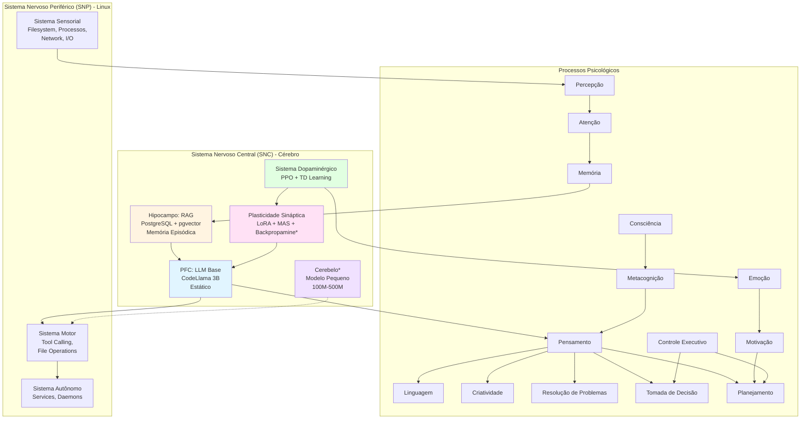

**Legenda**:
- `*` = Componente experimental (Backpropamine, Cerebelo)
- Cores diferentes = Diferentes subsistemas

---

## 🏗️ Arquitetura Detalhada por Camada

### Camada 1: Infraestrutura Base (Pragmática)

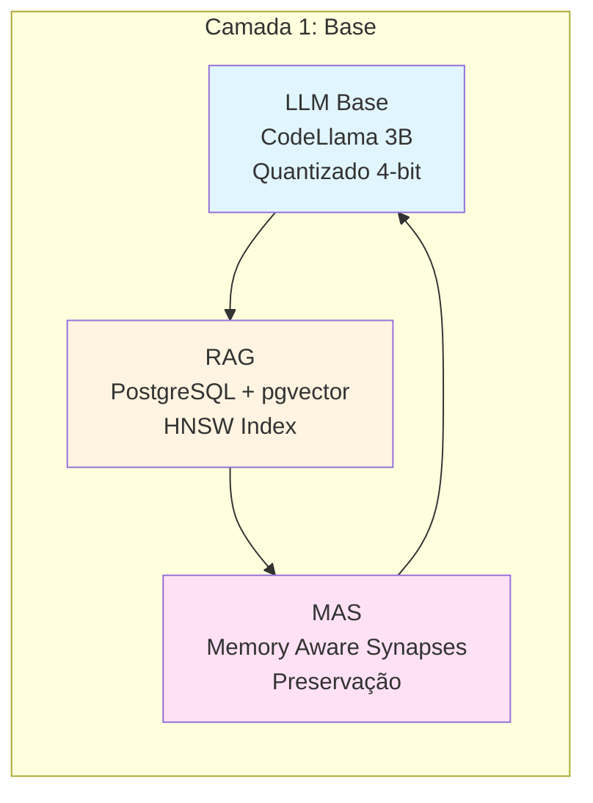

**Componentes**:
- ✅ **LLM Base**: CodeLlama 3B quantizado (já implementado)
- ✅ **RAG**: PostgreSQL + pgvector (já implementado)
- ✅ **MAS**: Memory Aware Synapses (já implementado)

**Status**: ✅ **Tudo implementado e funcional**

---

### Camada 2: Adaptação e Aprendizado (Híbrida)

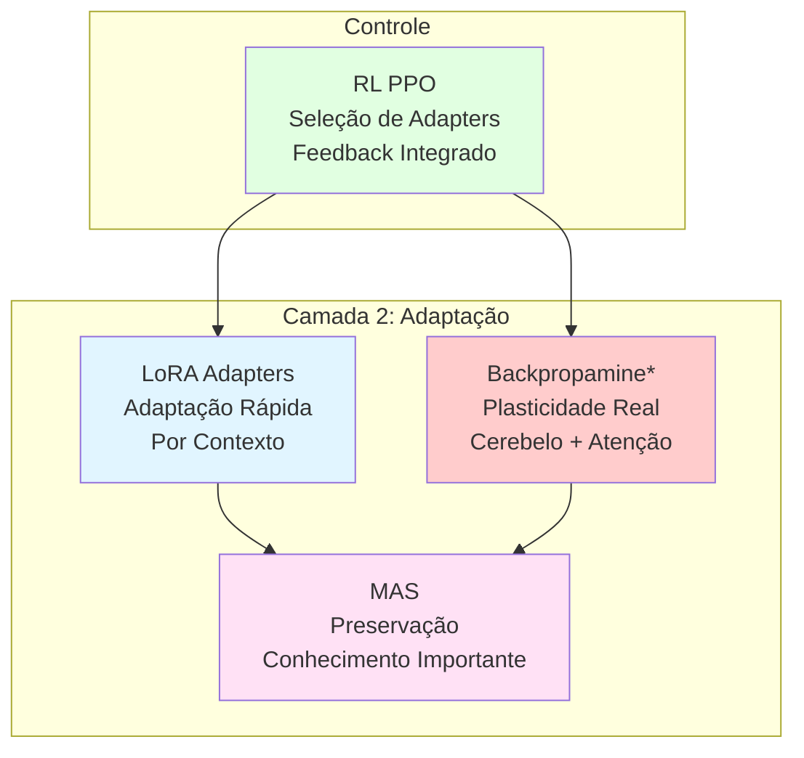

**Componentes**:
- ✅ **LoRA Adapters**: Adaptação rápida por contexto (a implementar)
- ✅ **MAS**: Preservação de conhecimento (já implementado)
- ⚠️ **Backpropamine**: Plasticidade real (experimental, em componentes específicos)

**Onde usar Backpropamine**:
1. **Cerebelo** (modelo pequeno 100M-500M) - padrões específicos
2. **Atenção Neuromodulada** - controle contextual de atenção
3. **Sistema de Consolidação** - transferência hipocampo → córtex

**Status**: ⚠️ **Parcialmente implementado** (MAS ✅, LoRA ⏳, Backpropamine ⏳)

---

### Camada 3: Memória e Consolidação (Híbrida)

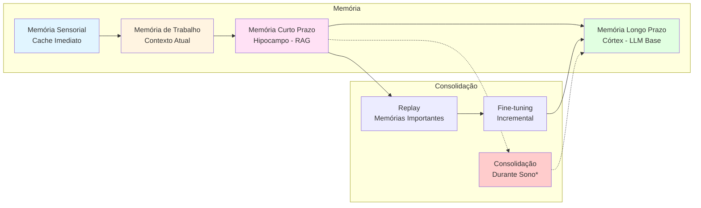

**Componentes**:
- ✅ **Hierarquia de Memória**: Sensorial → Trabalho → Curto → Longo (a implementar estrutura)
- ✅ **Replay + Fine-tuning**: Consolidação incremental (a implementar)
- ⚠️ **Consolidação Durante Sono**: Processo offline experimental (a implementar)

**Onde usar Consolidação Durante Sono**:
1. **Transferência Hipocampo → Córtex**: Consolidar memórias episódicas importantes
2. **Replay de Memórias**: Reativar e consolidar experiências significativas
3. **Limpeza Seletiva**: Remover memórias antigas não consolidadas

**Status**: ⚠️ **Parcialmente implementado** (RAG ✅, Consolidação ⏳)

---

### Camada 4: Sistema Dopaminérgico (Pragmática)

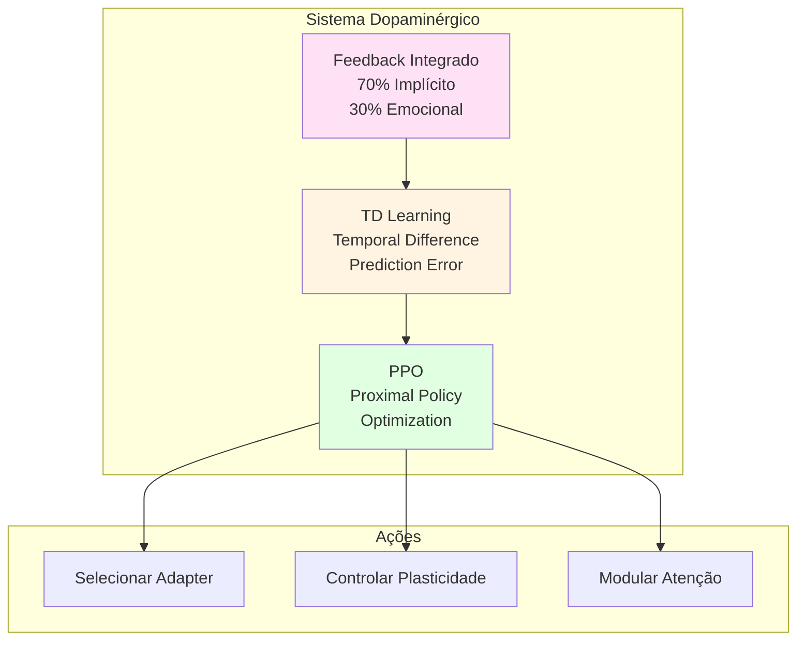

**Componentes**:
- ✅ **PPO**: Já implementado (Stable-Baselines3)
- ✅ **Feedback Integrado**: Estrutura implementada
- ⚠️ **TD Learning**: A implementar (melhorar PPO atual)

**Status**: ✅ **Estrutura implementada**, precisa melhorar integração

---

### Camada 5: Processos Psicológicos (Híbrida)

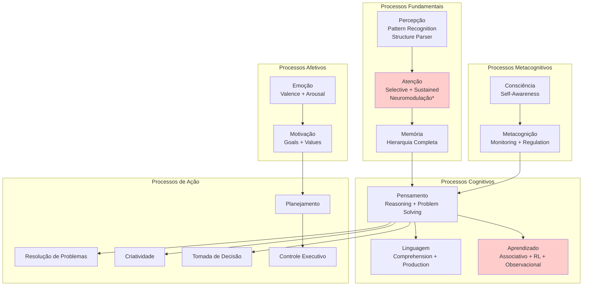

**Onde usar Backpropamine nos Processos Psicológicos**:
1. **Atenção Neuromodulada**: Backpropamine controla onde focar
2. **Aprendizado**: Backpropamine para adaptação rápida
3. **Consolidação**: Backpropamine para transferência de memória

**Status**: ⏳ **A implementar** (estrutura planejada)

---

## 🔄 Fluxo Completo de Processamento

### Fluxo Online (Durante Uso)

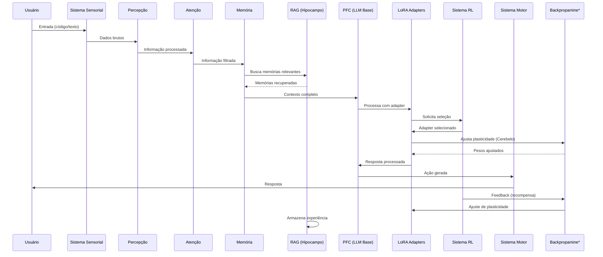

**Legenda**:
- `*` = Componente experimental (Backpropamine)

---

### Fluxo Offline (Durante "Sono" - Consolidação)

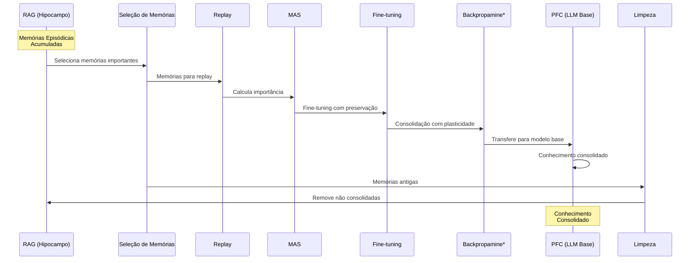

**Legenda**:
- `*` = Componente experimental (Backpropamine na consolidação)

---

## 📊 Matriz de Tecnologias por Componente

| Componente | Tecnologia Pragmática | Tecnologia Experimental | Status |
|------------|----------------------|------------------------|--------|
| **LLM Base** | CodeLlama 3B Quantizado | - | ✅ Implementado |
| **Memória Episódica** | PostgreSQL + pgvector | - | ✅ Implementado |
| **Preservação** | MAS | - | ✅ Implementado |
| **Adaptação Rápida** | LoRA Adapters | - | ⏳ A implementar |
| **Plasticidade Real** | - | Backpropamine (Cerebelo) | ⏳ A implementar |
| **Atenção Neuromodulada** | Attention (Transformers) | Backpropamine (Modulação) | ⏳ A implementar |
| **Consolidação** | Fine-tuning Incremental | Consolidação Durante Sono | ⏳ A implementar |
| **Sistema RL** | PPO | TD Learning (Melhorar) | ✅ Estrutura |
| **Feedback** | Implícito + Emocional | - | ✅ Implementado |

**Legenda**:
- ✅ = Implementado
- ⏳ = A implementar
- `-` = Não aplicável

---

## 🎯 Onde Aplicar Tecnologias Experimentais

### 1. Backpropamine

#### ✅ **Aplicar em**:

**a) Cerebelo (Modelo Pequeno 100M-500M)**
- **Por quê**: Modelo pequeno = menor overhead
- **Função**: Aprender padrões específicos e automatizar
- **Risco**: Baixo (modelo pequeno)
- **Benefício**: Alto (especialização real)

**b) Atenção Neuromodulada**
- **Por quê**: Controle contextual de atenção
- **Função**: Modular onde focar baseado em contexto
- **Risco**: Médio (integração com Transformers)
- **Benefício**: Alto (atenção biológica real)

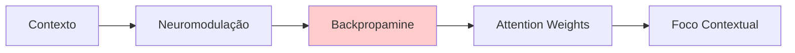

**c) Consolidação Hipocampo → Córtex**
- **Por quê**: Transferência real de conhecimento
- **Função**: Consolidar memórias importantes no modelo base
- **Risco**: Alto (modificar modelo base)
- **Benefício**: Muito Alto (consolidação biológica)

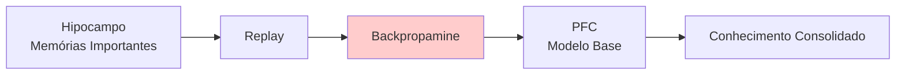

#### ❌ **NÃO Aplicar em**:

**a) LLM Base Principal (7B+)**
- **Por quê**: Overhead muito alto, não testado
- **Alternativa**: LoRA Adapters (pragmático)

**b) Adaptação Rápida por Contexto**
- **Por quê**: LoRA é mais eficiente
- **Alternativa**: LoRA Adapters (pragmático)

---

### 2. Consolidação Durante "Sono"

#### ✅ **Aplicar em**:

**a) Transferência Hipocampo → Córtex**
- **Por quê**: Processo biológico real
- **Função**: Consolidar memórias episódicas importantes
- **Frequência**: Diária ou após N experiências
- **Risco**: Médio (requer validação)

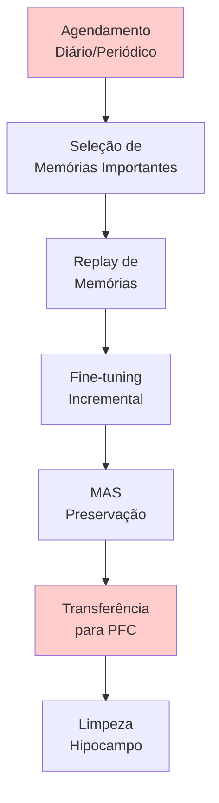

**b) Replay de Memórias Significativas**
- **Por quê**: Reativação biológica real
- **Função**: Reativar e consolidar experiências
- **Critério**: Memórias com alta importância (MAS)
- **Risco**: Baixo (já temos replay básico)

**c) Limpeza Seletiva do Hipocampo**
- **Por quê**: Evitar overflow de memória
- **Função**: Remover memórias antigas não consolidadas
- **Critério**: Idade + Importância + Consolidação
- **Risco**: Baixo (apenas limpeza)

#### ❌ **NÃO Aplicar em**:

**a) Consolidação Contínua**
- **Por quê**: Muito custoso computacionalmente
- **Alternativa**: Fine-tuning incremental periódico

---

## 🔍 Verificação: Temos Tudo Incorporado?

### ✅ Componentes Implementados

1. ✅ **LLM Base** (CodeLlama 3B)
2. ✅ **RAG** (PostgreSQL + pgvector)
3. ✅ **MAS** (Memory Aware Synapses)
4. ✅ **RL Estrutura** (PPO)
5. ✅ **Feedback** (Implícito + Emocional)

### ⏳ Componentes a Implementar (Pragmáticos)

1. ⏳ **LoRA Adapters** - Adaptação rápida
2. ⏳ **Integração RL + LoRA** - Controle de adapters
3. ⏳ **Replay Melhorado** - Memórias importantes
4. ⏳ **Fine-tuning Incremental** - Consolidação pragmática
5. ⏳ **Hierarquia de Memória** - Sensorial → Trabalho → Curto → Longo

### ⏳ Componentes a Implementar (Experimentais)

1. ⏳ **Backpropamine no Cerebelo** - Modelo pequeno
2. ⏳ **Backpropamine na Atenção** - Neuromodulação
3. ⏳ **Backpropamine na Consolidação** - Transferência
4. ⏳ **Consolidação Durante Sono** - Processo offline
5. ⏳ **Cerebelo** - Modelo pequeno especializado

### ✅ Processos Psicológicos Planejados

1. ✅ **Estrutura Planejada** - Arquitetura híbrida definida
2. ⏳ **Implementação** - A fazer gradualmente

---

## 📈 Plano de Implementação em Fases

### Fase 1: Base Pragmática (Sprint 1-2)

**Objetivo**: Sistema funcional com tecnologias comprovadas

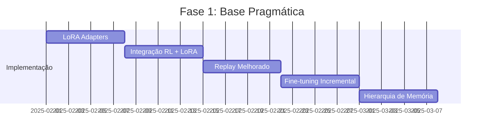

**Entregas**:
- ✅ LoRA Adapters funcionando
- ✅ RL controlando adapters
- ✅ Replay de memórias importantes
- ✅ Fine-tuning incremental
- ✅ Sistema funcional completo

---

### Fase 2: Experimentação (Sprint 3-4)

**Objetivo**: Validar tecnologias experimentais em componentes específicos

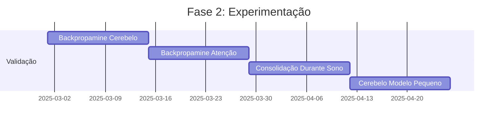

**Entregas**:
- ✅ Backpropamine validado no Cerebelo
- ✅ Atenção neuromodulada funcionando
- ✅ Consolidação durante sono implementada
- ✅ Cerebelo especializado

---

### Fase 3: Integração Completa (Sprint 5-6)

**Objetivo**: Integrar tudo e otimizar

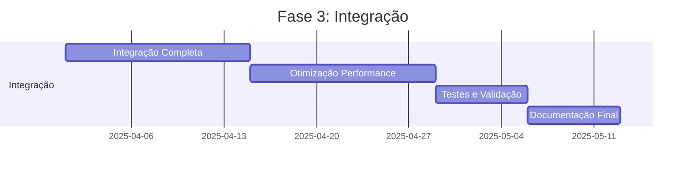

**Entregas**:
- ✅ Sistema completamente integrado
- ✅ Performance otimizada
- ✅ Testes completos
- ✅ Documentação final

---

## 🎨 Diagrama de Arquitetura Completo

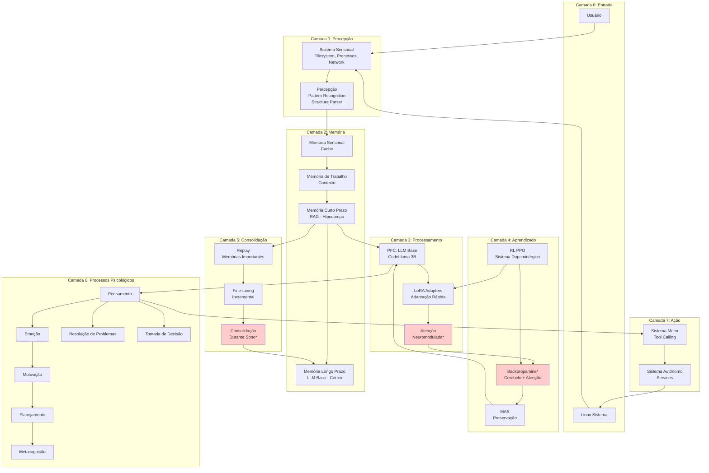

**Legenda**:
- `*` = Componente experimental (Backpropamine, Consolidação durante sono)

---

## 📋 Checklist de Implementação

### ✅ Fase 1: Base Pragmática

- [ ] **LoRA Adapters**
  - [ ] Implementar LoRA para CodeLlama 3B
  - [ ] Sistema de seleção de adapters
  - [ ] Integração com LLM base
  
- [ ] **Integração RL + LoRA**
  - [ ] RL controla seleção de adapters
  - [ ] Feedback integrado (implícito + emocional)
  - [ ] Ajuste de política baseado em feedback
  
- [ ] **Replay Melhorado**
  - [ ] Seleção de memórias importantes (MAS)
  - [ ] Replay durante treinamento
  - [ ] Balanceamento replay vs. novos dados
  
- [ ] **Fine-tuning Incremental**
  - [ ] Fine-tuning com preservação MAS
  - [ ] Consolidação periódica
  - [ ] Transferência para modelo base
  
- [ ] **Hierarquia de Memória**
  - [ ] Memória sensorial (cache)
  - [ ] Memória de trabalho (contexto)
  - [ ] Integração com RAG (curto prazo)
  - [ ] Integração com modelo base (longo prazo)

### ⏳ Fase 2: Experimentação

- [ ] **Backpropamine no Cerebelo**
  - [ ] Modelo pequeno (100M-500M)
  - [ ] Implementar Backpropamine
  - [ ] Validar em padrões específicos
  
- [ ] **Backpropamine na Atenção**
  - [ ] Neuromodulação contextual
  - [ ] Integração com Transformers
  - [ ] Controle de atenção
  
- [ ] **Consolidação Durante Sono**
  - [ ] Agendamento de consolidação
  - [ ] Seleção de memórias importantes
  - [ ] Replay e consolidação
  - [ ] Transferência para modelo base
  
- [ ] **Cerebelo Especializado**
  - [ ] Modelo pequeno
  - [ ] Aprendizado de padrões
  - [ ] Automatização

### ⏳ Fase 3: Integração

- [ ] **Integração Completa**
  - [ ] Todos os componentes integrados
  - [ ] Fluxo completo funcionando
  - [ ] Testes end-to-end
  
- [ ] **Otimização**
  - [ ] Performance otimizada
  - [ ] Uso de memória otimizado
  - [ ] Latência reduzida
  
- [ ] **Documentação**
  - [ ] Documentação completa
  - [ ] Exemplos de uso
  - [ ] Guias de implementação

---

## 🎯 Resumo Final

### O Que Temos

✅ **Base Sólida**:
- LLM Base (CodeLlama 3B)
- RAG (PostgreSQL + pgvector)
- MAS (Preservação)
- RL Estrutura (PPO)
- Feedback (Implícito + Emocional)

### O Que Vamos Adicionar (Pragmático)

⏳ **Fase 1**:
- LoRA Adapters
- Integração RL + LoRA
- Replay Melhorado
- Fine-tuning Incremental
- Hierarquia de Memória

### O Que Vamos Experimentar (Experimental)

⏳ **Fase 2**:
- Backpropamine no Cerebelo
- Backpropamine na Atenção
- Consolidação Durante Sono
- Cerebelo Especializado

### Abordagem Final

**Híbrida**: 
- **Pragmático** onde necessário (sistema funcional)
- **Experimental** onde adiciona valor real (componentes específicos)
- **Evolutivo** (pode melhorar com pesquisa)

---

## 📚 Referências

### Papers Fundamentais

1. **Backpropamine**: Miconi et al. (2020) - [2002.10585](https://arxiv.org/abs/2002.10585)
2. **Differentiable Plasticity**: Miconi et al. (2018) - [1804.02464](https://arxiv.org/abs/1804.02464)
3. **MAS**: Aljundi et al. (2017) - [1711.09601](https://arxiv.org/abs/1711.09601)
4. **RAG**: Lewis et al. (2020) - [2005.11401](https://arxiv.org/abs/2005.11401)
5. **LoRA**: Hu et al. (2021) - [2106.09685](https://arxiv.org/abs/2106.09685)

### Documentação do Projeto

- `docs/neuroplasticity-infrastructure/REVISAO-ARQUITETURA-2025.md`
- `docs/neuroplasticity-infrastructure/NP-001-synaptic-plasticity.md`
- `ARQUITETURA_BIOLOGICA.md`
- `PLANO_REDESENHO.md`

---

**Data**: 2025-01-27  
**Versão**: 2.0  
**Status**: 🟡 Proposta Final - Aguardando Aprovação

