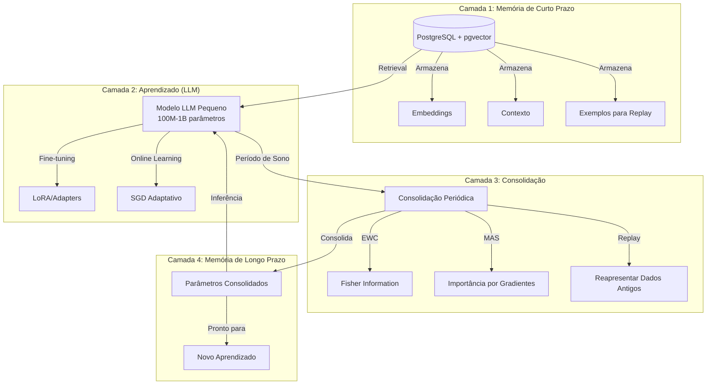

# Guia de Decisões Arquiteturais: Sistema de Aprendizado Contínuo

## Visão Geral e Contexto

### Objetivo

Implementar um sistema de aprendizado contínuo que simula neuroplasticidade em LLMs, utilizando:

- **Memória de Curto Prazo**: PostgreSQL + pgvector para armazenar embeddings, contexto e exemplos
- **Aprendizado Incremental**: Modelos LLM pequenos que aprendem continuamente de novas interações
- **Consolidação Periódica**: Transferência de conhecimento de curto para longo prazo durante períodos de "sono"
- **Valor de Negócio**: Aplicações práticas que melhoram continuamente sem retreino completo

### Arquitetura Proposta



### Quando Usar Esta Arquitetura

**Use quando:**
- Precisa de aprendizado contínuo sem retreino completo
- Tem dados que chegam incrementalmente
- Quer preservar conhecimento antigo enquanto aprende novo
- Precisa de sistema que melhora com o tempo
- Tem recursos limitados (modelo pequeno é viável)

**Não use quando:**
- Dados são estáticos e não mudam
- Pode fazer retreino completo regularmente
- Precisa de máxima performance imediata
- Não tem infraestrutura para PostgreSQL e processamento

## Decisões Arquiteturais Principais

### 2.1 Camada de Memória de Curto Prazo

#### Opção A: PostgreSQL + pgvector (Recomendado para Produção)

**Características:**
- Extensão pgvector para busca vetorial
- ACID transactions
- Suporte a metadata rica
- Integração com sistemas existentes
- Escalabilidade horizontal possível

**Trade-offs:**
- ✅ Persistência robusta e confiável
- ✅ Metadata filtering avançado
- ✅ Transações garantem consistência
- ✅ Integração com stack existente
- ⚠️ Setup mais complexo que alternativas
- ⚠️ Requer conhecimento de PostgreSQL
- ⚠️ Performance pode ser menor que soluções especializadas

**Quando usar:**
- Produção com requisitos de confiabilidade
- Necessidade de ACID transactions
- Já usa PostgreSQL na stack
- Precisa de metadata filtering complexo
- Requisitos de backup e recuperação

**Configuração sugerida:**
- Índice HNSW para busca rápida
- Particionamento temporal para dados antigos
- Backup automático configurado
- Connection pooling (PgBouncer)

#### Opção B: ChromaDB (Recomendado para MVP/Desenvolvimento)

**Características:**
- API simples e intuitiva
- Embedding functions integradas
- Metadata support básico
- Fácil de começar

**Trade-offs:**
- ✅ Muito fácil de usar
- ✅ Setup rápido
- ✅ Boa para prototipagem
- ⚠️ Menos robusto que PostgreSQL
- ⚠️ Escalabilidade limitada
- ⚠️ Menos features de produção

**Quando usar:**
- MVP ou prototipagem rápida
- Desenvolvimento e testes
- Projetos pequenos a médios
- Não precisa de ACID

#### Opção C: Pinecone (Recomendado para Escala Managed)

**Características:**
- Serviço gerenciado (SaaS)
- Escalabilidade automática
- Alta performance
- Sem infraestrutura própria

**Trade-offs:**
- ✅ Zero infraestrutura
- ✅ Escala automaticamente
- ✅ Alta performance
- ✅ Fácil de usar
- ❌ Custo (pago)
- ❌ Vendor lock-in
- ❌ Menos controle

**Quando usar:**
- Não quer gerenciar infraestrutura
- Precisa escalar rapidamente
- Orçamento permite serviço pago
- Time pequeno sem expertise em DB

#### Opção D: FAISS (Recomendado para Performance Máxima)

**Características:**
- Biblioteca de busca vetorial
- Muito otimizada
- GPU support
- Open-source

**Trade-offs:**
- ✅ Performance muito alta
- ✅ GPU acceleration
- ✅ Open-source
- ⚠️ Não é database completa
- ⚠️ Requer persistência customizada
- ⚠️ Mais complexo de integrar

**Quando usar:**
- Performance é crítica
- Tem GPU disponível
- Precisa de máxima velocidade
- Pode lidar com complexidade adicional

### 2.2 Camada de Aprendizado (LLM)

#### Opção A: Modelo Pequeno (100M-1B) com LoRA/Adapters (Recomendado)

**Características:**
- Modelos como GPT-2 Small, DistilBERT, TinyBERT
- LoRA (Low-Rank Adaptation) para adaptação eficiente
- Adapter Layers como alternativa
- Fine-tuning incremental

**Trade-offs:**
- ✅ Eficiente computacionalmente
- ✅ Rápido para treinar
- ✅ Menor custo de infraestrutura
- ✅ EWC/MAS funcionam bem
- ⚠️ Capacidade limitada vs. modelos grandes
- ⚠️ Pode precisar de mais dados para tarefas complexas

**Quando usar:**
- Recursos limitados (GPU, orçamento)
- Aprendizado contínuo focado
- Latência é importante
- Casos de uso específicos (não generalistas)

**Tamanhos sugeridos:**
- **100M-300M**: Tarefas simples, domínios específicos
- **300M-700M**: Balance entre capacidade e eficiência
- **700M-1B**: Máxima capacidade mantendo eficiência

#### Opção B: Fine-tuning Full (Para Capacidade Máxima)

**Características:**
- Atualização de todos os parâmetros
- Máxima capacidade de adaptação
- Requer mais recursos

**Trade-offs:**
- ✅ Melhor capacidade de adaptação
- ✅ Pode aprender padrões mais complexos
- ❌ Muito mais caro computacionalmente
- ❌ Mais lento
- ❌ EWC/MAS menos eficientes

**Quando usar:**
- Recursos abundantes disponíveis
- Mudanças significativas necessárias
- Capacidade máxima é crítica
- Poucas atualizações (não contínuo)

#### Opção C: Modelo Médio (1B-7B) com LoRA (Balance)

**Características:**
- Modelos como GPT-2 Medium, BERT-Large
- LoRA para eficiência
- Balance entre capacidade e custo

**Trade-offs:**
- ✅ Boa capacidade
- ✅ Ainda eficiente com LoRA
- ⚠️ Requer mais recursos que pequenos
- ⚠️ EWC/MAS mais caros

**Quando usar:**
- Precisa de mais capacidade que modelos pequenos
- Tem recursos moderados
- Quer balance entre performance e custo

### 2.3 Camada de Consolidação

#### Opção A: EWC (Elastic Weight Consolidation)

**Características:**
- Calcula Fisher Information Matrix
- Preserva parâmetros importantes
- Penaliza mudanças em parâmetros críticos

**Trade-offs:**
- ✅ Preservação garantida matematicamente
- ✅ Funciona bem em modelos pequenos
- ✅ Não requer dados antigos (apenas importância)
- ⚠️ Cálculo de Fisher Information é caro
- ⚠️ Não escala bem para muitos parâmetros
- ⚠️ Pode ser muito conservador

**Quando usar:**
- Modelos pequenos (até ~1B parâmetros)
- Poucas tarefas (2-5 tarefas)
- Precisa de preservação garantida
- Tem recursos para calcular Fisher

**Implementação:**
- Framework: Avalanche, PyTorch custom
- Frequência: Após cada tarefa ou período definido
- Overhead: ~20-30% do tempo de treinamento

#### Opção B: MAS (Memory Aware Synapses)

**Características:**
- Calcula importância baseada em gradientes
- Não-supervisionado (não precisa labels)
- Adaptativo

**Trade-offs:**
- ✅ Não requer labels
- ✅ Computacionalmente mais eficiente que EWC
- ✅ Adaptativo
- ⚠️ Menos preciso que EWC
- ⚠️ Pode não preservar tão bem

**Quando usar:**
- Sem labels disponíveis
- Adaptação contínua necessária
- Quer eficiência computacional
- Modelos pequenos a médios

**Implementação:**
- Framework: Avalanche, PyTorch custom
- Frequência: Contínua ou periódica
- Overhead: ~10-15% do tempo de treinamento

#### Opção C: Replay + EWC/MAS (Mais Eficaz)

**Características:**
- Combina replay de dados antigos com EWC ou MAS
- Reapresenta exemplos de tarefas anteriores
- Muito eficaz contra catastrophic forgetting

**Trade-offs:**
- ✅ Muito eficaz (melhor que EWC/MAS sozinhos)
- ✅ Preserva conhecimento melhor
- ⚠️ Requer armazenamento de dados
- ⚠️ Computacionalmente mais caro
- ⚠️ PostgreSQL precisa armazenar exemplos

**Quando usar:**
- Produção com requisitos de qualidade
- Múltiplas tarefas
- Tem armazenamento disponível
- Quer máxima preservação

**Implementação:**
- Armazenar exemplos no PostgreSQL
- Replay durante treinamento (10-20% dos dados)
- Combinar com EWC ou MAS

#### Opção D: Progressive Neural Networks (Crescimento)

**Características:**
- Adiciona nova coluna para cada tarefa
- Colunas antigas congeladas
- Zero esquecimento garantido

**Trade-offs:**
- ✅ Zero esquecimento
- ✅ Transfer learning explícito
- ✅ Modular
- ❌ Crescimento linear de parâmetros
- ❌ Não eficiente para muitas tarefas
- ❌ Não aproveita conhecimento compartilhado

**Quando usar:**
- Poucas tarefas (2-4 tarefas)
- Zero esquecimento é crítico
- Pode aceitar crescimento de parâmetros
- Tarefas são muito diferentes

## Decisões de Engenharia de Software

### 3.1 Padrões Arquiteturais

#### Event-Driven Architecture

**Conceito:**
Sistema baseado em eventos para desacoplar componentes.

**Eventos principais:**
- `interaction.received`: Nova interação chegou
- `embedding.generated`: Embedding criado
- `learning.triggered`: Aprendizado iniciado
- `consolidation.scheduled`: Consolidação agendada
- `consolidation.completed`: Consolidação finalizada

**Vantagens:**
- Desacoplamento de componentes
- Escalabilidade horizontal
- Resiliência (retry automático)
- Monitoramento facilitado

**Implementação:**
- Message broker: RabbitMQ, Redis Streams, ou Kafka
- Workers: Celery, RQ, ou custom
- Event store: PostgreSQL ou sistema dedicado

#### Microserviços vs. Monolito

**Microserviços (Recomendado para Escala):**

**Serviços sugeridos:**
1. **Embedding Service**: Gera embeddings
2. **Memory Service**: Gerencia PostgreSQL + pgvector
3. **Learning Service**: Executa fine-tuning e consolidação
4. **Inference Service**: Serve o modelo para inferência
5. **Orchestration Service**: Coordena fluxo

**Trade-offs:**
- ✅ Escala independente
- ✅ Tecnologias diferentes por serviço
- ✅ Falhas isoladas
- ⚠️ Complexidade operacional
- ⚠️ Latência de rede
- ⚠️ Debugging mais difícil

**Monolito (Recomendado para MVP):**

**Estrutura:**
- Módulos separados mas mesma aplicação
- Facilita desenvolvimento inicial
- Pode evoluir para microserviços depois

**Trade-offs:**
- ✅ Simplicidade operacional
- ✅ Desenvolvimento mais rápido
- ✅ Debugging mais fácil
- ⚠️ Escala tudo junto
- ⚠️ Tecnologias limitadas

**Recomendação:**
- **MVP**: Monolito modular
- **Produção Escala**: Microserviços

#### CQRS (Command Query Responsibility Segregation)

**Conceito:**
Separação de leitura (inferência) e escrita (aprendizado).

**Comandos (Write):**
- `TrainModel`: Inicia treinamento
- `ConsolidateKnowledge`: Inicia consolidação
- `StoreInteraction`: Armazena nova interação

**Queries (Read):**
- `GetRelevantContext`: Busca contexto relevante
- `GenerateResponse`: Gera resposta (inferência)
- `GetModelStatus`: Status do modelo

**Vantagens:**
- Otimização independente
- Escala leitura e escrita separadamente
- Cache mais eficiente
- Modelos de dados diferentes

### 3.2 Tecnologias e Frameworks

#### Stack Principal

**Python:**
- Linguagem padrão para ML/AI
- Ecossistema rico (PyTorch, LangChain, etc.)

**Frameworks ML:**
- **PyTorch**: Treinamento e fine-tuning
- **Transformers (Hugging Face)**: Modelos pré-treinados
- **PEFT**: LoRA e outros métodos eficientes
- **Avalanche**: Continual learning

**Frameworks RAG/LLM:**
- **LangChain**: Orquestração de LLMs
- **LlamaIndex**: RAG especializado
- **OpenAI/Anthropic APIs**: Modelos grandes quando necessário

**Database:**
- **PostgreSQL**: Database principal
- **pgvector**: Extensão para vetores
- **SQLAlchemy**: ORM Python

**Orquestração:**
- **Celery**: Task queue (recomendado)
- **Airflow**: Workflow orchestration (opcional)
- **Redis**: Message broker para Celery

**Monitoramento:**
- **MLflow**: Tracking de experimentos
- **Weights & Biases**: Experiment tracking avançado
- **Prometheus + Grafana**: Métricas de sistema
- **Custom logging**: Logs estruturados

#### Alternativas por Camada

**Embedding Generation:**
- OpenAI Embeddings API (fácil, pago)
- Sentence Transformers (local, gratuito)
- BGE, E5 models (open-source, boa qualidade)

**Vector Search:**
- pgvector (PostgreSQL)
- Qdrant (alternativa especializada)
- Milvus (escala muito grande)

**Model Serving:**
- FastAPI (API REST)
- vLLM (inference otimizado)
- TensorRT (NVIDIA, máxima performance)

### 3.3 Pipeline de Dados

#### Coleta: Streaming vs. Batch

**Streaming (Recomendado para Tempo Real):**

**Características:**
- Processa interações imediatamente
- Baixa latência
- Atualização contínua

**Quando usar:**
- Suporte ao cliente em tempo real
- Chatbots interativos
- Sistemas que precisam resposta imediata

**Implementação:**
- WebSocket ou Server-Sent Events
- Message queue (RabbitMQ, Redis)
- Workers processam em tempo real

**Batch (Recomendado para Eficiência):**

**Características:**
- Processa em lotes
- Mais eficiente
- Maior throughput

**Quando usar:**
- Análise de documentos
- Processamento de logs
- Consolidação periódica

**Implementação:**
- Scheduled jobs (cron, Airflow)
- Processa batches de N interações
- Otimizado para throughput

#### Processamento: Embedding Generation e Chunking

**Embedding Generation:**
- Modelo: Sentence Transformers (all-MiniLM-L6-v2, BGE, E5)
- Batch size: 32-128 para eficiência
- Cache: Embeddings já gerados não regenerar

**Chunking:**
- Estratégia: Semantic chunking (por significado)
- Tamanho: 500-1000 tokens
- Overlap: 50-100 tokens entre chunks
- Metadata: Timestamp, fonte, tipo de documento

#### Armazenamento: Estratégias de Particionamento

**Particionamento Temporal:**
- Tabelas por mês ou trimestre
- Facilita limpeza de dados antigos
- Melhora performance de queries

**Índices:**
- HNSW index no pgvector (busca rápida)
- Índice B-tree em timestamp
- Índice em metadata (fonte, tipo)

**Retention Policy:**
- Dados recentes (últimos 3 meses): Hot storage
- Dados antigos (3-12 meses): Warm storage
- Dados muito antigos (>12 meses): Archive ou delete

#### Retrieval: Estratégias de Busca Semântica

**Busca Simples:**
- Cosine similarity no embedding da query
- Top-K resultados (K=5-10)

**Busca Híbrida:**
- Combina busca semântica (vetorial) e keyword (BM25)
- Weighted combination
- Melhor recall

**Re-ranking:**
- Cross-encoder para re-ranquear top resultados
- Mais preciso mas mais lento
- Usar apenas nos top 20-50

**Filtros:**
- Metadata filtering (data, fonte, tipo)
- Temporal filtering (apenas dados recentes)
- Quality filtering (score mínimo)

## Casos de Uso e Valor de Negócio

### 4.1 Assistente de Suporte ao Cliente

**Problema:**
- Conhecimento desatualizado rapidamente
- Respostas inconsistentes entre agentes
- Custo alto de treinamento de equipe
- Escalações desnecessárias

**Solução Arquitetural:**
```
Interações de Clientes
    ↓
PostgreSQL + pgvector (armazena conversas, soluções)
    ↓
LLM Pequeno (fine-tuned com LoRA)
    ↓
Resposta Contextualizada
    ↓
Feedback Loop (thumbs up/down)
    ↓
Consolidação Noturna (EWC + Replay)
```

**Componentes:**
- **Memória**: PostgreSQL com todas as interações e soluções
- **Modelo**: 300M-700M parâmetros com LoRA
- **Consolidação**: EWC + Replay diário (durante madrugada)
- **Retrieval**: Busca semântica em histórico de conversas

**Valor de Negócio:**
- **Redução de Escalações**: 30-50% menos tickets para humanos
- **Melhoria Contínua**: Sistema aprende de cada interação
- **Custo Operacional**: Redução de 40-60% em custos de suporte
- **Consistência**: Respostas uniformes e atualizadas
- **ROI**: Payback em 3-6 meses

**Métricas:**
- Taxa de resolução na primeira interação
- Redução de escalações
- Satisfação do cliente (CSAT)
- Tempo médio de resposta

### 4.2 Tutor Educacional Personalizado

**Problema:**
- Adaptação a diferentes estilos de aprendizado
- Conteúdo dinâmico que muda constantemente
- Personalização em escala é impossível manualmente
- Dificuldade em identificar gaps de conhecimento

**Solução Arquitetural:**
```
Interações com Alunos
    ↓
PostgreSQL + pgvector (perfil do aluno, histórico)
    ↓
LLM Pequeno (adaptado por aluno via LoRA)
    ↓
Resposta Personalizada
    ↓
Tracking de Progresso
    ↓
Consolidação Semanal (padrões de ensino)
```

**Componentes:**
- **Memória**: Perfil de cada aluno, histórico de interações
- **Modelo**: 500M-1B parâmetros, LoRA por aluno ou grupo
- **Consolidação**: MAS semanal (identifica padrões de ensino)
- **Retrieval**: Busca em conteúdo educacional + histórico do aluno

**Valor de Negócio:**
- **Personalização em Escala**: Milhares de alunos simultaneamente
- **Melhoria de Resultados**: 20-30% melhoria em performance
- **Retenção**: Maior engajamento = menor churn
- **Custo**: Redução de 50-70% vs. tutores humanos
- **Escalabilidade**: Custo marginal próximo de zero

**Métricas:**
- Taxa de conclusão de cursos
- Melhoria em testes padronizados
- Tempo de aprendizado
- Satisfação do aluno

### 4.3 Assistente de Pesquisa Científica

**Problema:**
- Papers novos publicados constantemente
- Conhecimento fragmentado em múltiplas fontes
- Dificuldade em encontrar conexões
- Atualização manual é inviável

**Solução Arquitetural:**
```
Novos Papers + Queries de Pesquisadores
    ↓
PostgreSQL + pgvector (papers, citações, abstracts)
    ↓
LLM Pequeno (fine-tuned em domínio científico)
    ↓
Resposta com Referências
    ↓
Descoberta de Conexões
    ↓
Consolidação Semanal (novos papers, atualizações)
```

**Componentes:**
- **Memória**: Todos os papers indexados, citações, abstracts
- **Modelo**: 700M-1B parâmetros, fine-tuned em texto científico
- **Consolidação**: EWC semanal (incorpora novos papers importantes)
- **Retrieval**: Busca semântica + filtros por área, data, citações

**Valor de Negócio:**
- **Atualização Automática**: Sempre atualizado com últimos papers
- **Descoberta**: Encontra conexões que humanos não veem
- **Eficiência**: Reduz tempo de pesquisa em 60-80%
- **Qualidade**: Respostas baseadas em evidências científicas
- **Competitividade**: Vantagem em pesquisa e desenvolvimento

**Métricas:**
- Número de papers processados
- Taxa de descoberta de conexões relevantes
- Tempo economizado por pesquisador
- Citações de papers descobertos

### 4.4 Chatbot Empresarial com Conhecimento Interno

**Problema:**
- Documentação muda constantemente
- Conhecimento tácito não documentado
- Onboarding lento de novos funcionários
- Perda de conhecimento quando pessoas saem

**Solução Arquitetural:**
```
Conversas Internas + Documentos
    ↓
PostgreSQL + pgvector (docs, conversas, conhecimento)
    ↓
LLM Pequeno (fine-tuned em contexto da empresa)
    ↓
Resposta com Conhecimento Interno
    ↓
Aprendizado de Conversas
    ↓
Consolidação Mensal (conhecimento organizacional)
```

**Componentes:**
- **Memória**: Documentação, conversas internas, FAQs
- **Modelo**: 500M-1B parâmetros, adaptado ao contexto da empresa
- **Consolidação**: MAS mensal (identifica conhecimento importante)
- **Retrieval**: Busca em documentação + histórico de conversas

**Valor de Negócio:**
- **Onboarding Rápido**: Reduz tempo de onboarding em 50-70%
- **Preservação de Conhecimento**: Não perde conhecimento quando pessoas saem
- **Produtividade**: Respostas rápidas a perguntas internas
- **Consistência**: Conhecimento centralizado e atualizado
- **ROI**: Payback em 2-4 meses

**Métricas:**
- Tempo de onboarding
- Número de perguntas respondidas
- Satisfação dos funcionários
- Redução de tempo em busca de informação

## Matriz de Decisão

### Por Recursos Disponíveis

| Recursos | Memória | Modelo | Consolidação | Justificativa |
|----------|---------|--------|--------------|---------------|
| **Poucos (MVP)** | ChromaDB | 100M-300M + LoRA | MAS | Simplicidade e baixo custo |
| **Moderados** | PostgreSQL + pgvector | 300M-700M + LoRA | EWC + Replay | Balance custo/performance |
| **Abundantes** | PostgreSQL + pgvector | 700M-1B + LoRA | EWC + Replay | Máxima capacidade |
| **Escala Managed** | Pinecone | 500M-1B + LoRA | MAS | Zero infraestrutura própria |

### Por Requisitos

| Requisito | Memória | Modelo | Consolidação | Justificativa |
|-----------|---------|--------|--------------|---------------|
| **Latência Baixa** | PostgreSQL (local) | 100M-300M | MAS (mais rápido) | Performance em tempo real |
| **Precisão Alta** | PostgreSQL + pgvector | 700M-1B | EWC + Replay | Máxima qualidade |
| **Escalabilidade** | PostgreSQL (sharding) ou Pinecone | 300M-700M | MAS | Escala horizontalmente |
| **Custo Baixo** | ChromaDB | 100M-300M | MAS | Mínimo de recursos |

### Por Caso de Uso

| Caso de Uso | Memória | Modelo | Consolidação | Frequência Consolidação |
|-------------|---------|--------|--------------|------------------------|
| **Suporte ao Cliente** | PostgreSQL + pgvector | 300M-700M + LoRA | EWC + Replay | Diária (madrugada) |
| **Tutor Educacional** | PostgreSQL + pgvector | 500M-1B + LoRA | MAS | Semanal |
| **Pesquisa Científica** | PostgreSQL + pgvector | 700M-1B + LoRA | EWC | Semanal |
| **Chatbot Empresarial** | PostgreSQL + pgvector | 500M-1B + LoRA | MAS | Mensal |

## Roadmap de Implementação

### Fase 1: MVP - RAG Básico + PostgreSQL (2-4 semanas)

**Objetivo:** Sistema funcional com memória de curto prazo

**Entregas:**
- PostgreSQL + pgvector configurado
- Embedding generation (Sentence Transformers)
- RAG básico com retrieval
- API simples para inferência
- Armazenamento de interações

**Tecnologias:**
- PostgreSQL + pgvector
- LangChain ou LlamaIndex
- FastAPI
- Sentence Transformers

**Métricas de Sucesso:**
- Sistema responde com contexto relevante
- Embeddings armazenados corretamente
- Latência < 2s para inferência

### Fase 2: Fine-tuning Incremental com LoRA (4-6 semanas)

**Objetivo:** Modelo aprende de novas interações

**Entregas:**
- Modelo pequeno (100M-300M) configurado
- LoRA implementation
- Pipeline de fine-tuning incremental
- Sistema de feedback (thumbs up/down)
- Versionamento de modelos

**Tecnologias:**
- PyTorch + Transformers
- PEFT (LoRA)
- MLflow (tracking)
- Celery (task queue)

**Métricas de Sucesso:**
- Modelo melhora com feedback
- Fine-tuning completo em < 1 hora
- Retenção de conhecimento básica

### Fase 3: Consolidação Periódica (6-8 semanas)

**Objetivo:** Transferência de conhecimento para longo prazo

**Entregas:**
- EWC ou MAS implementado
- Sistema de replay de dados antigos
- Agendamento de consolidação
- Monitoramento de catastrophic forgetting
- Métricas de retenção

**Tecnologias:**
- Avalanche (EWC/MAS)
- Scheduled jobs (Celery Beat ou Airflow)
- Métricas customizadas

**Métricas de Sucesso:**
- Retenção > 80% após nova tarefa
- Consolidação completa em < 4 horas
- Modelo não degrada com tempo

### Fase 4: Otimização e Escalabilidade (8-12 semanas)

**Objetivo:** Sistema pronto para produção em escala

**Entregas:**
- Otimização de performance
- Escalabilidade horizontal
- Monitoramento completo
- Documentação operacional
- Disaster recovery

**Tecnologias:**
- Kubernetes (opcional)
- Prometheus + Grafana
- Backup automatizado
- Load balancing

**Métricas de Sucesso:**
- Throughput > 100 req/s
- Latência p95 < 1s
- Uptime > 99.5%
- Recovery time < 1 hora

## Riscos e Mitigações

### Catastrophic Forgetting

**Risco:** Modelo esquece conhecimento antigo ao aprender novo

**Mitigações:**
- **EWC/MAS**: Preservar parâmetros importantes
- **Replay**: Reapresentar dados antigos regularmente
- **Monitoramento**: Métricas de retenção de conhecimento
- **Validação**: Testes regulares em tarefas antigas
- **Thresholds**: Alertas se retenção cai abaixo de 70%

**Plano de Contingência:**
- Backup de modelos antes de cada consolidação
- Rollback automático se degradação detectada
- Dados antigos sempre disponíveis para retreino

### Custo Computacional

**Risco:** Consolidação e fine-tuning podem ser caros

**Mitigações:**
- **LoRA**: Reduz parâmetros treinados em 90%+
- **Modelos Pequenos**: Menor custo que modelos grandes
- **Agendamento**: Consolidação em horários de baixo uso
- **Otimização**: Batch processing, GPU eficiente
- **Cloud Spot Instances**: Reduzir custo de GPU

**Plano de Contingência:**
- Budget alerts configurados
- Fallback para consolidação menos frequente
- Opção de consolidação apenas em dados críticos

### Complexidade Operacional

**Risco:** Sistema complexo pode ser difícil de operar

**Mitigações:**
- **Documentação**: Guias operacionais completos
- **Automação**: Máximo de automação possível
- **Monitoramento**: Dashboards e alertas claros
- **Testes**: Testes automatizados extensivos
- **Gradual**: Implementação faseada (MVP primeiro)

**Plano de Contingência:**
- Runbooks para cenários comuns
- Suporte especializado disponível
- Opção de simplificar (desabilitar consolidação temporariamente)

### Qualidade de Dados

**Risco:** Dados ruins podem degradar o modelo

**Mitigações:**
- **Validação**: Filtros de qualidade de dados
- **Feedback Loop**: Usuários podem marcar respostas ruins
- **Análise**: Monitoramento de qualidade de embeddings
- **Limpeza**: Remoção de outliers e dados ruins
- **Diversidade**: Garantir diversidade nos dados de treino

**Plano de Contingência:**
- Quarentena de dados suspeitos
- Revisão manual de dados antes de consolidação
- Rollback se qualidade degradar

### Escalabilidade

**Risco:** Sistema pode não escalar com crescimento

**Mitigações:**
- **Arquitetura**: Design para escala desde início
- **Particionamento**: Dados particionados temporalmente
- **Caching**: Cache agressivo de embeddings e respostas
- **Horizontal Scaling**: PostgreSQL read replicas, workers distribuídos
- **Load Testing**: Testes de carga regulares

**Plano de Contingência:**
- Arquitetura permite adicionar recursos facilmente
- Opção de migrar para soluções managed (Pinecone)
- Degradação graceful (cache mais agressivo)

## Métricas de Sucesso

### Métricas Técnicas

**Retenção de Conhecimento:**
- **Métrica**: Accuracy em tarefas antigas após novo aprendizado
- **Target**: > 80% retenção
- **Medição**: Testes em dataset de validação de tarefas antigas

**Adaptação a Novos Dados:**
- **Métrica**: Melhoria em accuracy após fine-tuning
- **Target**: > 5% melhoria em novas tarefas
- **Medição**: Comparação antes/depois de fine-tuning

**Eficiência de Consolidação:**
- **Métrica**: Tempo de consolidação
- **Target**: < 4 horas para modelo 500M
- **Medição**: Logs de tempo de execução

**Qualidade de Retrieval:**
- **Métrica**: Precision@K e Recall@K
- **Target**: Precision@5 > 0.8
- **Medição**: Avaliação em queries de teste

### Métricas de Negócio

**Redução de Custos:**
- **Métrica**: Custo operacional vs. solução anterior
- **Target**: 30-50% redução
- **Medição**: Comparação de custos mensais

**Melhoria de Experiência:**
- **Métrica**: CSAT (Customer Satisfaction Score)
- **Target**: > 4.0/5.0
- **Medição**: Pesquisas de satisfação

**ROI:**
- **Métrica**: Retorno sobre investimento
- **Target**: Payback em 3-6 meses
- **Medição**: (Benefícios - Custos) / Custos

**Escalabilidade:**
- **Métrica**: Throughput (requests/segundo)
- **Target**: > 100 req/s
- **Medição**: Load testing

### Dashboard Sugerido

**Visão Geral:**
- Requests por dia
- Latência média (p50, p95, p99)
- Taxa de erro
- Custo diário

**Aprendizado:**
- Número de fine-tunings executados
- Melhoria em accuracy
- Retenção de conhecimento
- Tempo de consolidação

**Negócio:**
- CSAT score
- Redução de escalações (se aplicável)
- Tempo economizado
- ROI acumulado

## Conclusão

Este guia fornece um framework completo para decisões arquiteturais em sistemas de aprendizado contínuo com neuroplasticidade. As decisões devem ser adaptadas ao contexto específico:

- **Recursos disponíveis** determinam escolhas de tecnologia
- **Requisitos de negócio** determinam prioridades
- **Caso de uso** determina frequência e estratégia de consolidação

**Recomendação Geral:**
Começar com MVP simples (Fase 1), validar valor de negócio, e então evoluir gradualmente para fases mais avançadas. A arquitetura modular permite essa evolução sem grandes refatorações.

**Próximos Passos:**
1. Validar caso de uso específico
2. Escolher stack baseado em recursos
3. Implementar Fase 1 (MVP)
4. Medir e iterar

